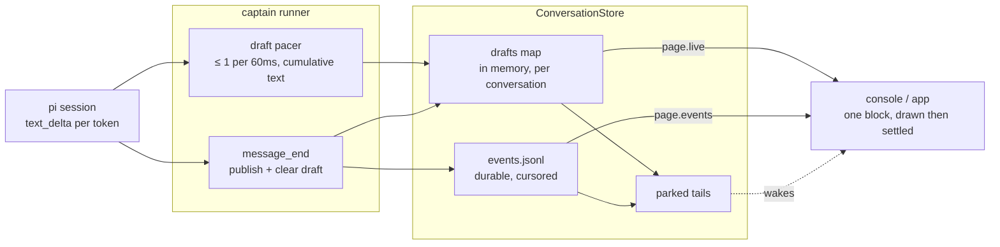

# 0141. The console watches him type

Accepted 2026-08-29.

## Context

The operator console showed a spinner for the whole of a turn and then the
whole answer at once. Pi streams: the captain's session subscription already
saw `text_delta` for every token and threw the text away, keeping only a
deduplicated `activity` phase — `Thinking…`, `Responding…` — for the loader.
The answer reached the transcript once, after `runDurableTurn` resolved.

Two things stood in the way of simply forwarding those deltas.

The tail is a **durable, replayable, multi-surface log**. Every event is a line
in `events.jsonl` with a cursor, and `replay` re-reads and re-parses that file
per request. Token-granular durable events would multiply the log by three
orders of magnitude, churn cursors, blow through retention trimming, and make
every surface pay to replay a message character by character. Streaming text is
not a record of what happened; it is a view of something that has not happened
yet.

The tail was also a **poll**: the client asked, and on an empty page slept
250ms. Even settled messages arrived up to a poll interval late, so no
publishing scheme could feel live through it.

A third problem was already there and would have become visible the moment
drafts rendered: only the _last_ assistant message of a turn was published.
`lastAssistantText` was overwritten at each `message_end`, so anything he said
before reaching for a tool — "let me check the config" — was dropped. A draft
that streamed and then vanished would have read as a bug.

## Decision

The captain's answer reaches watching surfaces twice: as a volatile draft while
he types it, and as the durable message that settles it.

- **A draft is volatile.** `ConversationStore.setLiveDraft` holds the message
  being typed in memory, per conversation, and it rides the tail page as an
  optional `live` field. It never enters `events.jsonl`, so replay, cursors,
  retention, and every surface that only wants the record are untouched. The
  text is cumulative, not a delta: a surface that misses a page still renders
  the right thing, and a dropped draft costs nothing.
- **The tail parks instead of polling.** A `tail` carrying `waitMs` waits for
  the next change to that conversation — a new event, or a draft the caller has
  not drawn (`liveSequence`) — up to the store's own cap. An idle conversation
  costs one request per wait window; a streaming one answers at the pace of the
  round trip. `replay` never waits, and a request without `waitMs` answers
  immediately, so nothing that has not asked to park can hang.
- **Drafts are paced, not throttled per token.** The captain emits at most one
  draft per 60ms — roughly sixteen frames a second, which reads as typing —
  and opens the gate again at each message boundary so a new message shows its
  first token at once.
- **Every message he finishes is published.** The durable `message` event moves
  from "after the turn, the last text" to "at each `message_end`, if it has
  text". The transcript now carries what he said before a tool call, in the
  order he said it, and each draft has a durable event that settles it.
- **The surface settles the draft in place.** The console draws a draft into a
  real transcript block from the first token; the settled message replaces that
  block's content rather than appending a second one. A draft that ends with no
  settled message behind it — an interrupted or failed turn — keeps the words he
  got out.

Thinking stays a loader phase. Streaming reasoning raises a separate question
about whether thinking belongs in durable history at all, and it is not
answered here.

## Consequences

- The console reads like pi's own: text appears as he writes it, tool blocks
  interleave where they actually happened, and the spinner is only for the
  parts where nothing is being said.
- The wire contract grew three optional fields (`live`, `liveSequence`,
  `waitMs`) and one tail item kind. A surface that ignores all of them behaves
  exactly as before, which is how the menu bar and local voice chat keep
  working unchanged.
- The parked request is bounded twice: by the caller's `waitMs`, capped at
  `OPERATOR_CONVERSATION_TAIL_WAIT_MS_MAX`, and by the store's own window,
  which sits under the relay's 30s upstream dispatch timeout. The dispatch
  contract takes an `AbortSignal` so a surface that goes away cancels its
  parked tail rather than stranding it.
- More durable `message` events per turn than before — a handful, not
  thousands. Retention math is unchanged in shape.
- A draft is per conversation, not per run. While a steered turn
  ([ADR 0091](0091-a-mid-turn-message-steers-the-turn.md)) has two runs in
  flight, the draft belongs to whichever is generating, and the last run to
  settle takes it down.
