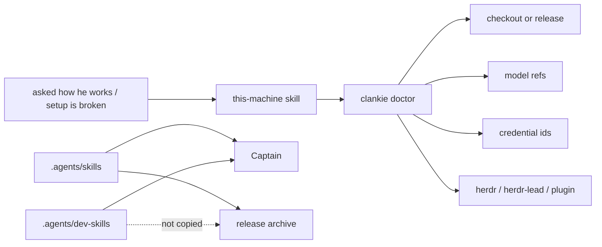

# 0142. The install tells him the truth

Accepted 2026-08-29. Applies the harness-truth principle from
[ADR 0072](0072-the-harness-tells-him-the-truth.md) to the machine he is
running on. Amends [ADR 0104](0104-clankie-works-where-you-launched-him.md)
(which skills the service root contributes) and
[ADR 0136](0136-a-release-is-one-command-and-one-runtime.md) (what a release
copies).

## Context

A checkout of this repository is an encyclopedia: ADRs, `AGENTS.md`, `pnpm`
scripts, and developer skills. An installed release is not. The captain still
loads skills from the service root, so James's Clankie could answer "how do
you work?" by reading `~/dev/clankie`. Another person's `curl | sh` install
got the same identity prompt, then three developer skills that told him to
`pnpm --filter` against a tree that is not there.

`instructions.md` already teaches him how to _act_. It is the wrong place for
an architecture dump: the social register refuses to mention his internals
unless asked, and every turn would pay for them.

## Decision

Live install facts come from a probe. Procedures for those facts come from a
bundled skill. Developer procedures stay in the checkout.

- **`clankie doctor`** reports this service root: `kind` (`checkout` vs
  `release`), version, model refs, Discord body flags, broker credential _ids_
  (never secrets), optional binaries, and whether the herdr plugin is bundled
  or linked. `ok` means the card was produced. Missing optional tools are
  facts, not failures. `clankie status` stays the process-liveness card.
- **`this-machine`** is the product skill. Load it when asked how he works, how
  to set him up, or why a body or credential is missing. It tells him to run
  doctor and believe it, that agents set up through the headless CLI
  (`docs/cli.md` at `repoRoot`; `clankie help` is the same index) while the
  person at the console uses TUI slash commands, and that the conversation
  workspace is not his body.
- **CLI contract.** `docs/cli.md` ships in the release so a `curl | sh`
  install can read the same flag/JSON/exit-code contract as a checkout. The
  rest of `docs/` does not.
- **Skill split.** `.agents/skills` ships with every install (`this-machine`,
  `trace-clankie`). `.agents/dev-skills` is checkout-only (`verify-clankie`,
  `release-clankie`). The captain and TUI catalog load both directories; a
  missing `dev-skills` directory is a no-op, which is the release case.
- **The herdr plugin is Clankie-owned** and copies into the release so
  `herdr plugin link <bundlePath>` works without a git tree. Herdr itself and
  `herdr-lead` remain optional external commands.

Do not put the ADR corpus or `architecture.md` in the always-on prompt. After
the fact, `trace-clankie` still names the XDG trails that exist on every
install.

## Alternatives considered

- **Always-on architecture in `instructions.md`.** Rejected: every social turn
  would carry it, and the register already says not to mention internals unless
  asked.
- **Ship the whole `docs/` tree.** Rejected: the operator needs the map of
  _this_ install, not 140 decision records. The one exception is
  `docs/cli.md`, the headless command contract both agents and humans need
  without a git tree.
- **`disable-model-invocation` on developer skills.** Rejected: James's
  checkout still needs to invoke them; the directory split encodes the
  audience without a runtime checkout detector.

## Consequences

- A release Clankie can set up and debug himself without a mirrored repo.
- `pnpm doctor` remains the checkout toolchain check; `clankie doctor` is the
  install card both audiences can run.
- A missing `herdr-lead` skill is an honest absence, not a playbook to invent.
