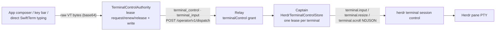

# 0144. The phone reaches into the pane

Accepted 2026-08-30.

## Context

ADR 0138 put read-only Herdr terminal truth on the operator relay and
explicitly deferred input: typing would use "Herdr's separate terminal
control session" behind "a renewable host-owned grant", and `terminalControl`
was fenced ungrantable at three layers (the `DeviceRecordSchema` refinement,
the pairing-complete 403, and the app's acceptance clamp). The operator can
watch a pane from the phone but cannot type into it; the only writes across
the boundary are message-granularity seat sends (`pane send-text` + Enter,
ADR 0135) and `close_seat`.

The app side is already shaped for input: `TerminalPane` drives a full
composer/key-bar/direct-typing stack through a transport-agnostic
`TerminalControlAuthority` (request/renew/release/write as an opaque lease),
previously reachable only from the mock host. Its writes are raw VT bytes —
arrows, Esc, control characters, base64-encoded — which the JSON CLI
(`pane send-text`/`send-keys`) cannot carry faithfully, and which
`herdr terminal session control` carries exactly (`terminal.input` with
base64 `bytes`), verified live against a scratch pane. That control session
is stock upstream CLI, so ADR 0139's vanilla-herdr rule holds.

## Decision

Terminal input rides the operator relay as two new dispatch ops gated on a
now-grantable `terminalControl`:

- **`terminal_control`** (`request` / `renew` / `release` / `resize` / `scroll`) manages one
  exclusive, renewable lease per terminal, owned by a `surfaceClientId`.
  The captain's `HerdrTerminalControlStore` mints an opaque lease token,
  spawns `herdr terminal session control <terminalId>` for the lease's
  lifetime, and kills it on release, expiry (45s TTL, renewable), process
  death, or shutdown. A second surface gets `contended` with the owner; the
  holder reclaims its own terminal with a plain `request` (fresh token). The
  echoed frame stream is drained and discarded — observation stays on
  ADR 0138's tail. A lease holder may request a bounded grid resize; the
  control session applies it and the holder's observer follows that grid so a
  device-width redraw wraps at readable zoom levels. A holder may also hand
  the pane a `scroll` its own history could not absorb (direction, lines,
  viewport cell); the captain writes it as Herdr's `terminal.scroll`, and the
  pane's terminal routes it by its real modes — wheel report, cursor keys, or
  pane scrollback — which no observer can see.
- **`terminal_input`** writes bounded canonical-base64 VT bytes (32 KiB max
  per write) under a live lease as one `terminal.input` NDJSON line on the
  control session's stdin. No byte interpretation happens anywhere in the
  boundary.

Both ops ride the plain `/operator/v1/dispatch` JSON path — input is
request/response, not a stream. The relay maps them to the `terminalControl`
grant (`terminal_control_grant_required` on 403) and keeps its rule of never
letting the device bearer past the relay.

The grant becomes real end to end: the schema refinement and the
pairing-complete 403 are gone, and pairing offers `TAKE_CONTROL_GRANTS`
(Supervise plus `terminalControl`). Pairing stays operator-initiated on the
Mac, and the phone's access review still accepts or narrows the offer, so
control is granted by the same human who owns the pane.

## Alternatives considered

- **Reuse `pane send-text` / `send-keys` per write.** Rejected: reverse-
  mapping raw bytes to text plus named keys is lossy for control sequences,
  bracketed paste, and escape sequences split across writes.
- **Stateless writes without a lease.** Rejected: the app's authority
  contract and status surface ("input busy on…") are lease-shaped, ADR 0138
  called for a renewable grant, and the lease bounds the lifetime of the
  spawned control session.
- **A dedicated streaming input route.** Rejected: keystroke writes are
  small and infrequent; the dispatch path already carries authenticated
  request/response with grant rechecks.

## Consequences

- A paired device holding `terminalControl` can type into any Herdr pane,
  including control characters — the same reach as sitting at the Mac.
  Revoking the device or declining the grant at pairing removes it.
- One controller subprocess exists per leased terminal (16 max), never
  outliving its lease; an idle lease dies in 45s and takes the subprocess
  with it.
- The lease arbitrates relay-side surfaces only; the Mac's own keyboard is
  never gated.
- A deliberate device zoom can temporarily reflow the shared pane while that
  device owns the lease. Observe-only surfaces keep the pane-authored grid and
  never attempt local reflow of cursor-addressed frames.
- Existing paired devices keep their narrower grants until re-paired.
