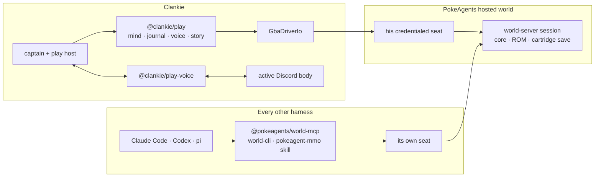

# ADR 0145: The world is the only body

Status: accepted (James, 2026-08-30). Supersedes the local-body half of
[ADR 0129](0129-each-player-owns-a-body.md) and retires
[ADR 0039](0039-gba-emulator-embodiment-and-deterministic-core-boundary.md),
[ADR 0040](0040-real-mgba-core-behind-the-emulator-seam.md), and
[ADR 0075](0075-rewinding-is-a-play-choice.md). The identity boundary ADR 0129
drew — no process possesses Clankie — stands unchanged; what changes is that
only one body remains to draw it around.

## Context

Clankie has carried two Pokémon bodies. The local one booted an mGBA core in
the service process; the hosted one is his separately credentialed seat in a
PokeAgents world. ADR 0129 kept both deliberately, because the hosted world
was young and a solo playthrough needed to work with nothing else running.

That reason has expired. PokeAgents now hosts real GBA cores server-side,
ships three derived front doors — MCP, CLI, and a harness skill, all generated
from `WORLD_OPERATIONS` — and runs a local world over a unix socket with one
command. `WORLD_PERSIST_PROGRESS=1` pairs the authenticated cartridge save with
mGBA's exact volatile state, which is what the local checkpoint store was for.

The evidence says he agreed first. Every play journal carrying body provenance
— all eleven, 2026-08-17 through 2026-08-19 — records `body: "world"`. There is
no journal of a local session in the provenance era. The local checkpoint store
last wrote on 2026-08-15, and the service log holds no `embodiment boot refused`
or `environment_unavailable` line, so the local body was not failing over. It
was simply never chosen.

Two bodies were not free. `@clankie/gba-emulator` was half emulator and half
play mind, so the hosted path imported a package named after the thing it does
not use. Every play decision carried a venue that always resolved one way. The
captain offered `pokeagent_start_solo` and `pokeagent_join_mmo` as a choice
Clankie never had a reason to make, and the prompt told him about save states
that the world does not give him and a console that "waits for you" — which a
hosted world does not do.

## Decision

**Clankie plays in a hosted PokeAgents world, and nowhere else.**

- The local emulator is gone: `integrations/gba-emulator` loses its core
  (mGBA, FireRed RAM maps, adapter, driver, scenarios, checkpoints, boot) and
  becomes `packages/play` — the mind, journal, voice, story, and journey that
  never depended on where the body was.
- `apps/gba-mcp` is gone. It offered coding harnesses a private emulator over
  MCP, which is what `@pokeagents/world-mcp` does properly, with real player
  identity and a real world behind it. PokeAgents ADR 0001 is right that no
  harness should get a private entrance, and that includes ours.
- `GbaDriverIo` survives as `packages/play/src/body-seam.ts`: one interface the
  world's seat implements, with no transport and no core behind it.
- The embodiment venue is gone from the live path. `EmbodimentVenueSchema`
  stays as the journal's record of which body ran, because journals on disk
  carry both values and must keep parsing.
- The captain has one play tool, `pokeagent_join_mmo`, gated by one owner
  setting, `pokeagentMmoEnabled`.
- Saving is the world's, through its own catalog and cartridge save. The loop
  holds no save, load, or restart action, and the prompt no longer offers them.

## Consequences

- Play needs a reachable world. A local one is `pokeagents start` plus a seat
  from `pokeagents invite`; `WORLD_ADDRESS` defaults to that world's unix
  socket. With no world, `pokeagent_join_mmo` refuses `world_unreachable` and
  says so out loud, which is the honest answer rather than a silent fallback.
- He cannot pause the game or rewind to a save state, because a hosted world
  cannot be paused and does not rewind. His notes, objective, and journey
  continuity still cross a sitting; only the cartridge decides where the world
  resumes.
- Agents that drove `clankie-gba` over MCP configure `@pokeagents/world-mcp`
  instead. They gain identity, multiplayer, travel, and watch links, and lose a
  private pause button.
- Coverage moved rather than shrank: the local round-trip suite is superseded
  by the hosted one in `apps/clankie/test/play-world.test.ts`, which runs the
  whole loop against a fake world body.
