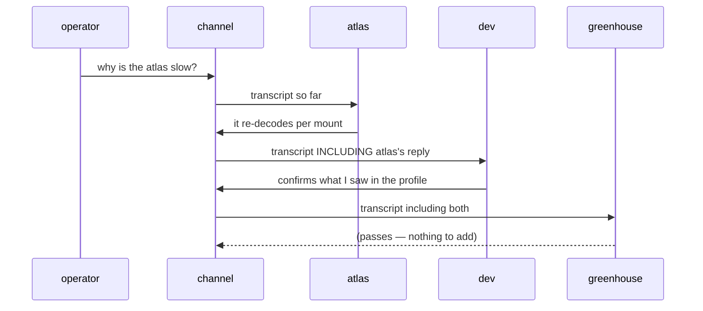

# ADR 0146: A channel is a conversation several seats share

Status: accepted (James, 2026-08-30). Extends
[ADR 0135](0135-a-herdr-seat-is-a-conversation.md) — a seat stays a
conversation; a channel is a conversation several seats share. Inherits the
Discord identity boundary from [ADR 0024](0024-discord-dual-plane-presence.md)
and [ADR 0048](0048-discord-user-session-transport.md). Built on 0135's native
harness transcript, which is how a member's reply reaches the round.

## Context

ADR 0135 gave every herdr seat a durable DM thread. The operator can talk to any
agent, and each agent can answer — but only ever one at a time, and only ever to
the operator. `OperatorConversationScopeSchema` is a closed union of `global`,
`workspace`, and `seat`, and `create()` takes exactly one scope, so a
conversation has exactly one counterpart by construction. There is no way for
three agents working the same problem to be in a room together, and no way for
one of them to read what another already said.

The fleet works in groups. Two agents in the same working directory, a reviewer
and the implementer it is reviewing, a lead and the workers it routes to — all
of it currently happens by the operator relaying messages between DM threads by
hand.

Two capabilities the operator asked for are missing in the same place. Reactions
do not exist on operator conversations at all. Neither does any group.

Both already exist in the Discord lane, fully modelled: channels, reactions,
`typing_start`, mentions, threads. Clankie participates in Discord with exactly
the semantics wanted here. What is missing is not a design — it is the same
model on the operator's own conversations, and a way to project it back out.

## Decision

### A channel is a scope

`OperatorConversationScopeSchema` gains a `channel` kind carrying a channel id.
Membership is a property of the channel record, not of the scope, so members can
join and leave without the conversation changing identity. One shared transcript:
every member reads all of it and writes into it, and the operator is a member
like any other participant.

A seat conversation is unchanged. A channel is not a new kind of thing — it is
the same conversation record with more than one counterpart.

### Replies are emergent, not routed

There is no reply policy. Each member reads the shared transcript and decides
for itself whether to answer, add something, or stay quiet — the same judgement a
person makes in a group DM. An agent that sees its point already made says
nothing.

That behaviour is only *possible* if replies are sequenced. Members prompted
simultaneously cannot see each other, so they would all answer at once, every
time, and the transcript would fill with three answers to every question. The
engineering problem here is turn-taking, not routing.

Members are therefore considered in order, each prompted with the transcript as
it stands at that moment — including a reply that landed a second earlier.
Passing is free and produces nothing visible: a member answers `PASS`, and a
member that is offline or silent passes for it.

The prompt a member is offered is one line, always. Herdr's `pane send-text`
writes raw bytes to the pty, so a newline inside the text lands as Enter and
submits a half-written prompt. Line breaks in the transcript are folded to a
separator on the way out.

The cost is N model calls per message even when most pass, and latency of N
turns. A reply lease is the intended optimisation once channels are real:
members evaluate in parallel, claim an exclusive lease to speak, and a loser
re-reads before deciding whether to add on. The relay already owns exactly that
lease shape from `terminal_control` (ADR 0144) — request/renew/release with a
typed `contended` outcome naming the holder — so it is a known pattern rather
than a new invention, and it doubles as the channel's typing indicator.

Sequential first because it produces the behaviour; the lease is a latency fix,
not a correctness one.

### Reactions become first-class

Reactions move out of the Discord lane onto conversation entries, with ops to
add and remove and stream events to carry them. Both the operator and agents may
react. An agent reaction is the cheap acknowledgement a transcript turn is too
expensive for — *seen*, *working on it*, *agreed* — and costs no model output.

A reaction is a side-record keyed by the entry's cursor, never a field on the
entry: entries are durable and append-only, reactions are mutable, and a
reaction arriving must not rewrite something already written. So a reaction is
its own event in the same log, an add or a removal, and the set standing on an
entry is the fold of those in cursor order. Replay, retention, and every tail
carry reactions for free, and no surface keeps a second copy that can drift.

### Discord is a second surface, not a second feature

A Clankie channel may be projected into a guild. It is the *same* conversation:
the same transcript, the same members, the same turn-taking. Discord renders and
participates; it does not own anything.

- **Reads** ride the existing bot gateway — one connection, already receiving
  messages, mentions, `typing_start`, and reactions. The bridge does not hold a
  copy of which guild channels are projected: a copy goes stale the moment a
  channel is projected, so it offers each message to the service and the service
  answers whether it took it. A message nothing is projected onto comes straight
  back, so a guild Clankie merely reads is unaffected by channels existing.
- **Who may speak** from Discord is decided on the bridge, which is the seat that
  knows who sent a message, and only the operator drives a round. A channel is a
  fan-out amplifier, so a guild member who can get an answer out of Clankie must
  not thereby get a turn out of every agent in a room; anyone else's message
  falls through to ordinary ingress, exactly as it did before the projection
  existed. Discord redelivers, so the round is keyed by message id and runs once.
- **Writes** ride a per-channel webhook, posting with a per-message `username`
  and `avatar_url` so each agent appears as itself. The operator's own messages
  are posted too when they were typed in the app — a room showing only the
  answers would be answering invisible questions — and not when they were typed
  in the guild, where they are already on screen.
- **Reactions** are performed by the bot, which already carries `react` and
  `unreact` in `DiscordCaptainActionInputSchema`.

Agent avatars come from the pixel variant the app already renders per harness,
so an agent wears the same face in Discord that it wears in the commons.

### Identity is webhooks, and this is not negotiable

Each agent appearing as its own Discord user must not mean a real user account
per agent. ADR 0048 already treats *one* automated user account as an accepted
ToS risk that is off by default; N of them is N violations, and the risk is the
account owner's. It must also not mean a bot application per agent — legitimate,
but a registration, a token, and an invite for every seat is exactly the
un-ergonomic setup this feature exists to avoid.

Webhooks give N apparent participants from one per-channel credential, entirely
within ToS, with nothing to register per agent.

Clankie makes the channel and its webhook himself, inside a guild the owner has
already approved. Anything less would put a trip through Discord's settings in
front of every room, and a feature whose point is that rooms are cheap to make
cannot cost that each time.

The grant this needs already exists. ADR 0133's fence is the **guild**
allowlist: an empty channel allowlist admits any channel inside an approved
guild, which is exactly the shape "make a channel here" requires, and a
provider with no guilds still grants nothing. Bot credentials stay in the
trusted runtime module — the service asks for a provisioned room and is handed
one, rather than holding the token that could make it (ADR 0024).

Pasting a webhook URL stays as the second path, for a channel the owner already
made or a guild where Clankie has no permission to create one. Either way the
host keeps the token half and the operator boundary carries only the webhook id,
so the credential that can post never leaves the machine.

The limitation is accepted deliberately: webhook posts carry a BOT tag, cannot
be DM'd, and have no presence. Inside a channel none of that is visible. Wanting
to DM an individual agent *in Discord* would need a real bot identity, and that
is a separate decision.

## Consequences

- The fleet can talk as a group, and the operator stops hand-relaying between DM
  threads.
- Channels cost N model calls per message under sequential turn-taking. That is
  the known price of the emergent behaviour, and the reply lease is the planned
  reduction. A channel with many members is expensive by construction, which is
  a reason to keep membership deliberate.
- Discord setup is provisioning inside a guild the owner already has — channels
  and webhooks created by Clankie — not guild creation, which bots may only do
  under narrow conditions. It needs `Manage Channels` and `Manage Webhooks` on
  the bot, and one designated home guild; more than one approved guild and no
  home guild set is refused rather than guessed at, because there is no right
  answer to which of the owner's servers a room belongs in.
- A channel is a fan-out amplifier for anything an agent can do. Membership is
  therefore an operator decision, never an agent one.
- The app renders channels natively; nothing about the app's rendering is
  privileged over Discord's, and neither surface may hold state the conversation
  does not.
- Altering a roster fans one message out to every seat in it, so the op that
  does it is a control action and rides the `steer` grant, not `chat`. Reading
  channels and reacting stay on `chat`.
- Membership arrives as the whole list the operator wants, in turn order, and
  the host reconciles it. Joining, leaving, and reordering are therefore one
  write rather than three ops that can disagree, and a member already in the
  room keeps the `joinedAt` it had.
- A projected channel costs one extra service call per inbound guild message,
  paid on the loopback hop the bridge already makes to hand Clankie a turn. That
  is the price of the bridge holding no projection state of its own, and it is
  the reason a channel can be projected without restarting anything.
