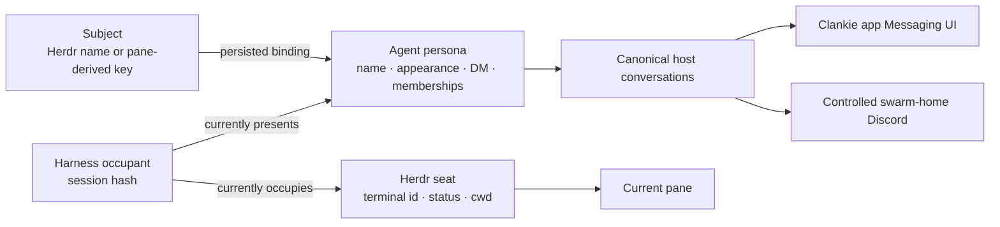

# ADR 0147: An agent persona outlives its Herdr seat

Status: accepted (James, 2026-08-30). Refines
[ADR 0135](0135-a-herdr-seat-is-a-conversation.md) and
[ADR 0146](0146-a-channel-is-a-conversation-several-seats-share.md).

## Context

Four identities meet in the fleet lane:

- a **subject** is the immutable managed-agent name that presents a character,
  or a stable pane-derived key for an unnamed agent in the selected session;
- a **persona** is the durable agent character the operator knows;
- a harness **occupant** is one resumable Claude, Codex, Pi, or other native
  session; and
- a Herdr **seat** is the terminal address that occupant currently uses.

Treating the seat as the character makes a pane move look like a new coworker,
makes closing a pane delete the apparent contact, and leaves Discord messages
named after terminal ids. Treating every Discord guild alike also lets a room
projection put the fleet into a server Clankie merely visits.

## Decision

The persona owns the agent's name, appearance, direct conversation, and channel
membership. A seat owns only live status, working directory, terminal access,
and routing to the current pane. Closing a seat removes the live binding and
keeps the persona and its conversations.

The host keeps three independent identity columns:

- the immutable **subject** is Herdr's managed-agent name, assigned when the
  operator hires the character; an unnamed agent uses a one-way hash of its
  pane id, which is stable for that seat and never confused with its occupant;
- the **persona id** is a random opaque id minted once and persisted against
  that subject; and
- the **occupant id** is a hash of Herdr's harness-native
  `agent_session { source, kind, value }` tuple.

A replacement harness session presenting the same managed subject therefore
occupies the existing persona. Moving either occupant or persona to another
terminal changes only the live binding. Changing a persona's display name does
not rename its immutable subject. The owner-selected Herdr session is the fleet
boundary (ADR 0149), so an unnamed agent inside it is also a character; its
pane-derived subject keeps the persona stable across service restarts while that
pane exists, but cannot claim to be the same character in a different pane.
Legacy seat-scoped conversations and channel members migrate in place when the
host first discovers their persona; the transcript is never copied or split.

Naming is not only a hiring act. `herdr agent rename` gives a name to an agent
the operator is already talking to, so the rename re-keys that character from
its pane-derived subject to the name and adopts the name as the persona's
display name. Only the rename itself adopts it; a later name chosen in the app
survives every census after. Herdr names are free-form and a subject is a
persisted key, so the host slugs the name deterministically — the same name
always recovers the same character — and a name with nothing to slug leaves the
seat on its pane-derived subject rather than writing a record the store cannot
read back.

`personas.json` is the host-owned identity record. The app edits that record
through `update_persona`; it does not keep a second persona store. The app and
Discord both render names and appearances from the same record, and both read
the same host conversation logs. Its persisted subject binding updates the
occupant column when a replacement session appears; persona ids are never
derived from credentials, sessions, panes, or display names. Version-1
session-derived records are retained only by the one-time state migration so
their existing conversations and avatar files remain addressable.

Appearance identity is the full `variant × accessory × shape` tuple. Gold is
reserved for the operator, leaving six agent variants; accessories and shapes
expand the default space and remain durable when the persona moves. The app
bakes the exact deterministic face it renders into a PNG. The host validates
the PNG, hashes its bytes, and publishes a content-hashed HTTPS URL through the
existing Activity server and `activityTunnelHostname`. Discord fetches that
URL server-side, so data URIs and local paths never enter the contract.

Discord projection remains available only in `swarmGuildId`, the server
Clankie controls. Ingress, presence, voice, and ordinary conversation in other
allowlisted guilds describe Clankie inhabiting them and confer no connection to
his fleet.

## Alternatives considered

- **Use terminal id as character id.** Rejected: a terminal is an address, and
  moving or closing it must not replace or delete the person using it.
- **Derive persona id from the harness session.** Rejected: a restart rotates
  the occupant and would orphan the character precisely when persistence is
  needed.
- **Keep personas in the app.** Rejected: Discord and every other surface would
  gain a competing source of truth.
- **Give every agent a bot or user account.** Rejected: one webhook already
  supports per-message names and avatars without per-agent credentials.
- **Serve a data URI or local asset path.** Rejected: Discord fetches webhook
  avatars from publicly reachable HTTPS URLs.

## Consequences

- Offline agents remain in Messages with their history; only their terminal
  action and live body disappear.
- A persona can move between panes without changing its DM or channel identity.
- A managed agent restart changes its occupant id and retains its persona id.
- Every agent in the owner-selected Herdr session appears in the fleet. Naming
  one gives it a rebinding key that follows it to another pane; an unnamed
  agent's persona stays tied to its current pane.
- Renaming a seated agent in Herdr is visible in Messages as that contact taking
  the new name, with its conversation intact — not as the contact going offline
  beside a new one named after a terminal title.
- The app is responsible for rendering proprietary skin art; the public host
  stores only semantic appearance fields and baked PNG bytes.
- Content-hashed filenames make Discord avatar changes immediate despite its
  server-side cache.
