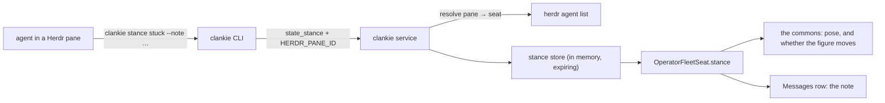

# ADR 0148: An agent moves its own figure

Status: accepted (James, 2026-08-30). Builds on
[ADR 0135](0135-a-herdr-seat-is-a-conversation.md) and
[ADR 0147](0147-an-agent-persona-outlives-its-herdr-seat.md). The app-side half
is clankie-app's ADR 0025 (the agent drives its own figure), which this ADR is
the host contract for.

## Context

The commons draws every fleet agent as a figure, and until now everything those
figures did was _observed about_ them: Herdr's pane status chose the pose, the
working directory chose where they stood, and the herd lead's written summary
chose the caption. Nothing an agent did with its own body was its own.

That gap is not cosmetic. There is a model behind each of those figures, and
the surface built to show the fleet as a household showed it as a readout. The
same agent that can write a file, take a lease on a terminal, and talk in a
channel could not say _I am stuck on this build_ in the one place its operator
is actually looking.

The ops that already exist are deliberately operator-only: `channel` and
`spawn_seat` carry the note that an agent that can hire is an agent that can
multiply itself, and `react` routes through the captain because that is the
boundary that can vouch for which seat is reacting. Both of those are about
authority. An agent describing itself is not.

## Decision

Add one agent-reachable op, `state_stance`. An agent says what it is doing —
`working`, `thinking`, `stuck`, `hauling`, `resting` — with an optional note in
its own words and a deadline. The seat carries the standing stance
(`OperatorFleetSeat.stance`), so every surface that already reads the roster
gets it with no new subscription.

Three properties make an agent-reachable op safe here, and they are the ones to
check before any second one is added.

**It names no seat.** The request carries the Herdr pane the caller is sitting
in, and the service resolves that to a seat against the live census
(`readSeatIdForHerdrPane`). Identity is checked, never claimed: the only figure
a caller can move is the one it occupies. A pane holding no seat gets
`unseated`, which is an ordinary answer for a shell pane rather than an error,
and nothing is recorded on that path.

That property only holds for a caller that reads its own environment, so the op
stays on the local door: the relay refuses it rather than mapping it to a device
grant. A phone typing a pane id is not a pane making a claim about itself.

**It expires.** A stance is a live statement, not a fact. It is held in memory,
clamped to an hour, and a lapsed one is simply absent from the seat — so no
surface has to reason about staleness, a restart forgets, and a figure falls
back to describing itself by what its pane is observed to be doing. There is no
fold here that can keep running over a feed that stopped, which is the failure
the app's ADR 0022 exists to prevent.

**It is sayable.** The note rides the seat into every list, so what the room
draws, Messages prints. This is the app's accessible-twin rule (its ADR 0015)
holding across the host boundary rather than being satisfied only inside the
app.

The agent's own shell is the channel. It has one already, the way it has one for
`git` and for `herdr`, and adding an MCP server or a captain round trip to carry
five words would put a model in the path of a statement about the model. The
captain credential the CLI brokers is local to the machine the agent is already
running on, so the door is no wider than the shell it is called from.

### What a stance does not do

It does not raise attention. The alert ring and glyph stay roster-driven, so an
agent cannot put itself into the operator's alert channel by saying it is stuck
— the room shows it standing still, which is what standing still means.

It does not move a figure anywhere. Poses are meanings and the app owns the art;
travel — walking to another figure, to a district, to a landmark — is not in
this contract. The pose vocabulary is the seam to widen when it is.

## Alternatives considered

**A captain tool.** Clankie already has a tool bank, and `herdr_watch` shows the
shape. But it would make one agent's self-description pass through another
agent's turn, which costs a model call, adds a place for it to be rewritten, and
makes the captain the author of a statement he did not make.

**Writing it into the seat summary.** The herd lead already writes summaries, so
the field exists. It is the wrong field: a summary is written _about_ a seat by
someone else, has no deadline, and cannot be told apart from an observation once
it is stored. Conflating the two would make the roster unable to say who said
what.

**An operator-only op the app calls on the agent's behalf.** That is the status
quo with extra steps — the operator's surface would be inventing the agent's
statements.

## Consequences

- The fleet gains a voice in the one surface that was purely observational, at
  the cost of one op, one in-memory store, and one CLI noun.
- `state_stance` is the first op meant to be called from the agent side. The
  three properties above are the bar for the second one; an op that names its
  own subject does not clear it.
- An agent has to know it has a figure. The op is reachable, and the CLI's help
  says so, but nothing yet prompts an agent to use it — that belongs in agent
  instructions, not in the protocol.
