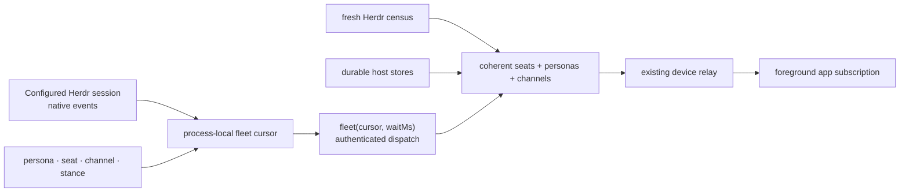

# ADR 0150: The fleet is a live cursor

Status: accepted (James, 2026-08-30). Extends [ADR 0135](0135-a-herdr-seat-is-a-conversation.md)
and [ADR 0149](0149-his-herdr-session-is-chosen-not-inherited.md) without adding
a service, route family, or second fleet projection.

## Context

The `roster`, `personas`, and `channels` dispatch operations are truthful reads,
but a phone that repeats them on a timer can miss an entire short agent turn.
Reading the three operations separately can also join records from different
moments. Herdr already publishes workspace, tab, pane, and agent-status changes
on the configured session socket, so another polling daemon or persisted world
model duplicates an authority that already exists.

## Decision

The captain holds one process-local fleet cursor. It advances on Herdr's native
event subscription, a herd-lead summary-file change, and every captain-owned
mutation that changes a persona, seat, channel, or agent stance. A stance expiry
also advances it at the expiry boundary.

The ordinary authenticated operator dispatch accepts `fleet { cursor?, waitMs? }`.
An absent or old cursor returns immediately. A current cursor parks for at most
30 seconds, then returns one coherent snapshot containing the new cursor,
current seats, durable personas, and channels. Snapshot construction rereads if
the cursor changes mid-read; the result never splices two fleet moments.

The cursor is volatile and opaque. Its instance component changes when the
service restarts, which makes every parked or returning client re-read. The
snapshot remains derived from Herdr and the durable host stores; no event is
folded into a second world model.

The app holds one abortable request only while foregrounded. A cursor change
updates every fleet surface from the same snapshot. If the live operation is
temporarily unavailable during an upgrade or transport failure, the app clears
live seats and falls back to the older five-second reads until the cursor lane
recovers; durable personas and channels remain visible.

## Rejected alternatives

- **Keep the five-second roster poll.** It still misses work shorter than its
  interval and spends requests while nothing changes.
- **Add a fleet WebSocket or bridge.** The existing dispatch already supports
  bounded long polls, authentication, cancellation, and the remote relay.
- **Project Herdr events into durable app state.** The Commons is a view of the
  live fleet, not a simulated world; a second projection can drift and survive
  after its source disappears.

## Consequences

- Messages, Commons, terminal signals, and chat headers change on the same
  Herdr event and cannot observe different roster/persona/channel moments.
- The configured Herdr session is the only fleet source. With the default
  setting, every agent in Herdr's `default` session is included across all of
  its workspaces, including unnamed ad-hoc agents whose durable fallback subject
  is derived from their pane rather than their rotating harness session.
- A down session or device link removes live bodies instead of animating stale
  agents. Durable contacts and conversations remain available offline.
- Existing hosts and rolling deployments continue through the bounded polling
  fallback; no second compatibility route exists.
