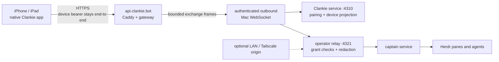

# ADR 0151: The public doorway routes home

Status: accepted (James, 2026-08-31), with manual host enrollment amended by
[ADR 0153](0153-an-account-signs-the-mac-in.md). Extends
[ADR 0138](0138-terminal-truth-rides-the-operator-relay.md) and
[ADR 0144](0144-the-phone-reaches-into-the-pane.md) without moving device
authority, conversations, terminal sessions, or Herdr state off the Mac.

## Context

The phone currently reaches one operator's Mac through a build-authored or
host-advertised origin. A Tailscale tailnet is an excellent private carrier,
but it makes another installed app, one tailnet membership, and one machine's
MagicDNS name part of the ordinary iOS product. Tailscale Funnel removes the
phone's tailnet requirement, but it remains a per-host beta service with a
tailnet domain, fixed public ports, and non-configurable bandwidth limits.
Neither is the stable public doorway a generally distributed App Store binary
needs.

The existing authority boundaries are already correct. The Clankie service
mints and redeems one-time pairing offers, owns the durable device projection,
and signs device sessions. The relay validates that live projection and its
grants on every operator request and between tail pages. It sends its own
captain credential upstream; the device credential never becomes a captain
credential. Terminal observation and control are operations on that same
bounded relay, not a second remote-access authority.

The public path must therefore reach those boundaries without reimplementing
them in a cloud account, opening an inbound Mac port, or turning the cloud into
Clankie's body.

## Decision

`https://api.clankie.bot` is the ordinary public origin. One gateway process
runs on a 1 GB AWS Lightsail Linux instance behind Caddy. Every configured Mac
opens one authenticated outbound WebSocket to it and multiplexes bounded HTTP
exchanges over that connection.

The routing domain has four explicit shapes:

- **Host route:** one opaque `hostId` bound to one currently authenticated Mac
  connection. A replacement connection closes the old one.
- **Pairing route:** the SHA-256 hash of one short-lived offer secret or
  normalized typed code, bound to the offer's `hostId` and expiry. The gateway
  retains no raw offer capability.
- **Exchange:** one `requestId`, target (`control` or `relay`), HTTP method,
  relative path, bounded public headers, and bounded body. The Mac returns one
  response start, zero or more bounded body chunks, and one response end.
- **Cancellation:** either side can close one exchange without affecting the
  host connection or its other in-flight requests.

An initial `POST /v1/pairing/redeem` is routed by the registered hash of the
presented offer capability. Its response supplies the host-specific gateway
origin, `https://api.clankie.bot/h/{hostId}`. Pairing completion, device restore
and refresh, operator dispatch, conversation tails, and terminal tails use
that origin. The gateway strips the host prefix and forwards only the explicit
public route allowlist to the local control or relay target.

The app persists the host-specific control and relay origins with the existing
Keychain-backed device session. A release build starts at the stable public
origin. A development build or an operator-selected advanced configuration may
still use a direct LAN, Tailscale, Funnel, or other HTTPS origin; direct access
is a transport choice, never authorization.

The gateway does not mint device sessions, evaluate grants, interpret operator
operations, or retain response bodies. It logs bounded route, host, request,
status, byte-count, duration, and disconnect metadata only. It never logs
authorization headers, pairing capabilities, message bodies, terminal bytes,
or response bodies. Requests use TLS from the Apple device to Caddy and the Mac
uses TLS for its outbound connection. The first deployment is content-oblivious
but not cryptographically blind because public TLS terminates on the gateway
instance; application-layer device-to-Mac encryption is the gate before the
service becomes multi-tenant.

The first deployment runs one gateway process and keeps live host connections
and expiring pairing hashes in process memory. A process replacement drops only
volatile routes: Macs reconnect, new pairing offers register again, and
already paired devices retry against the restored host route. Horizontal
gateway scale adds an external connection broker only when a second process is
required; durable Clankie or device state never moves into that broker.

## AWS shape

- Cloudflare owns authoritative DNS for `clankie.bot`; a DNS-only A record maps
  `api.clankie.bot` to one attached Lightsail static IPv4 address.
- One 1 GB Amazon Linux 2023 Lightsail instance runs Caddy and the existing
  gateway container. Caddy obtains and renews the public certificate and
  carries HTTP and WebSocket traffic without changing the application
  contract.
- The gateway keeps its strict health route, bounded WebSocket payloads,
  bounded concurrent exchanges, and idle heartbeat.
- A root-owned, group-readable host-token file is mounted read-only into the
  unprivileged gateway container. Tokens never enter CloudFormation, source
  control, the image, process environment, `docker inspect`, or logs.
- Docker applies bounded local log rotation. Lightsail supplies host metrics;
  metadata-only application logs stay on the instance for the first beta.

## Deployment control plane

The public data plane and private deployment plane are separate. Ports 80 and
443 remain public; Lightsail's public port 22 rule exists only for bootstrap.
The host joins Tailscale as `tag:clankie-gateway` with Tailscale SSH enabled,
then public SSH closes.

GitHub release runners join through Tailscale workload identity federation as
short-lived `tag:clankie-deployer` nodes. Tailnet policy grants that tag only
TCP 22 to the gateway and only the `clankie-deploy` SSH account. The account's
only passwordless root command is a root-owned release activator. The activator
validates the uploaded release shape and ownership, validates the pinned Caddy
configuration, verifies the host-token file boundary, health-checks the new
gateway, and restores the previous component on startup failure. GitHub stores
neither an AWS credential nor a reusable SSH private key.

The tagged release workflow builds and tests first, deploys through a protected
GitHub `production` environment, verifies the public health endpoint, and only
then publishes the GitHub Release. Pushes to `main` remain CI-only.

AWS IoT Secure Tunneling is not this product boundary. It is an operator-opened
source/destination proxy whose current multiplexing contract supports at most
three data streams and requires access tokens and local proxies on both ends.
API Gateway WebSockets are also not the carrier: their fixed 32 KiB frame,
128 KiB message, ten-minute idle, two-hour connection, and 29-second
integration limits add chunking and reconnect semantics below a relay that
already owns bounded streaming. A plain Caddy reverse proxy carries the
existing HTTP and WebSocket semantics directly.

## App Store boundary

The public gateway makes a review host and sample pairing QR reachable without
requiring the reviewer to join a tailnet. It does not decide whether Apple
classifies the native terminal as a specific-software remote desktop under
Guideline 4.2.7. Review metadata presents Clankie as the native client for a
user-owned local agent system, with terminal access as one ancillary surface.
If App Review requires LAN-only terminal access, chat, fleet, missions, and
agent control continue through the public gateway while terminal observation
and control select the direct local transport. The product does not hide or
remotely enable a review-rejected path.

App Review receives an always-online review Mac, a fresh sample QR or typed
code, complete setup notes, and live backend access for every submitted
feature.

## Alternatives considered

- **Make direct Tailscale membership the product default.** Rejected: it is an
  excellent operator path, but another iOS app, tailnet identity, and one
  private DNS namespace should not be prerequisites for the public binary.
- **Use Tailscale Funnel as the permanent public edge.** Rejected as the
  general product path because every host owns a beta, tailnet-scoped endpoint
  and its setup policy. It remains useful for development and review drills.
- **Run Clankie in AWS.** Rejected: the user's Mac owns his files, credentials,
  agent seats, terminal processes, and authority. Cloud hosting the body would
  be another product and would conflict with the existing trust model.
- **Put pairing and device authorization in AWS.** Rejected: it duplicates the
  durable device projection and makes revocation depend on two authorities.
- **Add a second mobile protocol for the cloud path.** Rejected: the gateway
  transports the existing strict control and relay HTTP contracts. Direct and
  public paths differ only in origin and carrier.

## Consequences

- One App Store binary reaches any enrolled Mac through one stable HTTPS
  origin without opening an inbound port.
- Existing pairing, revocation, grants, redaction, replay, fleet cursors,
  terminal observation, and terminal-control leases remain authoritative.
- Tailscale remains available for development, private direct access, and a
  fail-independent advanced path. It also carries operator and release access
  to the gateway without exposing SSH publicly.
- An AWS outage removes remote reachability but does not stop Clankie, local
  operator surfaces, or direct transport. Reconnect and cursor recovery repair
  the public path without inventing cloud-owned conversation state.
- A single instance and process are the deliberate initial availability and
  scale ceiling. Horizontal routing arrives with measured demand and requires an external
  live-connection broker, not a migration of Clankie state.
- App Review and a small invited paid beta fit this boundary. Automatic public
  host enrollment and application-layer end-to-end encryption arrive before
  unrelated customers share it.
- Metadata-only logging and no content retention keep the gateway's privacy
  surface small. Application-layer end-to-end encryption remains required
  before unrelated customers share the service.

## Primary platform references

- [AWS IoT Secure Tunneling local proxy](https://docs.aws.amazon.com/iot/latest/developerguide/local-proxy.html)
- [AWS IoT Secure Tunneling multiplexing](https://docs.aws.amazon.com/iot/latest/developerguide/multiplexing-multiple-streams.html)
- [API Gateway WebSocket quotas](https://docs.aws.amazon.com/apigateway/latest/developerguide/apigateway-execution-service-websocket-limits-table.html)
- [Lightsail instance bundles](https://docs.aws.amazon.com/lightsail/latest/userguide/amazon-lightsail-bundles.html)
- [Lightsail instance CloudFormation resource](https://docs.aws.amazon.com/AWSCloudFormation/latest/TemplateReference/aws-resource-lightsail-instance.html)
- [Caddy automatic HTTPS](https://caddyserver.com/docs/automatic-https)
- [Caddy reverse proxy](https://caddyserver.com/docs/caddyfile/directives/reverse_proxy)
- [Tailscale Funnel requirements and limitations](https://tailscale.com/docs/features/tailscale-funnel)
- [Apple App Review Guidelines](https://developer.apple.com/app-store/review/guidelines/)
