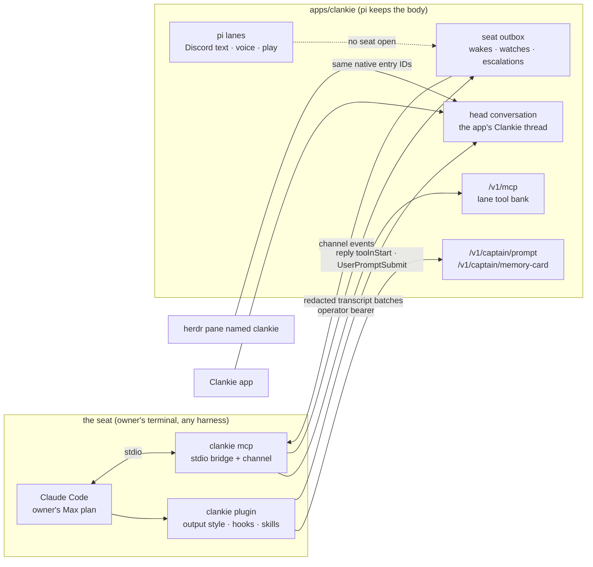

# 0152. A harness takes the operator seat

Status: proposed (2026-09-01), for James to accept with the first seated
session. Amends [ADR 0101](0101-pi-owns-the-captain-model-runtime.md) (pi owns
the model runtime for the pi lanes, not for the seat). Extends
[ADR 0135](0135-a-herdr-seat-is-a-conversation.md),
[ADR 0147](0147-an-agent-persona-outlives-its-herdr-seat.md), and
[ADR 0149](0149-his-herdr-session-is-chosen-not-inherited.md) (the seat, the
persona, the chosen herdr session). Stands on
[ADR 0129](0129-each-player-owns-a-body.md) (no process possesses Clankie) and
[ADR 0124](0124-one-self-has-many-local-threads.md) (one self, many local
threads); neither boundary moves.

## Context

The operator seat is where the owner talks to Clankie. Today it is the TUI's
operator lane: one durable pi session with his persona, his authored tool bank,
the memory card injected per run, and his skills. That session runs on
whichever model `clankie model` names, billed per token.

The owner also has Claude Code on a Max plan, an interactive harness whose
plan covers their own use and nobody else's. The Claude Agent SDK only spawns
the same `claude` binary in print mode, and its terms forbid offering a
[claude.ai](https://claude.ai) login or its rate limits to other people, so the
plan can carry the owner's seat and can never carry Discord, voice, or play.

The seat should not be welded to one harness. Every part of what makes the seat
his — persona, tools, memory, skills, the head the app pins — is already owned
by the service. What is missing is a seam through which any harness can take
that seat without the service knowing which one sat down.

## Decision

The primary operator seat is the TUI over Clankie's persistent pi lead. An
optional harness seat lets the owner talk to the same Clankie through Claude
Code on the owner's plan. pi keeps the body and every social lane. Choosing
Claude Code or Codex for a fleet worker does not select this alternative seat.

- **Vocabulary.** The **seat** is where the operator talks to him. The **head**
  is the seat's conversation, the one the app pins as Clankie. A **lane** is one
  durable session with its own tool authority (operator, a Discord text room, a
  voice room, a one-shot). A **harness** is the agent program in the seat.
  Rooms are lanes, never subagents, and no harness possesses him.
- **The tool bank over MCP is the seam.** The service serves each lane's
  authored tool bank as a streamable-HTTP MCP endpoint, `/v1/mcp`. The bearer
  selects the lane: the operator credential (or the console's captain token) is
  the operator lane, a Discord bridge bearer is its own social lane. The bank is
  the same registry the pi session is built from, wrapped once at runtime, so
  the tool list a connection sees is that lane's authority plan and never a
  second catalog. Each connection gets its own turn context; media a tool
  attaches rides the result the way it rides a pi reply. Operator-lane calls
  attribute to the selected conversation (the global head by default), so `remember_episode`, `schedule_wake`,
  and `herdr_watch` land where a pi turn would have landed them.
- **The prompt and the memory card are readable headlessly.** `clankie prompt`
  prints the sections a pi session starts from (identity, persona, reach, fleet preferences,
  address; the model card on request), and `clankie memory-card` prints the
  card the next pi run would inject, filtered by lane so operator-private notes
  never leave the operator lane. Both take `--lane`. One assembly serves the pi
  session and these reads.
- **The seat ships as a Claude Code plugin** at `integrations/claude-plugin`,
  beside the herdr plugin and under its rule: a plugin carries only what a
  plugin can uniquely declare. That is the output style holding his identity
  (forced on while the plugin is enabled, coding instructions left out), a
  `SessionStart` hook that injects persona, reach, fleet preferences, address, and the service
  model card, a `UserPromptSubmit` hook that injects the newest memory card, one
  stdio MCP entry (`clankie mcp`, a bridge to `/v1/mcp` that reads the operator
  bearer from the broker so no secret lands in a config file), and his product
  skills linked from `.agents/skills`. `clankie seat` is the launcher: it checks
  the plugin, passes the permission allowlist for `clankie` commands and the
  channel development flag (the two things a plugin cannot carry), enables the
  plugin for its own session only (a forced output style applies wherever the
  plugin is enabled, so it stays disabled at user scope), names an unselected
  global seat's Herdr pane `clankie`, and starts Claude Code. Codex is not a Claude plugin;
  it takes the same `clankie mcp` over stdio and the same skills directory.
- **The seated pane is his head.** A herdr agent named `clankie` is never a
  fleet contact: the census binds it to Clankie's own persona, and its Claude
  Code transcript projects into the head conversation the app pins, through
  the same seat projection that feeds every persona thread. One head at a
  time: the newest seat wins, a second pane claiming the name stays an ordinary
  fleet agent with a warning, and the TUI operator lane is the head again the
  moment no seat is open.
- **Seats bind a service conversation.** `--conversation ID` selects an existing
  global/workspace conversation and its working directory; resume retains that
  binding. Prompt assembly loads its workspace instructions, MCP sessions pin
  its tools/Swarm actor, and polls/replies use its own outbox. See
  [ADR 0181](0181-clankie-is-independent-of-his-connections.md) for the connection
  and working-preference contract. Project seats do not claim the global Herdr
  head name. Native plugin hooks run `clankie seat-sync` on the Claude host;
  authenticated, redacted display records append to `/v1/seat/transcript` for the
  selected conversation. The service pins each native session to one conversation,
  rejects a conflicting selection, and deduplicates native entry IDs across
  retries, restarts and overlapping Herdr observations. Host image paths do not
  cross this endpoint. The launcher session ID excludes inherited child sessions.
  This projection also works with `--plugin-dir` and outside Herdr.
- **Wakes and escalations follow their conversation.** Self-wakes, completion
  watches, Linear activity and human sends reach a bound seat through that
  conversation's outbox. Linear activity uses a wake after issue-owner routing;
  its provider content remains untrusted and carries no new authority.
  A `reply` tool returns escalation responses to the same conversation. A bridge
  polls only when its Claude channel is loaded; otherwise the service runs the
  turn. Goal continuations stay with their Pi loop. The operator's
  bearer authenticates this outbox; room text remains untrusted context.
- **Models.** ADR 0101 now reads: pi owns the model runtime for the pi lanes.
  The seat runs on its harness's own model. `clankie model` changes the service
  lanes; Claude Code's `/model` changes the seat, and the prompt says which is
  which.

## Options weighed

- **A headless Claude Code driver through the Agent SDK for every lane.**
  Rejected. The SDK only wraps the interactive binary in print mode, so it is
  the same plan and the same terms: a social lane served this way would put
  other people on the owner's consumer plan, which the terms forbid. Social
  lanes stay on pi.
- **Possession over MCP.** Rejected; ADR 0129 stands. A harness in the seat
  sits where the TUI sits, under the same lane and authority, and nothing
  reaches his body from outside. The MCP endpoint hands out his tools to the
  seat; it does not hand out him.
- **One session with rooms as subagents.** Rejected; ADR 0124 stands. Rooms
  would serialize behind one conversation, share one trust boundary, and lose
  their own memory the moment the subagent ended. Each room keeps its lane.
- **Keep the seat on pi and switch the pi lane to an Anthropic subscription
  token.** Not this decision. The service's Anthropic OAuth flow is
  [VUH-1088](https://linear.app/vuhlp/issue/VUH-1088)'s to keep or remove;
  until that lands, ADR 0052's Anthropic note describes the flow as it is
  written, and this record names the Claude Code seat as the way the owner's
  plan carries his own turns.

## Consequences

- The owner's own turns run on the plan they already pay for; every other
  room keeps costing what it costs today, on pi.
- The seat is harness-agnostic by construction: a Codex pane with the same
  `clankie mcp` entry and skills directory is the same seat.
- Two heads can never answer at once. The pi operator lane still exists for
  the phone, the menu bar, and any console without a seat; while a seat is
  bound, its conversation's wakes, watches, Linear activity and human sends
  reach it. Running Linear hooks in Pi alongside that seat would split ownership
  of the same work, so they use the existing outbox. Goal continuations remain
  with their Pi loop.
- Channels are a research preview, so `clankie seat` passes the development
  flag per entry and Claude Code prompts once; the seat is owner-only until the
  preview ends.
- The app's Clankie thread shows the seat's settled turns; live drafts do not
  cross, because a Claude Code transcript holds settled turns only.
