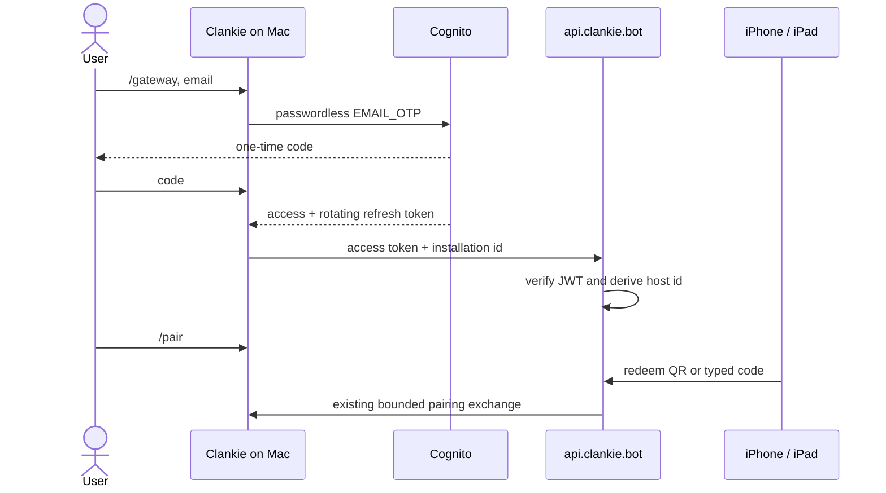

# ADR 0153: An account signs the Mac in

Status: accepted (James, 2026-09-01). Amends the manual host-token enrollment
in [ADR 0151](0151-the-public-doorway-routes-home.md); the public doorway,
device authority, and Mac-owned Clankie boundaries remain unchanged.

## Context

The first gateway deployment binds a hand-made host id to a bearer copied into
the Mac Keychain and the gateway host. That proves the transport, but it is not
a product journey: every tester needs operator intervention, rotation requires
a coordinated restart, and another Mac creates another secret to distribute.

The ordinary journey needs to identify a user, bind each Mac installation to
that account without granting AWS or gateway administration, survive access
token expiry and login, and retain the existing `/pair` phone flow. The gateway
does not need a customer database merely to validate that identity.

## Decision

One Amazon Cognito Essentials user pool is Clankie's account authority. Its
public client requests passwordless `EMAIL_OTP`; it has no client secret,
hosted UI, or social provider. Cognito currently requires `PASSWORD` to appear
beside `EMAIL_OTP` when the pool is created, but Clankie creates every user
without a password and never presents or requests the password challenge.
During the invited beta, self-sign-up is disabled and an operator adds allowed
email addresses. Opening signup later changes the same pool flag, not the client
or gateway protocol.

The Mac discovers the non-secret Cognito endpoint, issuer, client id, and signup
mode from `GET /gateway/v1/config`. `/gateway` asks for an email, completes the
one-time email challenge, stores the access and rotating refresh token in the
existing Keychain credential broker, creates one random installation id, and
restarts the connector. It then tells the user to run the unchanged `/pair`
flow. `clankie autostart enable` installs a per-user LaunchAgent so the existing
supervisor starts Clankie and its relay after login.



An installation's public host id is deterministic:

```text
base64url(sha256("clankie-host-v1\0" + cognito-sub + "\0" + installation-id))
```

The Mac and gateway compute it independently. The gateway verifies the Cognito
RS256 access JWT against the issuer's JWKS and requires the exact issuer, client
id, `token_use=access`, signing key, signature, and time claims. It accepts the
derived host id only when it matches the authenticated subject and presented
installation id. There is no host registry or enrollment database.

Access tokens last one hour. The Mac refreshes within five minutes of expiry,
persists Cognito's rotated refresh token, and reconnects the WebSocket; the
gateway closes a connection at token expiry as a backstop. Refresh tokens last
90 days. Disabling a Cognito user revokes the account across its installations;
each installation still has a distinct route identity.

The Cognito stack is separate from the Lightsail stack. The gateway continues
to accept the original static host token during migration, so deploying account
support cannot strand the existing review Mac. Tailscale remains only the
private operator and release path to the gateway host.

## Alternatives considered

- **Keep manual bearer enrollment.** Rejected because operator-mediated setup
  is not acceptable user onboarding and rotation couples two machines.
- **Add a gateway-owned user and host database.** Rejected because Cognito can
  issue and verify identity while the installation-derived route removes the
  only proposed registry lookup.
- **Use Cognito Hosted UI or a browser callback.** Rejected because email OTP is
  native in the existing TUI and does not need a redirect scheme, domain, or
  browser session.
- **Make Tailscale identity the customer account.** Rejected because Tailscale
  is the deployment plane, not an App Store dependency.

## Consequences and ceilings

- An invited tester can configure the Mac with an email and one code, then pair
  the phone without AWS, SSH, Tailscale, URLs, host ids, or bearer tokens.
- Cognito owns account identity and account-wide disable; Clankie on the Mac
  still owns devices, grants, conversations, terminals, and model credentials.
- Cognito email OTP requires a verified Amazon SES sender. SES production
  access is required before an unverified tester address can receive a code.
- Account disable is intentionally account-wide. Per-installation remote
  revocation requires a persisted installation registry if the product later
  needs it.
- This removes the automatic-enrollment launch gap. ADR 0151's application-layer
  device-to-Mac encryption gate still remains before unrelated customers share
  the public gateway.

## Primary platform references

- [Cognito passwordless authentication](https://docs.aws.amazon.com/cognito/latest/developerguide/amazon-cognito-user-pools-authentication-flow-methods.html#amazon-cognito-user-pools-passwordless-authentication)
- [Cognito user pool sign-up](https://docs.aws.amazon.com/cognito/latest/developerguide/signing-up-users-in-your-app.html)
- [Cognito refresh token rotation](https://docs.aws.amazon.com/cognito/latest/developerguide/amazon-cognito-user-pools-using-the-refresh-token.html#amazon-cognito-user-pools-refresh-token-rotation)
- [Cognito JWT verification](https://docs.aws.amazon.com/cognito/latest/developerguide/amazon-cognito-user-pools-using-tokens-verifying-a-jwt.html)
