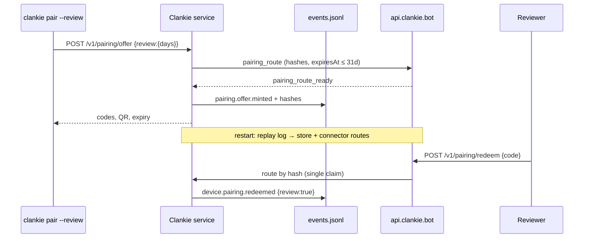

# ADR 0154: A review offer outlives the window

Status: accepted (James, 2026-09-02). Extends the pairing-route shape of
[ADR 0151](0151-the-public-doorway-routes-home.md); device authority,
single-use redemption, and the Mac-owned device projection are unchanged.

## Context

A pairing offer is display data with a five-minute life, and the public gateway
refuses any pairing route more than fifteen minutes out. Both limits are right
for an operator holding a phone next to a Mac. They are wrong for App Review
and TestFlight testers, who read the code out of review notes hours or days
after it was minted, may try it twice, and may try it after the review Mac has
restarted. A code that reads `expired` on review day is a rejection.

## Decision

`clankie pair --review --days N` mints a small set of independent single-use
offers that live `N` days. Their shape, redemption, grants, and device records
are the ordinary offer's; only the lifetime and durability differ.

- **One ceiling.** `PUBLIC_GATEWAY_PAIRING_ROUTE_LIFETIME_MAX_MS` (31 days) in
  `@clankie/protocol/public-gateway` is both the gateway's route window and
  the control plane's cap on `days`. The two limits cannot drift apart.
  Ordinary offers keep the five-minute default.
- **Hashes are durable, secrets are not.** The offer store holds only the
  sha256 of the secret and of the normalized typed code, the same hashes the
  gateway routes on. A review offer's `pairing.offer.minted` event carries
  those hashes; on boot the service rebuilds every review offer that is
  unexpired and has no `device.pairing.redeemed` event, and re-registers its
  route through the connector's reconnect replay. Ordinary offers record no
  hashes and die with the process, as before.
- **A set of codes, not a multi-use code.** Each review code is redeemed
  once. A second reviewer device or a second attempt takes the next code, so
  `consumed` never appears in the review notes' path.
- **Marked end to end.** The wire, the minted event, the redeemed event, the
  device record, and `clankie devices` (`SOURCE` = `review`) carry the marker,
  so the review devices are found and revoked after the review.

## Alternatives considered

- **One offer redeemable several times.** Rejected: it changes the single-use
  contract at the store and at the gateway's route claim for one caller, and
  a reused code is a reused capability. A short list of single-use codes costs
  nothing new.
- **Long-lived offers held in memory only.** Rejected: the review Mac runs on
  autostart and will be restarted during a review window; a restart would
  silently void the code in the notes.
- **A separate gateway window for review routes.** Rejected: the gateway cannot
  tell a review hash from an ordinary one and does not need to. One shared
  constant is the simplest way to keep the two limits together.

## Consequences

- The hashes in the operator's 0600 event log are the hashes the gateway
  already holds in memory. The typed code carries about 40 bits, so its hash
  is brute-forceable by whoever can read the log — the operator, who can
  already mint offers. The high-entropy QR secret is not.
- **Deploy order matters.** A Mac on this change sends days-long routes; a
  gateway still on the fifteen-minute window closes the host socket, and the
  connector replays the route on every reconnect. Release the gateway before
  the first `clankie pair --review`.
- Review devices are ordinary devices: `clankie devices revoke <id>` after the
  review removes them, and the `SOURCE` column says which ones they are.
- The hosted enrollment path (VUH-1069) can mint the same offer from the web;
  nothing here is specific to the CLI.
