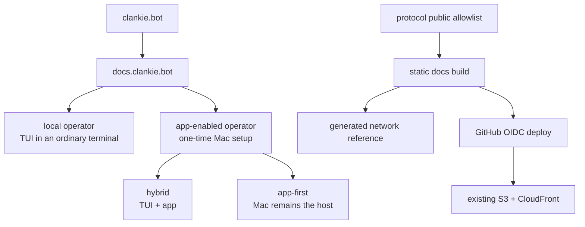

# ADR 0155: Public docs are a product surface

Status: accepted (James, 2026-09-02). Extends the public doorway in
[ADR 0151](0151-the-public-doorway-routes-home.md) and account enrollment in
[ADR 0153](0153-an-account-signs-the-mac-in.md).

## Context

Clankie serves two operator paths. A local operator can use the complete TUI in
an ordinary terminal without an account, public gateway, or mobile app. An
app-enabled operator configures the Mac once, then uses the TUI and app together
or works app-first while the Mac remains awake and online. Herdr is the supported
fleet and terminal-observation integration, but it is not a prerequisite for
local conversation or app pairing.

`docs.clankie.bot` still presents a retired multi-package contract architecture.
The landing page links to that hostname, while its own canonical privacy and
support pages serve App Store metadata. A manually maintained endpoint list
would also drift from the gateway's deliberately small public allowlist.

## Decision

The current `Volpestyle/clankie` repository owns a dependency-free static site
under `apps/docs`. It presents the two user paths and the exact public network
boundary, and links to the landing site's canonical privacy and support pages.
Contributor and implementation-depth documentation remains under `docs/`.

The network reference imports the production public-route constants and
allowlist from `packages/protocol`. Its build fails when a route lacks a public
access and purpose description, or when the reference describes a removed
route. The larger localhost OpenAPI contract is not published as a public API.

A GitHub workflow builds on relevant pull requests and deploys relevant pushes
to `main`. It assumes the existing `clankie-docs-deploy` AWS role through a
short-lived GitHub OIDC identity. The role trusts only the current repository's
`main` branch and can modify only the existing docs bucket and invalidate the
existing docs CloudFront distribution.

## Alternatives considered

- **Keep the retired docs site.** Rejected because it describes a product and
  repository topology that no longer exists.
- **Put all public guidance in the landing page.** Rejected because setup and a
  generated network reference are durable reference material, not landing-page
  copy. Privacy and support remain there because they are already the App Store
  URLs.
- **Publish the local OpenAPI document.** Rejected because it includes the
  private Mac contract, while the gateway exposes only a narrow allowlist.
- **Restore the retired site generator and theme.** Rejected because static
  HTML and CSS cover this small site without a runtime or dependency tree.

## Consequences

- Local-only users are first-class and are not pushed through account or app
  setup.
- App users see one normal setup journey without Tailscale, host ids, origins,
  or bearer tokens.
- App Store Connect keeps the landing site's stable privacy and support URLs;
  the docs site links to them instead of duplicating policy text.
- Public endpoint documentation fails closed when the allowlist changes.
- The existing S3, CloudFront, certificate, domain, and directory-index rewrite
  remain in place; only source and deployment ownership move to the current
  repository.
