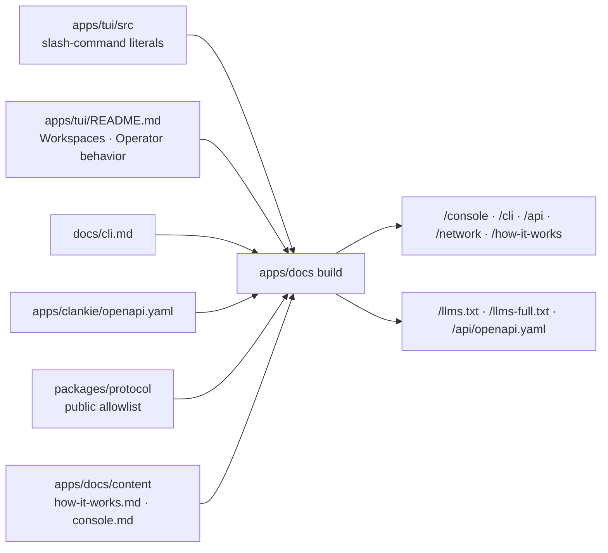

# ADR 0156: The docs site renders the canonical references

Status: accepted (James, 2026-09-03). Amends
[ADR 0155](0155-public-docs-are-a-product-surface.md): the product boundary and
deployment ownership it drew stand; the site now leads with Clankie rather than
two paths, and renders the operator-depth references it previously only linked.

## Context

ADR 0155 gave `docs.clankie.bot` two user paths and a generated network table,
kept "contributor and operator-depth references" in the repository's `docs/`,
and rejected publishing the local OpenAPI document. Read as onboarding it
worked. Read as the place to learn how Clankie works it stopped at the door:
no console command reference, no CLI contract, no HTTP catalog, and an
`llms.txt` that sent an agent to the repository for anything technical.

The site also framed the product as "Two ways in. The same Clankie." That
promotes the companion app to a co-equal identity. The app is half of the
product and deserves a first-class section, but it is not who he is: the
landing site says "Lead with Clankie", and the README leads with him and files
the app under "Reach him from your phone".

## Decision

The site leads with Clankie. The hero is his name and what he does; the
companion app is section 02 of the same page, with the same four setup steps
and the doorway diagram it had before.

The site renders the references from their canonical files at build time
instead of copying or hand-authoring them:

| Page                          | Source                                                                                                                     |
| ----------------------------- | -------------------------------------------------------------------------------------------------------------------------- |
| `/console/`                   | The `FaceShellCommand` literals in `apps/tui/src` (name, aliases, description, argument hint) plus two TUI README sections |
| `/cli/`                       | `docs/cli.md`                                                                                                              |
| `/api/`                       | `apps/clankie/openapi.yaml`, also served raw at `/api/openapi.yaml`                                                        |
| `/network/`                   | The protocol package's public allowlist, unchanged from ADR 0155                                                           |
| `/how-it-works/`              | `apps/docs/content/how-it-works.md`, a product-depth digest of `docs/architecture.md`                                      |
| `/llms.txt`, `/llms-full.txt` | Generated from the pages above and `docs/architecture.md`                                                                  |

Relative links inside rendered Markdown become GitHub links, so the same text
resolves on the site, in `llms-full.txt`, and in the repository. The build
fails closed when a console command is registered in a shape the extractor
cannot read (the count of registered `takesArgument` literals must equal what
it read), when the media-model factory gains or loses a command, or when a
README section it slices has moved.

The OpenAPI catalog is published as what it is: the local contract on
`127.0.0.1:4310`. ADR 0155 rejected it because it "includes the private Mac
contract". The contract is not secret — it ships in every install and every
surface speaks it — and the risk it named was confusion with the public
surface. The API page answers that at the top: only the network page's routes
are reachable from the internet, and the Mac still decides every grant.

`marked` and `yaml` become devDependencies of `@clankie/docs`, at the versions
the lockfile already carries through pi's TUI and vitest. The site still ships
no JavaScript.

## Alternatives considered

- **Keep linking to GitHub for everything technical.** Rejected: onboarding
  ends where understanding begins, and an agent reading `llms.txt` gets a
  pointer instead of a contract.
- **Hand-author the reference pages.** Rejected: the repository already holds
  each source, and a second copy drifts on the first change.
- **Import the console's command registry at build time.** Rejected: that
  pulls the console runtime into a static build. The literal shape is stable,
  and the count check turns a new shape into a build failure rather than a
  missing row.
- **Render `docs/architecture.md` verbatim as "How he works".** Rejected: it
  is contributor-depth, and its Mermaid needs a runtime the site does not have.
  The digest is product-depth; the Mermaid source still ships in
  `llms-full.txt`, where an agent reads it fine.
- **A documentation generator with a theme.** Rejected again: one build script
  and two parsers cover six pages.

## Consequences

- The docs workflow also builds on changes to `docs/cli.md`,
  `docs/architecture.md`, `apps/tui/README.md`, `apps/tui/src/**`, and
  `apps/clankie/openapi.yaml`, and `pnpm check` builds the same pages, so a
  broken table in `cli.md` or a moved README section fails CI, not production.
- A new console command appears on the site on the next deploy with no docs
  work; a command registered outside the literal shape fails the build with a
  message naming the extractor.
- The "two ways in" framing is retired. Local-only users remain first-class;
  the app remains a first-class section rather than a second identity.
- Privacy and support pages, the S3 and CloudFront hosting, and the OIDC deploy
  role are unchanged from ADR 0155.
