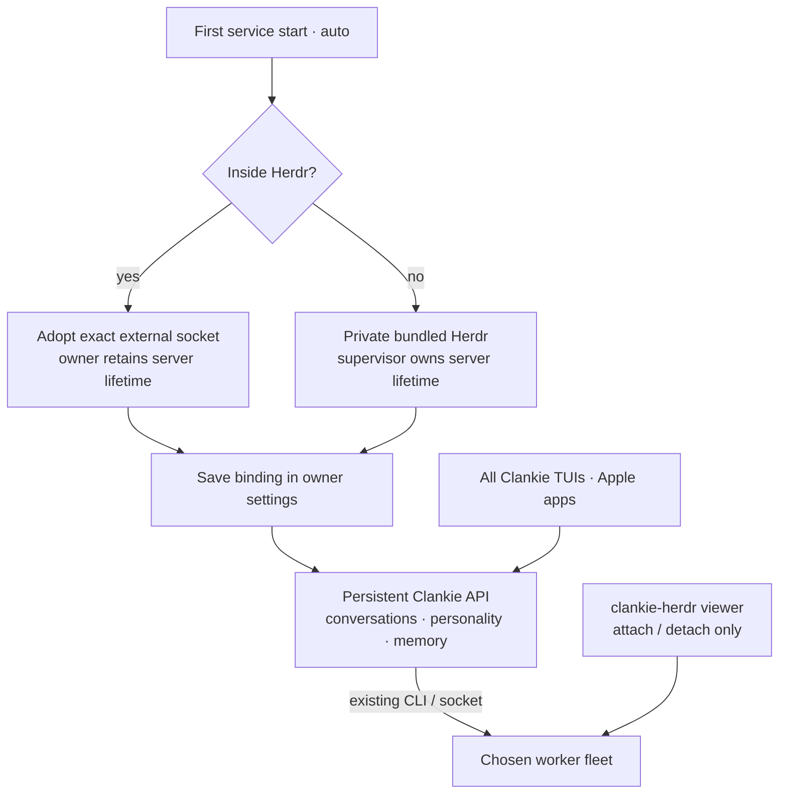

# 0157. Herdr is an owned runtime

Accepted 2026-09-04. Tracked in VUH-1109 under the hosted Clankie plan.

## Context

Paid hosting runs a persistent Clankie with personality, memory, conversations,
and tools, reachable through his clients. Depending on a customer's separately
installed terminal application leaves worker execution outside that service's
ownership. Herdr already has a headless server and the CLI/socket operations
Clankie uses. Its Rust executable includes terminal presentation and process
state; extracting a library would enlarge the boundary without improving the
first hosted release.

## Decision

Clankie bundles a native executable built from a checksum-pinned commit of
`Volpestyle/clankie-herdr`. The pin and toolchain version live in
`scripts/release/herdr.json`. The source checkout in `~/dev/herdr` is independent
of the build; local commits and working-tree edits are not release inputs.

The service starts its supervisor before accepting requests. The supervisor
checks `herdr api snapshot`, retries crashed or unresponsive servers with bounded
backoff, and closes the native process when Clankie disconnects, including after
Clankie's abrupt death. A live socket blocks a second owner. Runtime health is
part of `/health`; it returns 503 while bundled Herdr is unavailable.

Herdr's sockets, configuration, session files, and logs live under
`$CLANKIE_STATE/herdr` (default `~/.clankie/herdr`). The directory is owner-only,
and Herdr restricts its sockets to mode 0600. Its update and agent-manifest
checks default to disabled: Clankie releases own the version. The initial
configuration is created only when absent, preserving viewer preferences. Herdr's child environment
uses this private XDG configuration and state. The captain receives the bundled
CLI on PATH and the private socket, but keeps his existing settings and memory
locations. No Herdr socket is exposed through the gateway or relay.

`herdr.runtime` selects `auto`, `bundled`, or `external`. Auto selects once:
inside Herdr it adopts the actual surrounding socket; otherwise it selects
bundled mode. The service saves that resolved binding in settings after the
runtime is reachable. Source checkouts require `pnpm herdr:build` for bundled
mode. Existing explicitly named session preferences remain external. Explicit
`set --session NAME` selects external mode; `set --runtime auto` requests fresh
selection on next start. An unavailable external session refuses startup rather
than selecting another fleet, and Clankie never starts or stops that server.

The service retains its binding across restarts and all clients. Starting a
TUI inside another Herdr session cannot rebind it. The authenticated operator
`GET /v1/herdr` reports the running binding separately from pending settings.
TUIs read the captain's roster and terminal catalog, and route native board
and jump commands through that binding. `clankie-herdr` / `clankie herdr open`
attaches with Herdr's `client` command, which cannot start a server. TUI
`/herdr open` temporarily yields its terminal to that viewer. Detaching leaves
the persistent service and workers running. The optional herdr-lead board
requires installation in the selected runtime; the native viewer is bundled.

Pane IDs are local to a Herdr session. The dispatch boundary checks
`x-clankie-herdr-socket` before using a caller pane: mismatched message turns
omit the pane association and mismatched stances return 409. Workers in the
chosen session retain their stances, including in bundled mode. This guards
accidental cross-session collisions; the bearer still carries operator
machine authority. Native socket viewing is local-only; remote terminal
transport stays on the separate authenticated Clankie API.

## Consequences

Clankie owns fork maintenance, source provenance, native build tools, and license
inventory. This replaces ADR 0139's fork-retirement objective. Removing unused
patches remains appropriate when backed by evidence; introducing a private API
or extracting a Rust library requires a concrete consumer.

Herdr restores its saved session after restart. Running shell commands can be
interrupted by a crash; this is not durable job execution or a promise to replay
work. Backups, job reconciliation, billing, tenant isolation, and hosted fleet
provisioning remain separate hosted-product work. Process/socket separation
here is not a multi-tenant security boundary: hosting must isolate each customer's
OS account/container or VM and storage.

`pnpm herdr:smoke` exercises the native lifecycle. `pnpm herdr:linux:smoke`
runs the same proof in Linux without a display or terminal. The Linux image is
an integration test, not a deployable hosted Clankie image. Release smoke runs
the proof against the executable extracted from the distributable archive.
