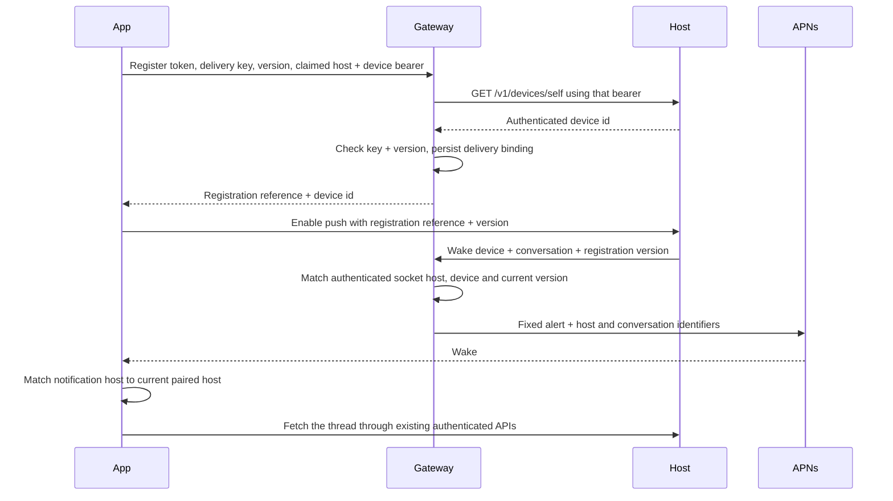

# ADR 0159: The device authorizes push delivery

Status: proposed (VUH-1052). The portable protocol is implemented; delivery integration is in progress.

## Context

iOS suspends the app's conversation tail in the background. APNs wakes the
app, while the authenticated host remains the source of conversation content.
The App Store app uses an operator-owned Apple signing credential that cannot
be distributed to self-hosters. A host can mint its own device sessions, so
its claim that a phone is paired does not authorize spending that credential.

## Decision

The gateway owns durable delivery registrations. Hosts retain device grants
and conversation authority; the delivery table holds neither. The gateway
signs APNs requests and builds a fixed alert containing only host and
conversation identifiers. Message text never enters the push request.

The app stores a random registration UUID, 32-byte delivery key and monotonic
sequence together in secure storage. It increments and persists the sequence
before a registration or clear request. The key never goes to a host. The
gateway checks a live device session at the claimed host and requires the
delivery key to update an existing registration. Equal versions are retries
only when the requested binding is identical; older or conflicting versions
fail. Token rotation and re-pairing update the same registration. They do not
depend on token and keychain lifetimes coinciding.

Only the app's delivery key authorizes clearing a registration, including
while its former host is offline. A clear retains the key hash and sequence
as a tombstone, preventing a delayed registration from restoring delivery.
The app clears delivery when disconnecting or disabling notifications. Loss
of secure storage does not silently bypass an existing registration's key.

The host stores only registration id and sequence on its existing device
record. A wake names these plus device and conversation ids; the gateway
requires all of them to match the current row and authenticated host socket.
The host never receives the APNs token. APNs 410 invalidates only the token
version actually sent, and only when Apple's timestamp does not predate its
registration; it cannot clear a newer registration that won the race.

The gateway uses Node's SQLite support and a persistent local volume, with
unique token/environment bindings and atomic conditional updates. A missing
push configuration disables delivery without changing pairing or messaging.
Per-host request limits and per-device coalescing bound traffic; no durable
message queue or retry worker is introduced.

## Alternatives and limits

- A volatile first-use token map loses authorization on restart and permits
  a former host to win a race after re-pairing. A durable device-held key
  supplies the missing authorization.
- Direct host signing distributes the app team's signing key. The gateway
  is the signing boundary instead.
- Tokens can rotate independently of secure storage. Explicit versions
  govern ordering; token or keychain lifetime assumptions do not.
- A never-registered token leaked alongside a device session can be claimed
  first. Normal hosts never receive tokens. Registration conflicts surface
  explicitly; App Attest is an upgrade if this residual attack is observed.
- The gateway and Apple see token, timing, host id and conversation id.
  Application message encryption is separate work (VUH-1112). Push does not
  claim to hide metadata or to encrypt the existing pairing transport.
- A notification for another host performs no fetch. An unknown thread on
  the current host uses the existing directory/tail path, including cold start.
- Self-hosters using their own gateway need their own compatible app signing
  setup; the App Store build's push path uses the operator gateway.

The implementation has no real APNs delivery proof until signing configuration
and the app entitlement are provisioned. Local HTTP/2 tests and simulator
payload injection exercise different boundaries and are labelled separately.
