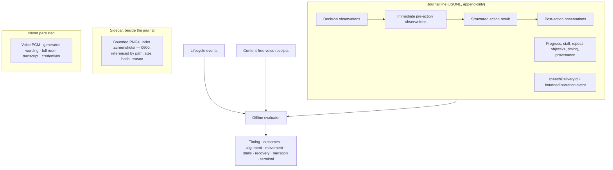

# ADR 0160: A play journal is read against its own history

Status: accepted (James, 2026-09-05). Amends
[ADR 0117](0117-play-evidence-preserves-causal-stages.md) and
[ADR 0068](0068-a-playthrough-leaves-a-durable-trail.md).

## Context

The journal is the durable trail of a playthrough, and
[ADR 0068](0068-a-playthrough-leaves-a-durable-trail.md) promises it is never
rewritten or pruned by code. Its turn line, though, embedded the _live_ decision
schema — the same discriminated union the running loop validates a new decision
against.

That made the archive a projection of today's catalog rather than a record of
what happened. [ADR 0145](0145-the-world-is-the-only-body.md) retired the local
body's checkpoint actions along with the emulator, and every historical turn
holding `load_checkpoint` stopped parsing. Because `parseFreePlayJournal`
rejects a corrupt line by throwing for the whole file — deliberately, since a
lying record is worse than none — one retired action erased an entire run from
every reader at once: offline evaluation, cross-run journey continuity
(`listPlayJourneyRuns`), and the operator's own trail read (`play-sight`). The
sweep of this machine's archive found it: 39 of 40 journals readable, one 129-turn
run gone, with no error anywhere near the retirement that caused it.

The same trap is armed for every future retirement, and nothing about retiring
an action points at the archive.

## Decision

**Reading is archival; writing is live.** A journal turn line validates its
action against the live catalog _or_ any bounded historical action shape
(`{ kind }` plus its recorded payload). Every other field stays strict, and a
torn or invented line still throws.

The asymmetry is the point, and it costs nothing: a turn is written only after
the loop has validated it against the live catalog, so a retired kind can be
read back but never recorded. The fallback is deliberately open rather than an
enumeration of what has been retired so far — a list would have to be edited by
whoever next retires an action, which is exactly the step that was missed.

Offline evaluation reports a retired action as itself, with
`decision.actionRetired` and `aggregate.retiredActionTurns` beside verdicts of
`unknown`. This build cannot reason about a vocabulary it no longer has, and
"unknown" is a different answer from "he did nothing" — the same conservative
rule ADR 0117 applies to missing semantic evidence.

### The evidence model and where each thing lives

PNG bytes never enter the JSONL. The room's audio, the wording a voice actually
generated, and the transcript of what was said around him are never written at
all: a `speechDeliveryId` is a join key, and only a matching played, suppressed,
refused, or settled receipt establishes delivery.

## Consequences

- Retiring an action from the live catalog no longer destroys history. All 40
  journals on the operator machine parse, including the 2026-08-11 run that had
  silently dropped out of every reader.
- A retired action reads as evidence with unknown verdicts, so an evaluation
  never quietly counts it as a turn that moved nothing.
- The archive accepts an action shape this build cannot execute. That is the
  trade: an unreadable record cannot be evaluated at all, while an
  uninterpretable one still carries its monologue, intent, objective, effect,
  timing, and causal states.
- Strictness is unchanged everywhere else, and the write path is unchanged
  entirely.
