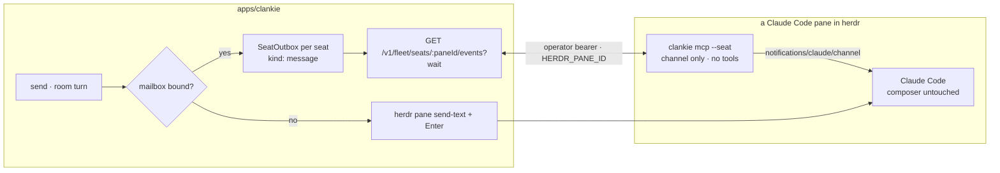

# ADR 0161: A fleet seat reads its mail instead of its keyboard

Status: proposed (2026-09-06), for James to accept with the first message that
lands as a channel event. Amends
[ADR 0135](0135-a-herdr-seat-is-a-conversation.md) (how `send` reaches a
persona's pane) and extends
[ADR 0152](0152-a-harness-takes-the-operator-seat.md) (the head's outbox and
channel) to every Claude Code seat in the fleet.

## Context

A message to a fleet agent — a DM from the app, or a group-chat turn — reaches
its pane as keystrokes: `herdr pane send-text` writes the text into the pty and
a second command presses Enter. The pty is the same stdin the operator's
keyboard feeds. Nothing on either side can see the harness's composer, so a
message that arrives while the operator is half-way through typing in that pane
is appended to their draft and the Enter submits the mixture. Herdr cannot
guard this: `agent prompt` refuses a `blocked` pane, but a draft leaves the
pane `idle` and no metadata field exposes it.

Claude Code sessions already have an input that is not the keyboard. Its peer
tools (`SendMessage`) and its channels research preview both deliver text as an
inbound event that starts or queues a turn, with the composer untouched. The
head seat uses exactly this: `clankie mcp` long-polls the seat outbox and pushes
each wake, watch, or escalation as a `notifications/claude/channel` event
(ADR 0152). Worker seats had no such door.

## Decision

Every fleet seat has a mailbox, and a Claude Code seat reads it through a
channel bridge of its own. The pty is the fallback, not the lane.

- **One mailbox per seat.** The service keeps a `SeatOutbox` per seat id (the
  herdr terminal id `sendToSeat` already takes), created on first use. The
  outbox is the head's type unchanged: `bound()` while a bridge is polling or
  polled within the last window, `deliver` resolves `delivered` once taken and
  `unbound` at once when nobody is polling.
- **The pty is the fallback.** The seat sender tries the mailbox first and
  types into the pane only when no bridge is bound. A Codex or pi seat, or a
  Claude Code pane launched without the channel, behaves exactly as before.
- **A message is its own event kind.** `OperatorSeatEventKind` gains
  `message`; the event carries the conversation and a `source` of `operator`
  (a DM) or `room` (a group-chat turn). The head never receives one.
- **The bridge is channel-only.** `clankie mcp --seat` serves no tools and no
  `reply`: a worker answers in its own transcript, which the transcript
  projection already harvests into the thread, so the reply path does not
  move. It identifies itself by `HERDR_PANE_ID`, which herdr sets in the pane
  and Claude Code passes to its MCP servers; the service resolves the pane to
  the seat. It polls with the operator bearer from the broker, like the head
  bridge, and reads only its own pane's mailbox.
- **404 is an early state.** The bridge starts before herdr has classified
  the harness, so `unknown_seat` is retried quietly rather than treated as a
  failure.
- **The hire path loads the channel.** Channels are a per-launch opt-in with
  no persistent setting, and the `server:` form of the flag binds only a server
  in Claude Code's persisted config, never one handed over with `--mcp-config`
  (probed 2026-09-06: the harness starts the process but reports `no MCP server
configured with that name`). So a seat hired from the app for the `claude`
  harness gets `clankie-seat` registered once at user scope
  (`claude mcp add -s user clankie-seat -- clankie mcp --seat`) and is started
  with `--dangerously-load-development-channels server:clankie-seat`. That
  flag stops every launch at a "Loading development channels" dialog before
  the TUI is usable; the hire path reads the pane, recognizes that dialog and
  nothing else, confirms its preselected "local development" option, and waits
  for the agent to settle. The approved form, `--channels server:clankie-seat`,
  starts without the dialog but then rejects a `server:` entry as not on the
  allowlist, so the development flag is the one that binds. A pane the
  operator opens by hand gets the mailbox only if launched with the flag;
  otherwise it keeps the pty lane.
- **The bridge polls only when the channel is bound.** A user-scope
  registration means every Claude Code session on the machine spawns the
  bridge, including ones started without the flag, whose harness would drop
  each notification on the floor while the mailbox read as bound — a black
  hole with no pty fallback. The bridge therefore reads its parent process's
  argv and polls only when that launch named `server:clankie-seat` to a
  channels flag; otherwise it serves an empty channel and never binds.

## Consequences

- A DM or room turn to a channel-loaded Claude Code seat never touches what
  the operator is typing there. The transcript, the thread, and the room's
  harvest are unchanged.
- The fleet-wide `SeatSender` contract carries the conversation and source, so
  a mailbox event can say where it came from.
- A moved pane keeps its mailbox: herdr resolves the old pane id as an alias
  and the mailbox is keyed by the seat id underneath, not the pane id.
- A Codex seat takes its message through `codex queue --thread <session>`,
  which the harness runs as its own user turn with the composer untouched
  (probed 2026-09-06). Herdr reports no session for Codex, so the service
  reads it off the rollout file the running `codex` process holds open,
  `rollout-<timestamp>-<uuid>.jsonl`, via the pane's foreground process and
  `lsof`. A pane that has never spoken has no rollout yet and keeps the pty
  lane; so does any failure to resolve or queue.
- pi and Grok seats still take keystrokes. Extending delivery to them waits
  on those harnesses growing an out-of-band input.
