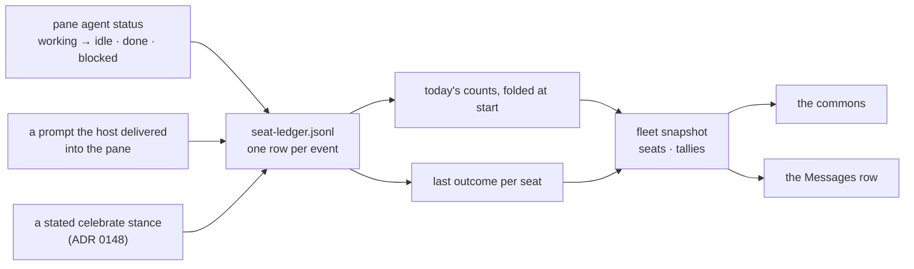

# ADR 0162: The host keeps the seat's ledger

Status: accepted (James, 2026-09-06). Builds on
[ADR 0148](0148-an-agent-moves-its-own-figure.md), whose stance vocabulary this
extends, and [ADR 0150](0150-the-fleet-is-a-live-cursor.md), whose snapshot
carries the new facts. This is the host contract for clankie-app's ADR 0030
(the commons is a game surface), which permits the room to render an economy
only against a ledger the host owns. Tracked as
[VUH-1211](https://linear.app/vuhlp/issue/VUH-1211).

## Context

The app's ADR 0030 retires the rule that the commons may not show an economy,
and replaces it with a narrower one: state the app owns is state the app is the
authority on. Outcomes and tallies are host facts, so the room may draw them and
may never keep a score of its own. That is only possible if the host can answer
what a seat has earned.

It could not. The host's one usage record, `turn-settled.jsonl`
(`/v1/captain/turn-metrics`, `clankie metrics`), is the ledger of the turns
**Clankie himself** ran: keyed by conversation and lane, carrying a run id, tool
counts, and provider usage. A fleet seat's run happens in another agent's pane
and is observed through Herdr. It has no conversation, no run id, and no tool
counts, and writing one into that row as zeroes would say a run touched nothing
rather than that the host never saw. So this is a second record because it
records a different event, not a second copy of the same one.

What the host does already see about a seat is exactly three things: the pane's
agent status changing, a prompt it put into that pane, and an agent making a
statement about itself.

## Decision

The captain keeps a seat ledger, and the fleet snapshot renders it.

**A run is a pane that was working and has stopped.** Herdr's own agent status
says how it stopped: `idle` or `done` is a pane ready for the next thing and
counts as `passed`; `blocked` is one that stopped on this and counts as
`failed`. Every other transition settles nothing — a pane that goes offline
mid-run has an outcome nobody watched, and the host would be inventing it. The
host is not judging the work: it is reporting the status the pane ended at.

**Counts are derived from rows, never folded in memory alone.** An accumulator
held only in memory is the failure the app's ADR 0022 was written against: after
a restart it silently under-reports while still calling itself "today". So every
event appends one line to `seat-ledger.jsonl` beside `turn-settled.jsonl`, and
the day's counts are rebuilt from those lines when the captain starts. A run is
written as how it came out rather than as a run with a nullable result, so no
row can say a run settled without saying into what.

**A stance may say `celebrate`.** It is one more value in the ADR 0148 pose
enum, with the same expiry, the same op, and the same identity check — the agent
says it landed something, and the figure reacts. Nothing else about the op
changes. A ship is counted at the moment the statement is struck, not for the
whole time it stands, so restating a standing celebration is the same landing
rather than a second one.

**What a seat has earned follows the seat.** The ledger is keyed by seat id — a
Herdr terminal id, which outlives a harness restart and a captain restart — and
so is the stance store beside it. A persona that is re-seated into a new pane
starts a fresh day, because the record is of what happened in a pane.

### The fields

Every field is optional on the seat and snapshot schemas, so a surface written
before the ledger keeps typechecking and reading unchanged. Absence is a real
answer here rather than a gap: a seat with no settled run carries no
`lastOutcome`, and a seat that has done nothing today is not in `tallies` at all
rather than carrying zeroes.

| Field                             | Derived from                                               | How the Messages row says it                                                         |
| --------------------------------- | ---------------------------------------------------------- | ------------------------------------------------------------------------------------ |
| `seat.lastOutcome.result` / `.at` | the seat's newest settled run, whenever it was             | "Last run passed" / "Last run failed", with the time it settled                      |
| `snapshot.tallies[].runs`         | rows for that seat today                                   | "4 runs today"                                                                       |
| `snapshot.tallies[].greenRuns`    | the `passed` half of them                                  | "3 of 4 green"                                                                       |
| `snapshot.tallies[].ships`        | `celebrate` stances struck today                           | "2 ships today"                                                                      |
| `snapshot.tallies[].promptsSent`  | prompts the host delivered into the pane, from any surface | "6 prompts sent"                                                                     |
| `stance.pose: "celebrate"`        | the agent's own statement                                  | the stance note already previews the row (ADR 0148); the pose reads as "celebrating" |

That column is the contract, not a suggestion. The app's third garden rule is
that every graphical fact has a list equivalent, and it holds across the host
boundary because these facts arrive on the same seat and snapshot the list
already reads.

A prompt delivered to a seat advances the fleet cursor, as a stance does
(ADR 0150), because it changes what the next snapshot says. A settled run
advances it too rather than waiting for the pane event that caused it.

## Rejected alternatives

- **Put seat runs in `turn-settled.jsonl`.** Its row is a captain turn: a lane,
  a conversation, a run id, tool counts. A seat run has none of them, and the
  zeroes needed to fit it there would read as measurements.
- **Hold the counts in memory only, like the stance store.** A stance is a live
  statement worth exactly as much as the agent that just made it, so forgetting
  it on restart is correct. A day's count is an accumulation; forgetting half of
  it and still calling it "today" is the quiet lie the app's ADR 0022 forbids.
- **Let the app count what it renders.** That is the cached copy ADR 0030 names
  as the one thing neither side may do.
- **A new agent-reachable op for shipping.** `state_stance` already carries an
  agent's statement about itself, already resolves identity from the caller's
  own pane, and already expires. A second op would be a second thing to make
  safe for the one property ADR 0148 spent its safety argument on.
- **Infer a ship from the work instead of the agent.** The host has no record of
  a commit, a push, or a green build. Counting a claim the agent makes about
  itself is honest about what it is; inferring one from a pane going quiet is
  not.

## Consequences

- `seat-ledger.jsonl` joins `turn-settled.jsonl` in the captain's state
  directory. It is append-only and read whole at start; rotate it by day if a
  machine ever runs enough seats for that read to show up in captain start.
- The pose enum gained a value, which is a widening every exhaustive consumer
  must answer. clankie-app's `POSE_ANIMATION` map is one, and it already had a
  `celebrate` animation waiting in its atlas.
- The room may now render blooms, compost, and celebrations (VUH-1219) without
  holding a number. Everything it draws is on the snapshot it already reads.
- A seat's day is the host's local calendar day, so "today" is the day its
  operator is having rather than a UTC one.
