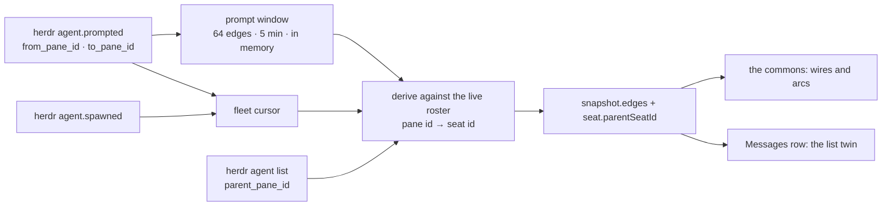

# ADR 0163: The fleet carries its own edges

Status: proposed (2026-09-06), for James to accept with the first commons
surface that draws one. Extends [ADR 0150](0150-the-fleet-is-a-live-cursor.md)
(the fleet is a live cursor) without adding a service, route family, or second
fleet projection, and supplies the host fact that app
[ADR 0030](https://github.com/Volpestyle/clankie-app/blob/main/docs/adr/0030-the-commons-is-a-game-surface.md)
requires before the room may draw a relationship. Tracked as
[VUH-1212](https://linear.app/vuhlp/issue/VUH-1212), on
[VUH-1210](https://linear.app/vuhlp/issue/VUH-1210).

## Context

The fleet snapshot describes seats one at a time. Who prompted whom and who
started whom is the fleet's actual texture, and no surface can see it: the
roster is a list of strangers who happen to share a session.

Herdr now records both (VUH-1210). `agent.prompted` and `agent.spawned` ride the
same session event socket the fleet cursor already subscribes to, and the pane
that started an agent is readable on the child through `agent list`. So the
edges need no new transport — the question is only what the captain is allowed
to remember.

That question has a scarred answer here. `garden-model` folded a stream of
events into an accumulated world, the platform deleted the source, and the fold
kept running over an empty array. App ADR 0030 names the rule that failure
actually established: **state the app owns is state the app is the authority
on**, and a host fact is rendered from the snapshot and forgotten. Prompt edges
are the awkward case, because Herdr publishes each prompt once and keeps no
history. Something has to hold them or they cannot be shown at all.

## Decision

The snapshot carries `edges`, derived on every read. Each edge is
`{ kind, fromSeatId, toSeatId, at }`, and both ends are seats on the roster at
the moment of that read.

**Spawn edges are read, not remembered.** The census carries `parent_pane_id`
on the child; the captain joins it to the parent's seat by pane id. The tree
rebuilds from one `agent list`, so it needs no history and cannot drift. A seat
also carries `parentSeatId` directly, which is the same fact stated where a
list row can reach it without walking the edge array.

**Prompt edges live in a bounded window the captain owns.** It is the one fleet
fact the host must hold, and it is held under the narrowest terms that still
work:

|          |                                                                                                                                                                                      |
| -------- | ------------------------------------------------------------------------------------------------------------------------------------------------------------------------------------ |
| Bound    | the newest **64** edges, and nothing older than **5 minutes** — whichever drops an edge first                                                                                        |
| Lifetime | process-local; it starts empty on restart and is never written to disk                                                                                                               |
| Scope    | an edge whose sender or recipient has left the roster is not carried                                                                                                                 |
| Identity | a prompt with no sender — the operator's own shell, or a service — is not an edge at all                                                                                             |
| Volume   | every prompt in the window, not one per pair: how often two seats talk is the fact a wire's weight and a worn path are drawn from, and only the identical event twice is a duplicate |

This is a window, not a projection. It accumulates nothing: an edge enters when
Herdr reports it and leaves on a clock, so the structure has a fixed ceiling and
drains on its own while the fleet is idle. It cannot outlive its source the way
the garden did, because every read re-derives against the live roster — when
Herdr goes quiet the window empties and the room empties with it, which is the
behaviour ADR 0022 asked for and got wrong the first time.

Five minutes is chosen to match what "recently" means to someone watching the
room: long enough that a prompt is still visible when the operator looks up from
another window, short enough that a wire on screen means a conversation that is
actually happening. Sixty-four edges is well above a busy fleet's five-minute
traffic and, with a full roster of spawn edges, stays under the wire's ceiling
of 128.

### The list twin

App ADR 0030 requires every graphical fact to be readable as text in a seat's
Messages row. Both new facts have one:

- **Parent.** A seat with `parentSeatId` reads `Started by <parent name>`, using
  the parent's persona name as the row already renders it. A seat with no parent
  on the roster says nothing — not "no parent", which would be a claim the
  snapshot never made.
- **Most recent counterpart.** The newest prompt edge touching the seat reads
  `Last prompted <name>` when the seat is the sender and `Prompted by <name>`
  when it is the recipient, with the edge's `at` rendered as the row's existing
  relative time. When the window holds no edge for that seat the line is absent,
  and it disappears on its own five minutes after the prompt — the same moment
  the room's wire fades.

Both lines are rendered from the snapshot and forgotten, exactly like status and
stance. Neither is stored by the app.

## Rejected alternatives

- **Persist prompt edges.** A durable edge log is the garden's mistake with a
  new name: it survives its source, and nothing in the room can tell a real
  relationship from a fossil.
- **Have Herdr keep the history.** Herdr is ridden vanilla
  ([ADR 0139](0139-clankie-rides-vanilla-herdr.md)); a retention window is a
  product opinion of Clankie's, not a terminal multiplexer's.
- **Key edges by pane.** Panes are Herdr's address and seats are the fleet's.
  Publishing pane ids would put a second identity on the wire for surfaces to
  join incorrectly; the captain does the join once, where it already knows both.
- **A separate `edges` operation.** The snapshot is already one coherent fleet
  moment behind one cursor. A second read could observe a different one.

## Consequences

- The Commons can draw visits and spawn arcs (VUH-1216, VUH-1217, VUH-1218), and
  every one of them is a fact the snapshot stated.
- `edges` is optional on the wire, so an app pointed at a host that predates it
  keeps working and simply draws no relationships.
- Prompt edges require the Herdr the release pins to be one that emits them. An
  older bundled Herdr yields spawn edges only — `parent_pane_id` is absent too,
  so that degrades to today's behaviour rather than to a wrong graph.
- A captain restart empties the prompt window. This is visible — wires vanish —
  and correct: the captain cannot vouch for a prompt it never saw.
