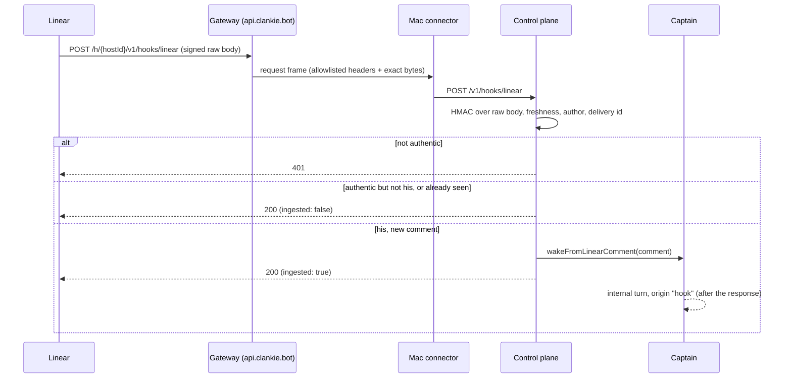

# ADR 0164: A Linear comment wakes the operator thread

Status: accepted (James, 2026-09-07, operator console). Rides the routing built
in [ADR 0151](0151-the-public-doorway-routes-home.md) and the wake seam built in
[ADR 0130](0130-goals-and-self-wakes-share-the-operator-thread.md) and
[ADR 0131](0131-herdr-completion-watches-wake-the-operator-thread.md). Splits a
second Linear credential away from the MCP token of
[ADR 0093](0093-owner-authored-service-connections.md) and
[ADR 0109](0109-mcp-is-how-he-reaches-a-service.md). Stops short of the
delivery path in [ADR 0161](0161-a-fleet-seat-reads-its-mail-instead-of-its-keyboard.md).

## Context

Project work is tracked in Linear, and James writes his real direction into
issue comments. Clankie learns about that direction only when someone asks him
to go and read it. A comment written while he is idle sits unread until the next
time a person thinks to mention it, which makes the tracker a place work is
recorded rather than a place work is dispatched from.

Two properties of the existing system decide most of the design.

The first is that a Linear comment is not addressed to Clankie. It is a note on
a ticket, written to whoever reads the ticket, and it may quote logs, paste an
agent's own output, or contain text that reads like an instruction. Treating it
as a prompt would let anything that reaches a Linear comment — including a
Clankie-authored comment — steer the fleet.

The second is that Linear's webhook contract is strict about time. A delivery
that is not answered within five seconds is retried at one minute, one hour, and
six hours. The host answering that request is a Mac at the far end of an
outbound WebSocket, so nothing on the answering path can wait for a model.

Linear also cannot reach the Mac directly: webhooks require a public HTTPS
endpoint, and the whole point of ADR 0151 is that no inbound Mac port exists.

## Decision

A signed Linear `Comment.create` webhook wakes Clankie's operator thread with
the comment quoted. It ingests; it does not dispatch.

**The doorway carries it.** `POST /v1/hooks/linear` joins the shared route
allowlist as a `control` route, so the public address is
`https://api.clankie.bot/h/{hostId}/v1/hooks/linear` and the delivery reaches
the Mac over the connection it already holds open. Linear's own request headers
join the gateway's request-header allowlist, which is now a single list in
`@clankie/protocol` rather than one copy per side — a signature header dropped
on either hop makes every real delivery look forged.

**The raw bytes are the message.** Linear signs the exact POST body with
HMAC-SHA256. The route reads the body as bytes, verifies, and only then parses;
it never re-serializes a parsed object, and the transport preserves the body
byte-for-byte across both hops.

**The webhook secret is its own credential.** `/connect linear` mints an OAuth
token audience-restricted to `https://mcp.linear.app/mcp`; it cannot sign or
create webhooks, and creating one requires an `admin`-scoped credential Clankie
deliberately never asks for. James creates the webhook in Linear's settings and
pastes the signing secret, which is stored in the broker under `linear-webhook`.
Only the non-secret question of whose comments count lives in settings.

Both halves are one console flow — `/connect linear` → _Wake me on my comments_
— which prints the URL to register, takes the secret, and records the author.
Setup that requires typing a provider id or editing a settings file is setup
that gets done wrong once and then debugged as a broken webhook.

**Only his comments, and only new ones.** A verified delivery whose author is
not the configured owner is dropped, as is any type or action other than
`Comment` / `create`, and any delivery id already seen. An unset owner drops
everything rather than admitting everything: agents comment on his issues too,
and a comment written by an agent must never wake the thread that wrote it.

**A rejection is about authenticity; everything else is a 200.** A bad or stale
signature answers 401. A delivery that is genuinely Linear's but not worth a
wake answers 200, because a 4xx would put a comment we have already judged into
a six-hour retry.

**The wake is queued, not awaited.** The verified comment is handed to the
captain, which composes a host-authored prompt and enqueues an internal turn on
the default global conversation under a new `hook` origin, then returns — the
same shape a settled Herdr watch already uses. The prompt quotes the comment as
untrusted text, names the issue, suggests at most one pane, and says explicitly
that this is something to look at, not something to act on.

**The suggested pane is a read, not a record.** It is matched against the live
fleet census the captain already keeps — a ticket identifier appearing in a
pane's title, its summary, or the worktree it sits in. Two matches suggest
nothing. There is no ticket-to-pane ledger.

## Alternatives considered

**Poll Linear over the existing MCP token.** No second credential and no public
endpoint. Rejected: polling frequently enough to feel immediate costs a model
turn per poll and still lags, and the token already in hand is audience-bound to
the MCP resource. A webhook is the mechanism Linear provides for exactly this.

**Open an inbound port on the Mac.** Rejected on the same grounds as ADR 0151.
Linear requires public non-loopback HTTPS, and the doorway already routes home
without an inbound port.

**Reuse the Linear MCP OAuth token as the webhook credential.** Rejected because
it does not work — Linear audience-restricts it to `https://mcp.linear.app/mcp`
and `api.linear.app/graphql` rejects it outright — and because webhook creation
needs `admin`, a scope the MCP connect flow should not start requesting.

**Auto-prompt the pane that owns the ticket.** The tempting version: route the
comment straight to the agent working that issue. Rejected for now. A comment is
not addressed to an agent, the ticket-to-pane match is a heuristic, and a wrong
route spends a worker's context on someone else's ticket. Clankie looks first;
ADR 0161's mailbox is the delivery path when that step is designed.

**Treat the comment as an operator message.** Rejected: it would appear in the
thread as though James typed it into this conversation, which is both untrue and
the exact framing that makes quoted text read as instruction.

## Consequences

- Clankie learns about a comment seconds after it is written, without anyone
  asking him to go and look.
- James does one thing outside Clankie: create the webhook in Linear's API
  settings against the URL the flow prints. Everything else is that flow.
- The gateway's request headers are one shared list. Adding a header for a future
  signed hook is one edit, and the two sides cannot drift apart.
- Duplicate suppression is in-memory and bounded, so a process restart can admit
  one already-handled delivery. One duplicate wake is a smaller failure than
  durable state that has to be pruned.
- A comment thread between agents on one of his issues stays silent, because the
  filter is a single configured author rather than a bot exclusion list.
- Nothing is dispatched. Every routing decision remains Clankie's, in his thread,
  where James can see it.
- This is the first inbound signed hook. A second one — GitHub, say — adds a
  route, its headers, and its own broker secret, and reuses the raw-body-then-
  verify shape rather than inventing another.

## Primary platform references

- [Linear webhooks](https://linear.app/developers/webhooks)
- [Linear OAuth scopes](https://linear.app/developers/oauth-2-0-authentication)
- [RFC 8707: Resource indicators for OAuth 2.0](https://datatracker.ietf.org/doc/html/rfc8707)
