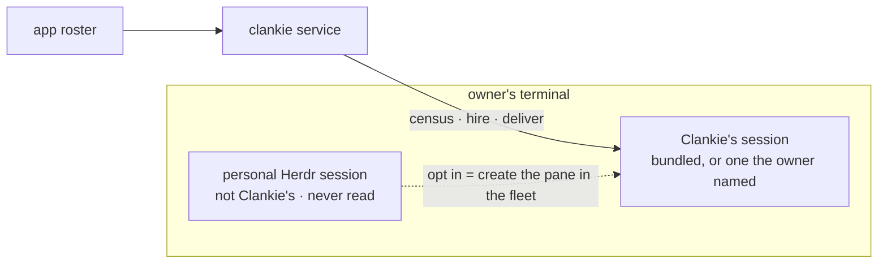

# ADR 0164: The fleet is its own session

Status: proposed (2026-09-06), for James to accept with the first service
start that binds bundled from inside a Herdr pane. Amends
[ADR 0157](0157-herdr-is-an-owned-runtime.md) (retires its adopt-the-surrounding-session
rule) and [ADR 0139](0139-clankie-rides-vanilla-herdr.md) (retires the fork's
scheduled death). Stands on [ADR 0149](0149-his-herdr-session-is-chosen-not-inherited.md):
his session is chosen, and this decision says what the default choice is.

## Context

The service's `auto` binding adopted whatever Herdr session it was launched
inside. On the owner's machine that made every pane they ever opened a Clankie
contact: their own agents showed on the roster, Clankie's hires landed in their
workspaces, and a service restart shared a server with panes it had no business
near. For an everyday user that is the wrong default. Someone who runs Herdr
for their own work has not agreed to have every session read by Clankie, and
the app's roster should not be a list of strangers who happen to share a
terminal.

The fork question was decided at the same time. Prompt and spawn edges
([ADR 0163](0163-the-fleet-carries-its-own-edges.md)) need herdr internals no
plugin hook or CLI exposes, the fork carries a performance overlay the owner's
GUI depends on under Clankie's polling, and nothing will be sent upstream. A
fork with no scheduled death is a runtime Clankie owns, so the binary the owner
runs must be the one Clankie ships or the fork's features are invisible to the
one person using the product daily.

## Decision

**Clankie's fleet is its own Herdr session.** A pane is Clankie's only if it
lives in that session, and the way to opt a pane in is to create it there:
through Clankie's own Herdr UI, or through his CLI, or through a hire from the
app. No pane is ever adopted from the session the service was launched in.

- `auto` binds **bundled** on first start, always. Only a session or socket
  the owner named (`clankie herdr set --session NAME`) makes the binding
  external, and then that named session is the fleet.
- Launching `clankie` inside some Herdr session is not a signal. `HERDR_ENV`,
  `HERDR_SESSION`, and `HERDR_SOCKET_PATH` play no part in the choice.
- The owner sees the bundled fleet through `clankie-herdr`, the viewer; a
  developer who wants a windowed session runs the fork binary and names a
  session of their own for the fleet, side by side with their personal one.
- **Clankie runs its own herdr.** The bundled binary is built from the pinned
  fork commit, the owner's machine runs the same binary, and features the
  fleet needs may live in the fork. The upstream CLI and socket API remain the
  rule for anything that can be built without a patch, and every fork-only
  feature degrades to nothing on a binary that lacks it rather than breaking.

## Consequences

- The roster is Clankie's fleet and nothing else. "What is everything doing"
  means what his agents are doing.
- A service restart or crash cannot touch a pane the owner opened for
  themselves.
- The fork carries a rebase tax: every patch it holds is re-applied on each
  upstream pull. The cost is paid for in fleet features the plugin API cannot
  provide, and it is why a herdr change is the last resort after a service-side
  one.
- The console and `clankie seat` claim a pane as his only when the terminal
  they sit in is the fleet's session, checked by socket. Opened inside any
  other Herdr they run as ordinary consoles: no pane is him, no pane is
  renamed there, and the turn leads the fleet from the service body.
- An owner already bound to an external session keeps that binding; the
  service saves it once and `auto` only runs again after
  `clankie herdr set --runtime auto`.
