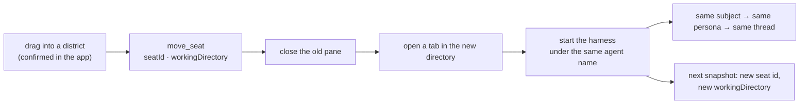

# ADR 0166: A seat moves by being hired again

Status: proposed (2026-09-07), for James to accept with the first drag that
lands. Extends [ADR 0135](0135-a-herdr-seat-is-a-conversation.md) (a seat is a
conversation) and serves app
[ADR 0030](https://github.com/Volpestyle/clankie-app/blob/main/docs/adr/0030-the-commons-is-a-game-surface.md),
which lets the room issue commands that a host contract already supports.
Tracked as [VUH-1227](https://linear.app/vuhlp/issue/VUH-1227), on
[VUH-1214](https://linear.app/vuhlp/issue/VUH-1214).

## Context

The commons offers a drag: pull a figure into another district and the seat
should work there. VUH-1214 wired the gesture and found nothing behind it, so
the app shows an honest alert instead — there is no host command to move a
seat, only one to hire a new one.

A seat's district is its working directory (ADR 0022), and its working
directory is the directory its harness process is running in. That sentence is
the whole problem.

## Decision

**A seat moves by being hired again in the new directory, under the name it
already has.** The captain closes the seat's pane, opens a tab in the target
directory, and starts the same harness there with the same herdr agent name.

The name is the load-bearing part. A persona is bound to its _subject_ — the
agent name herdr knows it by — not to a chair, so hiring under the old name
seats the same character. Its conversation follows the persona, and everything
hanging off the conversation follows it. What the seat was saying about itself
is carried across explicitly with whatever life the statement had left: the
move is the operator relocating a worker, not the worker changing its mind.

The seat id changes, because a seat id is a herdr terminal id and the terminal
is new. Surfaces already treat seat ids as the chair rather than the worker
(ADR 0147), and the snapshot's next read re-districts the figure on its new
`workingDirectory`, which is what the drag was asking for.

The old pane closes **first**. A hire that then fails leaves the seat gone,
which the operator can see and act on, rather than two live panes wearing one
name, which they cannot.

## Rejected alternative: a herdr pane move

The obvious smaller change is to ask herdr to move the pane — change its
working directory and re-census, so the persona, seat, conversation, and stance
all survive because the _pane_ does. It was rejected on what a process is, not
on effort.

A process's working directory is fixed when it is executed. Herdr's `cwd` is an
observation, not a setting: a pane's directory is reported by its shell through
OSC 7 and carried as `TerminalCwdReported`, and the only place herdr accepts a
directory is when it _creates_ a pane. There is no operation to change one
because there is nothing an operation could do — a running Claude Code or Codex
process cannot be told it now lives somewhere else.

The nearest real version is: stop the agent, `cd` the shell left behind, start
the agent again in the same pane. That would keep the terminal id, and so the
seat id, which is genuinely nicer. But it still restarts the harness — the part
that actually costs something — and it buys that by sending harness-specific
keystrokes to make an agent exit, which differs per harness and has no
contract. Trading a contract for keystrokes to save a seat id is the wrong
trade.

So there is **no herdr change and no pin move** in this ticket. That is the
finding, not an omission.

## Consequences

- **The harness session does not survive.** A moved seat starts a fresh Claude
  Code or Codex session with no memory of what it was doing. This is inherent:
  the directory is the thing changing, and a harness session belongs to the
  directory it was started in. The app's confirm gate is what makes this the
  operator's decision rather than a surprise, and it stays.
- The persona, its thread, its history, and its stance survive; the seat id
  does not. Anything keyed by seat id and not carried here is lost by the same
  rule that loses it when a seat is stopped and hired by hand today.
- A seat whose harness is not one hiring can start cannot be moved anywhere.
  The move says so — `harness_unavailable` — rather than pretending.
- The Messages row needs nothing new: it already states a seat's working
  directory, and after a move it states the new one.
