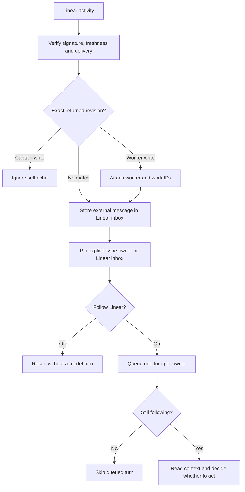

# ADR 0168: Linear awareness is opt-in

Status: accepted (James, 2026-09-08, operator conversation). Amended by
[ADR 0191](0191-a-reply-to-his-post-goes-to-whoever-owns-the-work.md) (headlines name a comment's parent; replies to his posts are routed).

## Context

James sometimes wants Clankie to follow the swarm live and usually wants him
quiet. Workers and Clankie can post through James's Linear account. An author
email identifies the account, not the human who wrote a comment. The observed
session contains 542 comment wakes in about 25 hours, including Clankie's own
reply returning as a fresh wake. A stream of routine status reports is useful
context but is not a stream of new operator instructions.

## Decision

The signed webhook accepts all subscribed data-change resource types and
`create`, `update`, and `remove` actions. The owner selects all available
activity events in Linear. HMAC verification and timestamp freshness stay at public ingress (ADR 0165).
The canonical signed event identity commits atomically with its inbox record;
reordered JSON keys, a fresh delivery timestamp or a changed unsigned delivery
header do not create another event. Failed persistence is retryable. Retained
events keep their identities; after history is trimmed, identities remain in
private metadata for seven days. Inbox and metadata writes use atomic replacement.

`linearWebhook.following` defaults to false. The headless CLI, local operator
API and `/connect linear` expose the same switch. It applies per delivery and
again before a queued hook starts a model turn. Every accepted event is saved
as an `external` message in the inbox. Off suppresses model turns, not delivery.
Turning on follows new deliveries without scheduling a turn per old message.
Skipping a queued turn leaves its inbox message intact. A running turn finishes
normally. Retained external messages are available for
Clankie to read when asked to check the inbox; receipt alone does not load them
into model context.

Accepted activity is stored once in the stable `linear-inbox` conversation, titled
**Linear inbox**, with its own durable Pi context. Retention preserves unread events and bounds
consumed history. The inbox conversation is exempt from automatic pruning. Unbound issues wake that inbox. Explicit issue bindings select an existing
Clankie global/workspace conversation for new deliveries, including its native
seat. A binding is keyed by provider organization UUID and issue UUID and lives
in the service conversation store. Rebinding requires the expected current
owner; it does not move already admitted events or their pending wakes. Bound
conversations are retained until unbound. Operator chat and fleet-completion
watches retain their routes.
The inbox is a reading room, not a lead room: turns there carry no Herdr
census (ADR 0149), whoever opens them.

The MCP host reports settled writes with the verified account used for the call
and any delegated worker provenance. Private, atomic receipts in
`linear-writes.json` retain the returned resource type, ID, `updatedAt`, workspace,
actor and hashes of returned resource fields. Matching requires all those fields;
updates also require coverage of every changed field named by `updatedFrom`.
Related IDs mentioned in a response are not receipts. Only a matching captain
write is dropped as `self_echo`. Matching worker writes enter the inbox with
grant, worker and work IDs; other activity stays visible even on the same object
or account. Receipt failure is logged without changing a settled tool result into
a retryable failure.

Receipts survive restart, with at most 500 records and a seven-day matching
window. Supported structured responses come from `create`, `update` and `save`
tools for issues, comments, projects, project updates and documents. An unverified
account, missing revision/field evidence, conflicting provenance, unsupported
response or webhook arriving before its receipt is recorded remains ordinary
inbox context. This favors an extra review over losing human direction. Receipt matching supplies provenance; durable admission and explicit issue
bindings supply deduplication and conversation ownership.

The event is quoted as untrusted external context, including its actor and
metadata. Its first line is a headline (type, action, issue, actor). A hook
wake is worded when the turn starts: one headline per event not yet surfaced
by a wake, nothing else, so a routine event costs one line and no tool call.
How to read deeper lives in his standing instructions, not in every wake. The
TUI renders external activity the same way, headline shown and payload folded. The model sees the type, action, URL, timestamp, data and previous
values, bounded to 8,000 characters before quotation. Clankie chooses whether
anything deserves action; silence is ordinary. A shared account name does not
establish human authorship. His own echoes require no reply. A webhook grants
no new authority and requires no acknowledgment on Linear.

## Alternatives

A separate Linear identity for every writer can improve attribution but does
not answer when James wants live awareness. The follow switch remains useful
regardless of identity setup.

The passive inbox uses existing conversation persistence, replay, and retention.
A durable acknowledgment cursor tracks reviewed external messages. A forward
read returns the oldest unread events, 20 by default and up to 100, within a
30,000-byte budget (under 31 KB for the full response), below the bash tool's
50 KB output cap. `headlines` returns one line per event; `before` returns the
events just before a cursor, read or not, so he walks history back from
`oldestCursor` as deep as he wants. Reads never consume. The response supplies
an `ackCursor`; only an explicit acknowledgment advances the read boundary,
and only to an unread event he was already shown, whichever way he reached it.
Retries are idempotent and cannot consume later arrivals. Legacy consume-on-read markers
are not evidence of review, so retained history is offered again once.
Live and manual reads share this contract. Transport failure leaves the page
unread; acknowledgment records the caller's review, not inferred comprehension.
External messages do not
impersonate the operator or a fleet agent and do not emit reply notifications.

Deliveries coalesce: at most one hook turn waits behind a running one, and
every delivery that lands before it starts rides it, since the turn reads the
whole unread page. A burst costs one turn of context, not one per event. The
existing serialized conversation runner carries it.

## Issue ownership and recovery

`clankie linear work` manages explicit bindings through the operator API;
[CLI documentation](../cli.md#issue-ownership) owns the command and request contracts.
Only signed Issue and Comment activity with the matching organization/issue UUID
uses a binding. Names, emails, issue labels and webhook text cannot choose a
conversation or grant authority. The selected project conversation carries its
existing doctrine and Swarm connections. It checks live task ownership before
routing work to a worker; a binding does not duplicate Swarm's attempt/fence model.

The inbox retains the event's original owner and whether following was enabled
at admission. Each owner has its own queued-turn flag, wake checkpoint and
read/ack cursors. `--conversation ID` filters the canonical inbox to that owner.
Acknowledging a page cannot consume another owner's unseen event. Global inbox
review can consume any event it actually offers. Pending followed events survive
retention until their wake settles; read events can then leave the transcript.

Before a hook invokes the model or native seat, its previous wake cursor is
checkpointed. A completed turn clears the checkpoint; failure, cancellation or
restart restores it. Startup with following enabled resumes pending followed
events. Turning following off still prevents queued model turns, and passive
backlog does not become a wake merely because following is later enabled.
The local follow API can explicitly resume previously accepted pending wakes.

This is retry-safe event admission and recoverable wake delivery, not exactly-once
external side effects. A process can stop after a provider write but before the
turn settles. The existing conversation, write receipts and Swarm work IDs are
context for reconciliation; a recovered owner checks them before repeating work.
