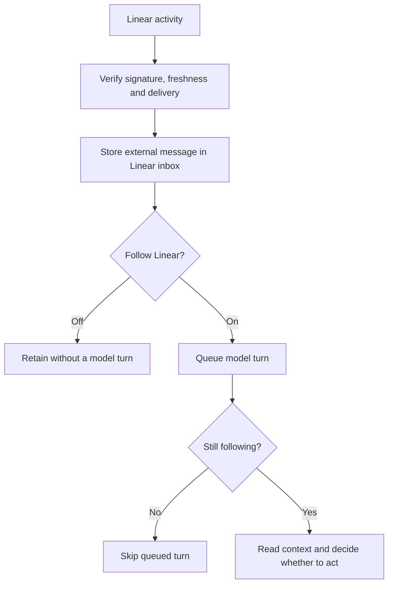

# ADR 0168: Linear awareness is opt-in

Status: accepted (James, 2026-09-08, operator conversation).

## Context

James sometimes wants Clankie to follow the swarm live and usually wants him
quiet. Workers and Clankie can post through James's Linear account. An author
email identifies the account, not the human who wrote a comment. The observed
session contains 542 comment wakes in about 25 hours, including Clankie's own
reply returning as a fresh wake. A stream of routine status reports is useful
context but is not a stream of new operator instructions.

## Decision

The signed webhook accepts all subscribed data-change resource types and
`create`, `update`, and `remove` actions. The owner selects all available
activity events in Linear. HMAC verification, timestamp freshness and bounded
delivery deduplication stay at the public ingress (ADR 0165).

`linearWebhook.following` defaults to false. The headless CLI, local operator
API and `/connect linear` expose the same switch. It applies per delivery and
again before a queued hook starts a model turn. Every accepted event is saved
as an `external` message in the inbox. Off suppresses model turns, not delivery.
Turning on follows new deliveries without scheduling a turn per old message.
Skipping a queued turn leaves its inbox message intact. A running turn finishes
normally. Retained external messages are available for
Clankie to read when asked to check the inbox; receipt alone does not load them
into model context.

Accepted activity is stored in the stable `linear-inbox` conversation, titled
**Linear inbox**, with its own durable Pi context. Retention preserves unread events and bounds
consumed history. The inbox conversation is exempt from automatic pruning. Hooks do not enter the default global conversation or its bound
Herdr seat. Operator chat and fleet-completion watches retain their routes.
The inbox is a reading room, not a lead room: turns there carry no Herdr
census (ADR 0149), whoever opens them.

The webhook about an object Clankie himself just wrote through Linear's MCP is
dropped at ingress (`self_echo`). He posts through the owner's account, so the
actor cannot tell them apart; the object id can. The MCP host reports every
settled call, the service remembers the ids a successful write's result names
for 90 seconds, and a delivery whose `data.id` matches is not ingested. A
human's later edit to the same object outlives the window and arrives
normally.

The event is quoted as untrusted external context, including its actor and
metadata. Its first line is a headline (type, action, issue, actor). A hook
wake is worded when the turn starts: one headline per event not yet surfaced
by a wake, nothing else, so a routine event costs one line and no tool call.
How to read deeper lives in his standing instructions, not in every wake. The
TUI renders external activity the same way, headline shown and payload folded. The model sees the type, action, URL, timestamp, data and previous
values, bounded to 8,000 characters before quotation. Clankie chooses whether
anything deserves action; silence is ordinary. A shared account name does not
establish human authorship. His own echoes require no reply. A webhook grants
no new authority and requires no acknowledgment on Linear.

## Alternatives

A separate Linear identity for every writer can improve attribution but does
not answer when James wants live awareness. The follow switch remains useful
regardless of identity setup.

The passive inbox uses existing conversation persistence, replay, and retention.
A durable acknowledgment cursor tracks reviewed external messages. A forward
read returns the oldest unread events, 20 by default and up to 100, within a
30,000-byte budget (under 31 KB for the full response), below the bash tool's
50 KB output cap. `headlines` returns one line per event; `before` returns the
events just before a cursor, read or not, so he walks history back from
`oldestCursor` as deep as he wants. Reads never consume. The response supplies
an `ackCursor`; only an explicit acknowledgment advances the read boundary,
and only to an unread event he was already shown, whichever way he reached it.
Retries are idempotent and cannot consume later arrivals. Legacy consume-on-read markers
are not evidence of review, so retained history is offered again once.
Live and manual reads share this contract. Transport failure leaves the page
unread; acknowledgment records the caller's review, not inferred comprehension.
External messages do not
impersonate the operator or a fleet agent and do not emit reply notifications.

Deliveries coalesce: at most one hook turn waits behind a running one, and
every delivery that lands before it starts rides it, since the turn reads the
whole unread page. A burst costs one turn of context, not one per event. The
existing serialized conversation runner carries it.
