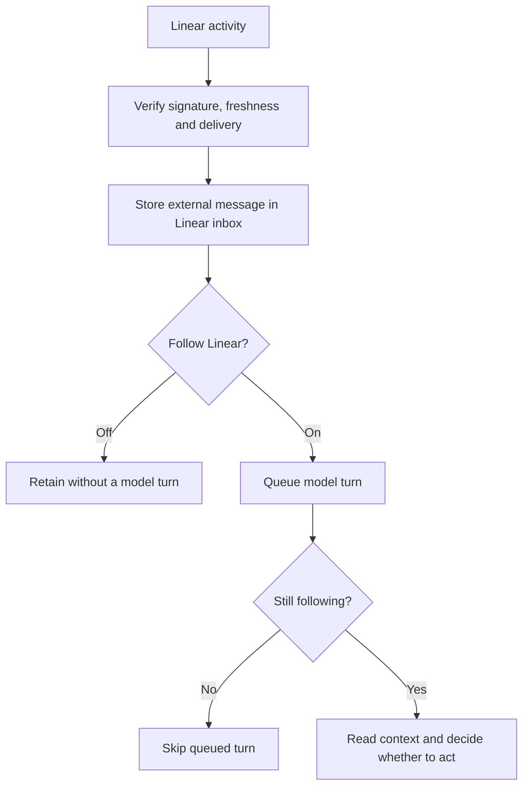

# ADR 0168: Linear awareness is opt-in

Status: accepted (James, 2026-09-08, operator conversation).

## Context

James sometimes wants Clankie to follow the swarm live and usually wants him
quiet. Workers and Clankie can post through James's Linear account. An author
email identifies the account, not the human who wrote a comment. The observed
session contains 542 comment wakes in about 25 hours, including Clankie's own
reply returning as a fresh wake. A stream of routine status reports is useful
context but is not a stream of new operator instructions.

## Decision

The signed webhook accepts all subscribed data-change resource types and
`create`, `update`, and `remove` actions. The owner selects all available
activity events in Linear. HMAC verification, timestamp freshness and bounded
delivery deduplication stay at the public ingress (ADR 0165).

`linearWebhook.following` defaults to false. The headless CLI, local operator
API and `/connect linear` expose the same switch. It applies per delivery and
again before a queued hook starts a model turn. Every accepted event is saved
as an `external` message in the inbox. Off suppresses model turns, not delivery.
Turning on follows new deliveries without scheduling a turn per old message.
Skipping a queued turn leaves its inbox message intact. A running turn finishes
normally. Retained external messages are available for
Clankie to read when asked to check the inbox; receipt alone does not load them
into model context.

Accepted activity is stored in the stable `linear-inbox` conversation, titled
**Linear inbox**, with its own durable Pi context. Retention preserves unread events and bounds
consumed history. The inbox conversation is exempt from automatic pruning. Hooks do not enter the default global conversation or its bound
Herdr seat. Operator chat and fleet-completion watches retain their routes.

The event is quoted as untrusted external context, including its actor and
metadata. The model sees the type, action, URL, timestamp, data and previous
values, bounded to 8,000 characters before quotation. Clankie chooses whether
anything deserves action; silence is ordinary. A shared account name does not
establish human authorship. His own echoes require no reply. A webhook grants
no new authority and requires no acknowledgment on Linear.

## Alternatives

A separate Linear identity for every writer can improve attribution but does
not answer when James wants live awareness. The follow switch remains useful
regardless of identity setup.

The passive inbox uses existing conversation persistence, replay, and retention.
A durable read cursor in conversation metadata tracks consumed external messages.
`clankie linear inbox read` returns and consumes up to 20 unread events; preview
does not consume. History stays under normal conversation retention. Live wake
prompts use the same read command, so manual and live reads share one unread
boundary. A failed response transport after consumption can require rereading
conversation history; consumption records delivery, not model comprehension. External messages do not
impersonate the operator or a fleet agent and do not emit reply notifications.

Batching can reduce turns during sustained bursts. This mode currently admits
one queued turn per delivery and uses the existing serialized conversation
runner. Add batching when live-follow traffic shows that queue cannot keep up.
