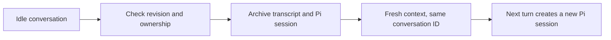

# 0169: Conversation context can start fresh

Status: Accepted

## Context

The default Clankie conversation has a stable identity and accumulates model
context. Clearing the console only changes presentation. Creating a different
conversation leaves the default routing target and its model context intact.

## Decision

The shared conversation API exposes a revision-guarded `reset` operation,
projected by `clankie reset --conversation ID` and TUI `/reset`. It preserves
identity and durable memory while replacing the service-owned transcript and
Pi session with fresh metadata. The previous directory remains in a sibling
`conversation-archives` directory, outside live-history pruning.

Remote reset requires the device’s `steer` grant.

Reset refuses active turns, open side conversations, unsupported scopes, and
an externally bound default seat. An external harness owns its own context;
resetting its service projection cannot reset that context.

The store stages fresh metadata before renaming the live directory to its
archive, then installs the staged directory. A failed installation restores
the original directory. Startup completes an interrupted swap when the archive
and pending metadata exist and the live directory is absent. Reset clears
cached sessions, conversation goals, and watches through the existing cleanup
hook. Advancing the retained cursor boundary forces old observers to recover.

## Consequences

The root can start fresh without deleting history or changing webhook routing.
Archives consume disk until explicitly removed. Persona, settings, and durable
memory remain available to new sessions. Reset is distinct from screen clearing
and from creating another conversation.
