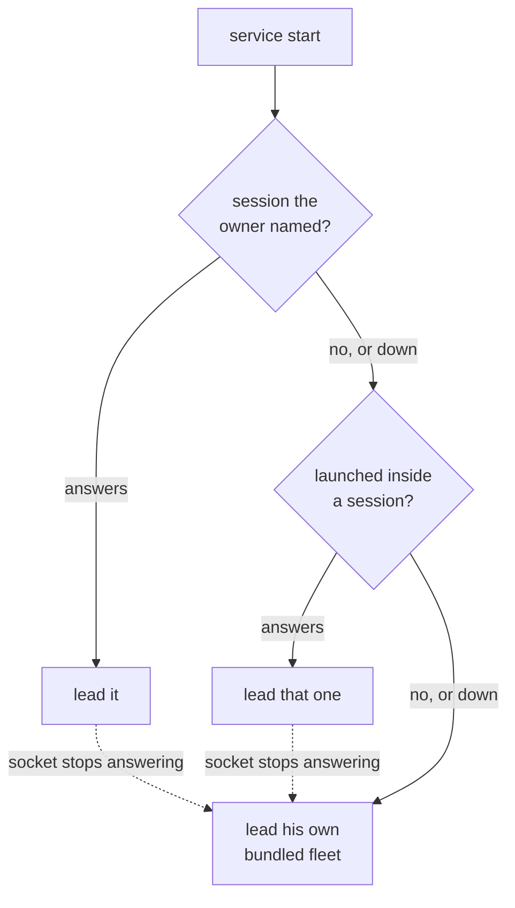

# ADR 0170: A session that stops is unbound

Status: accepted (James, 2026-09-08). Amends
[ADR 0164](0164-the-fleet-is-its-own-session.md): the fleet is still its own
session, but `auto` now follows the session the service was launched inside,
and no binding is saved back to settings. Everything else 0164 decided — the
owned fork, the fleet outliving the service, `clankie-herdr` as the fleet's
CLI — is unchanged. Continues the chosen-not-inherited line of
[ADR 0149](0149-his-herdr-session-is-chosen-not-inherited.md) by making the
choice cheap to express and impossible to be trapped by.

## Context

The binding was a pin with no way out. `auto` chose bundled on first start and
the service wrote the result into settings, so a machine that had once adopted
an external session carried `runtime: external` plus that session's socket
forever. When the session stopped, startup did not degrade: the resolver ran
`herdr api snapshot` against the dead socket, the raw `execFile` rejection
escaped, and the service exited 1 before its own error message could say why.

```
✗ Clankie: Clankie exited with code 1.
Error: Command failed: herdr api snapshot
{"error":{"code":"server_not_running","message":"no herdr server is running at …"}}
```

A settings file is not a heartbeat. The owner's terminal is: starting Clankie
from a pane says which fleet is in front of them, and closing that Herdr says
it is gone. ADR 0164 read an inherited session as an accident to be ignored,
which is right for the roster it protects — a session Clankie was never given
is not his — but wrong about the one session the owner deliberately typed
`clankie` inside.

## Decision

**The binding is chosen fresh at every start, and no candidate that fails to
answer is fatal.** The service tries, in order:

1. the session or socket the owner named (`clankie herdr set --session NAME`,
   `/herdr` in the console) — a standing instruction that outranks the terminal;
2. the session the service was launched inside, read from `HERDR_SOCKET_PATH`
   and named from `herdr session list --json`;
3. his own bundled fleet.

`clankie herdr set --runtime bundled` opts out of 1 and 2 entirely: the owner
asked for his own fleet and no session is probed. Each candidate is probed with
`herdr api snapshot`, which never starts a server, so a saved session that is
down reads as down.

**Nothing is written back.** Settings hold the owner's intent; `GET /v1/herdr`
and `clankie herdr status` report what is live, and the two are allowed to
differ. A named session that is down today rejoins the moment it is up and
Clankie restarts.

**A bound session that stops is unbound while he runs.** The service watches
the external socket, and after three refused connections in a row it starts its
own runtime and re-points every child it spawns from then on.



## Consequences

- Clankie boots. No configuration, no reachable session, and a dead saved
  socket all resolve to a fleet he can lead rather than to exit 1.
- Typing `clankie` in a Herdr pane puts him in that session, with no settings
  write and nothing to undo later. Typing it anywhere else gives him his own.
  This is the reversal of ADR 0164's "launching inside is not a signal"; the
  roster it guarded is still the fleet's session and nothing else, because a
  session he was launched in is one the owner opened Clankie inside on purpose.
- Settings stop accumulating machine state. A `socketPath` there is now only a
  custom socket the owner wrote, and the legacy one a previous version saved on
  adoption is honored while it answers and stepped over when it does not.
- The fallback is one-way within a run: a session that comes back is rejoined
  at the next start, not mid-flight. Sessions already spawned in the stopped
  Herdr are gone with it; children spawned after the fallback get the new
  socket.
- `/health` gains an owned-runtime state it did not report while external, and
  the operator endpoint changes answer without a restart, so consoles follow
  the fallback on their next read.
