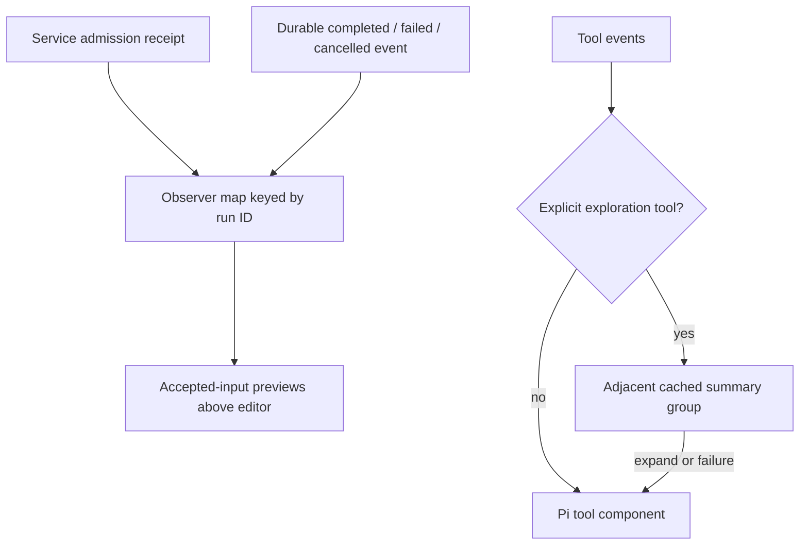

# 0171. The console keeps work in the background

Accepted 2026-09-20.

## Context

The operator needs to follow Clankie's conversation while tools run and see
whether additional instructions are still outstanding. Individual read-output
blocks and routine service status compete with that conversation. Codex's
compact exploration groups and pending-input previews provide the reference.

## Decision

Keep Pi's editor, scrolling, selection, search, and tool renderers. Group only
adjacent explicit `read`, `grep`, `find`, and `ls` tools into an expandable
Exploring / Explored component. Show three operation summaries at most and an
overflow count; failed output remains visible. Expansion uses the original Pi
components. Messages, other tools, and settled turns separate groups. Classifying
arbitrary shell commands would require a command parser and is outside this
presentation change.

The footer shows working context, model/effort, and remaining context, using
one row when they fit and two when they do not. Routine Discord and Herdr
status belongs in `/status`; side-conversation and shell state remain in the
dock. Successful turn lifecycle labels do not occupy a status row.

The existing prompt observer publishes accepted local steers and follow-ups to
the dock, keyed internally by their service run IDs. Completion, failure, or
cancellation removes the matching preview. Admission failure uses the existing
prompt restoration flow. Receipt/event races use the observer's serialized
admissions before settlement. This adds no service API or durable client queue.

The protocol reports acceptance and settlement, not dequeue or consumption.
Consequently the label is **Accepted inputs · awaiting completion**, with
**Steer** and **Follow-up** identifying delivery mode. Reconnects within the
same observation retain previews; ending observation or switching conversations
clears them. The durable transcript retains submitted messages. Editing or
cancelling individual queued inputs requires service-backed controls and is not
offered by this display.

## Verification

Shell tests cover grouping, expansion, failure visibility, replay-only
completions, turn boundaries, and preview bounds. The prompt-session test
covers concurrent startup admissions, settlement racing receipts, and removal
by run ID. Footer tests cover compact and narrow layouts. The transcript
benchmark compares the same Pi read components ungrouped and grouped.
