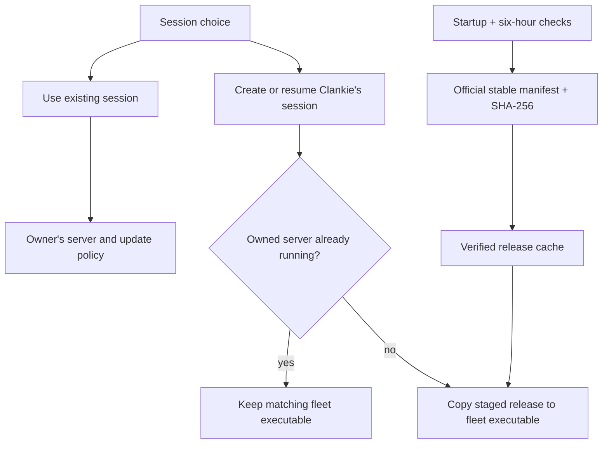

# 0172. Herdr sessions follow official releases

Accepted 2026-09-20. Amends executable sourcing in ADR 0157 and ADR 0164.

## Context

The operator chooses which agents Clankie sees, not how an executable is
packaged. A menu of internal, external, and bundled runtimes obscures that
choice. A pinned private fork also creates a second Herdr update stream.
The owner explicitly chooses independent official releases over following the
Herdr installed on the machine.

## Decision

`/herdr` offers **Use an existing Herdr session** and **Create a session for
Clankie**. `clankie herdr use NAME` and `clankie herdr create` are the same
settings write path. The existing low-level settings remain compatible.
Create reuses the owned session's retained state; it does not delete workers
or create a fresh fleet each time. Changes take effect on service restart.

Clankie's own session runs official stable Herdr release binaries. The service
checks `https://herdr.dev/latest.json` on startup and every six hours. It accepts
only stable versions, official `herdrdev/herdr` release asset URLs, and matching
SHA-256 hashes, with bounded download size/time and atomic installation.
A verified cache or the checksum-verified official packaged binary supports
offline startup. No Jev workflow, upstream fork rebase, or source compilation
is part of the update path.

Releases are staged under `$CLANKIE_STATE/herdr/releases/<version>/herdr`.
The current fleet's executable is a separate copy at `herdr/bin/herdr`, used
by its supervisor, captain tools, and native viewer. Updating a download cannot
change the CLI protocol underneath a running server. An existing pre-upgrade
fleet may retain its compatible bundled executable solely to preserve its
live workers.

The staged release is promoted when Clankie starts with no live owned fleet
server. Restarting Clankie alone adopts that server and does not upgrade it.
The operator ends the fleet explicitly when its work is finished; Clankie never
kills worker panes to install an update or uses experimental live handoff.
Existing sessions chosen by name retain their owner's executable and update
policy. The app does not replace the user's installed Herdr.

Release packaging downloads the pinned official binary and the corresponding
checksum-pinned official source archive for the native license inventory.
`scripts/release/herdr.json` is the reproducible offline baseline; the runtime
stable channel does not wait for that pin to advance.

## Verification

The official macOS ARM64 release passes the native lifecycle smoke, including
worker execution, environment restoration, adoption, crash recovery, owner
death, and explicit fleet stop. The managed smoke exercises automatic download
and the matching CLI copy. Unit tests cover menu settings, checksum and URL
rejection, caching, offline recovery, and preserving a live fleet's executable.
