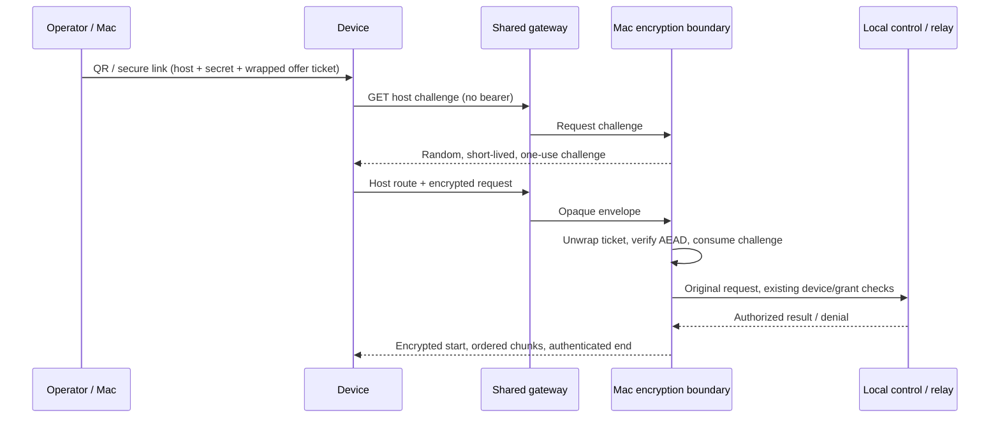

# ADR 0173: The gateway cannot read device traffic

Status: accepted for VUH-1112 implementation (2026-09-20). Amends
[ADR 0151](0151-the-public-doorway-routes-home.md). Deployment and external
customer release remain separate gates requiring inspected evidence.

## Decision

Device application traffic uses an authenticated AES-256-GCM envelope between
the device and its Mac. The gateway routes opaque ciphertext. Node's platform
crypto, Expo Crypto's platform AES-GCM, Apple CryptoKit, and Android's platform
Cipher implement the cipher; the protocol package contains only portable schemas.

Pairing receives a random 256-bit secret and a host-wrapped ticket through the
operator's QR or pasted `clankie://connect` link. The encryption credential is in
the link fragment, never an HTTP URL. The device proves possession by encrypting
the single-use offer redemption; the host proves possession by returning an
authenticated response before the app accepts host identity or grants. The
operator's out-of-band link is the trust anchor. A substituted link from an
untrusted source is not an authenticated pairing ceremony.

Eight-character public pairing codes are refused with an instruction to scan or
paste the full secure link. The gateway knows their routing hashes and can search
the short code space; they cannot authenticate an untrusted gateway. Direct
private connections retain their existing short-code flow. A PAKE or an additional
operator comparison ceremony is a future product choice, not a silent downgrade.

## Key and authorization lifecycle

The credential broker stores one random host wrapping key under
`clankie-gateway-encryption`. Tickets contain a secret, subject, stage and expiry,
sealed with AES-GCM and the host id as authenticated data. The gateway cannot
unwrap them; no ticket/key registry moves to the cloud.

An offer ticket permits only redemption of its exact offer hash. Its replacement
pending ticket names the resulting device and completion-token hash, and permits
only that completion. Completion returns a fresh device secret and ticket. Device
tickets expire with the signed session. Session refresh rotates both the secret
and ticket over the authenticated response. Old credentials remain bounded by
their original session expiry; revocation takes effect immediately through the
live device projection. The app stores the secret and ticket alongside the device
bearer in platform secure storage. A device ticket never replaces that bearer.

Every device exchange verifies the live local device identity, matches it to the
ticket subject, and then traverses the original control/relay route. Existing
grant checks, redaction, terminal-control leases and checks between tail pages
remain authoritative. An envelope cannot widen authorization. Push registration
replaces its exposed device bearer with a one-use encrypted device-self proof;
the gateway receives only the resulting authorization/delivery metadata.

Each request uses a fresh platform-random 96-bit nonce and an independent random
256-bit response key inside the encrypted request. Response records use that
per-exchange key and fresh random nonces. Tags are 128 bits. AAD binds protocol
version, direction, host, the exact subject-bearing ticket, host challenge,
client request id, and response sequence. A response cannot be reflected as a
request or moved to another exchange.

The host holds at most 4096 challenges, valid for 60 seconds, and consumes one
synchronously after request authentication, before dispatch. Replay cannot cause
a second side effect. A restart clears challenges while retaining the broker key:
old requests fail, fresh requests with valid stored device credentials work.
Reconnect retries acquire a new challenge; operations whose response was lost
still follow their existing idempotency contract. The envelope does not invent
exactly-once delivery or retry a write automatically.

The start/status/headers, every body chunk, and the terminal end marker are
authenticated. JS HTTP and long-poll callers receive a result only after the end
marker validates. Native terminal observers verify each record before displaying
its bytes and reject an incomplete stream; existing cursor recovery handles a
subsequent connection. Deliberate caller cancellation is not a successful end.

## Coverage and visible metadata

The carrier permits only challenge, encrypted-exchange, and the separately
signed Linear webhook routes under a host path. The Mac validates the decrypted
public route allowlist. Pairing, restore, refresh, conversation dispatch/tails,
control, artifact byte downloads, native terminal observation and JS terminal
control all traverse this boundary. Plaintext application routes return `426`;
plaintext device authorization on an envelope route is refused.

Visible metadata includes gateway account/host connection identity, host route,
opaque ticket and challenge/request identifiers, ciphertext lengths and timing,
connection/cancellation events and carrier status. Padding is not provided.
Push delivery intentionally retains APNs routing tokens, registration/device ids,
chat authorization, conversation wake ids and delivery-key hashes under ADR 0159.
Signed third-party Linear webhooks and Cognito sign-in are separate gateway
services, not device-to-host application traffic. TLS remains required for the
public carrier; loopback HTTP exists only for local tests.

## Recovery, threat model and alternatives

An active or compromised gateway can observe metadata, deny service, reorder,
replay, truncate or substitute traffic. It cannot decrypt or forge authenticated
application traffic without a device/host secret. Compromised endpoints and a
leaked operator QR are outside this boundary. There is **no forward secrecy**:
a later endpoint key compromise can decrypt recorded traffic from that key's
lifetime. TLS alone was rejected because it ends at the gateway. A custom
JavaScript cipher or unauthenticated public-key download was rejected. Native
ECDH is not exposed by the installed Expo crypto API; out-of-band high-entropy
pairing reuses installed cryptography and makes its trust anchor explicit.

`clankie gateway rotate-encryption-key` (also in `/gateway`) replaces the broker
wrapping key. After the coordinated captain restart, old tickets fail and every
device must pair again. It does not restart or deploy automatically. Lost or
invalid broker keys fail closed. There is no automatic key replacement for a
malformed stored credential and no plaintext fallback for old app sessions.

`clankie gateway status` diagnoses reachability. `encryption_required` or
`secure_pairing_required` means the client needs secure pairing; an
`invalid_encrypted_request` carrier refusal means expired, rotated, mismatched,
replayed or unauthenticated identity. It deliberately exposes no decryption
oracle detail. A healthy connection with that refusal requires a fresh pairing
QR, not repeated sign-in to Cognito. Deploy matching gateway/host/app versions
and perform fresh review pairing before reopening external testing.

## References

- [VUH-1112](https://linear.app/vuhlp/issue/VUH-1112/encrypt-device-to-host-traffic-across-the-shared-gateway)
- [NIST SP 800-38D](https://tsapps.nist.gov/publication/get_pdf.cfm?pub_id=51288)
- [Apple AES.GCM.SealedBox](https://developer.apple.com/documentation/cryptokit/aes/gcm/sealedbox)
