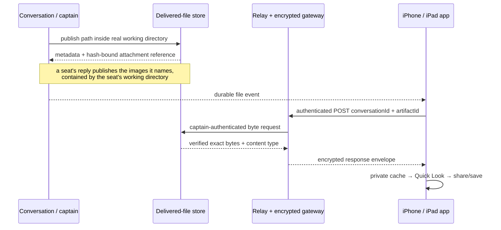

# 0174. Finished files belong to conversations

Accepted 2026-09-20.

## Context

Clankie can create reports, spreadsheets, presentations, and site bundles, but
a filesystem path is not a usable delivery. A phone cannot dereference the
Mac's path, a public download URL would outlive device authorization, and a
bearer in a URL would leak through history and logs. The durable conversation
already owns the message that says the work is finished and the retention
window in which the result remains meaningful.

## Decision

A deliberate `deliver_file` tool and the local `publish_file` service operation
copy one regular file from the conversation's real working directory into the
existing attachment root. Realpath containment rejects symlink and `..`
escapes. Files are capped at 15 MiB, stored with private permissions, and named
by an opaque artifact id with a SHA-256 manifest. The conversation appends a
strict `file` event containing only the id, safe filename, content type, size,
and hash. Reset, close, and retention pruning remove the conversation's bytes.

Downloads use `POST /operator/v1/artifacts/download` with the conversation and
artifact ids in a JSON body. Local clients authenticate with the captain bearer;
remote clients authenticate with their device session and require the `chat`
grant. The public gateway carries the same host-scoped application route inside
its encrypted envelope. No download URL contains a bearer, device secret, or
artifact capability. The host revalidates the manifest, size, and hash before
returning the exact bytes and published content type.

A seat in a DM has no `deliver_file` tool; it is a vanilla harness that names
paths in prose, which is exactly the delivery this decision rejects. When a
seat's reply folds into its persona thread, each image it names (png, jpeg,
gif, webp; at most four per reply) is published through the same store with the
seat's working directory as the containment root, and follows the message as a
`file` event. A name that is not a file, escapes that directory, or exceeds the
cap stays prose, and an artifact already in the thread is not repeated. The
reply is untrusted model output, so it can only choose among images already
inside the directory the seat works in, and only the owner's authorized devices
can fetch them.

Codex also records an explicit `ImageView` item when a seat inspects a local
image. That native item is preserved as an internal transcript entry and, only
for a supported image suffix, published through the same containment root. A
serial queue keeps viewed images in their native order; file events append
after prose the transcript has already folded. Its host path never enters the
conversation protocol. Retained sessions backfill previously unprojected views
on the next transcript fold. A view is checkpointed after the file event is
confirmed, so an interrupted queue retries on restart; a missing or outside
path gets one bounded retry and then stops without breaking later messages or
images. The head seat uses its live Herdr working directory by the same rule.

The app renders each event as its own block: an image shows inline, fetched
through the same authenticated download, and every other file is a card. A tap
downloads through the injected authenticated transport first, checks the
published size and content type, then writes the bytes to the private device
cache and presents Quick Look.
Quick Look supplies native preview and share/save actions on both iPhone and
iPad. Discord machine-authorized turns use the same store and existing
hash-bound attachment resolver; ungranted social turns never receive the tool.

## Consequences

The artifact is durable for exactly the conversation lifetime rather than a
second retention policy. Publishing remains local because it accepts a host
path; remote devices can retrieve but cannot ask the Mac to publish arbitrary
paths. The 15 MiB ceiling keeps relay and mobile memory bounded. Larger or
multi-file results are delivered as a deliberate archive or through a future
streaming object store if measured use requires it.

## Alternatives

- Signed public URLs were rejected because URL history becomes a second secret
  and revocation boundary.
- Direct native URL downloads were rejected because they bypass the injected
  encrypted device transport.
- Teaching every seat harness a publish command was rejected: a seat already
  says which image it means, and a rule per harness would have to be carried
  into every repo a seat works in.
- Keeping source paths in transcript events was rejected because paths disclose
  host layout and are meaningless off the host.
