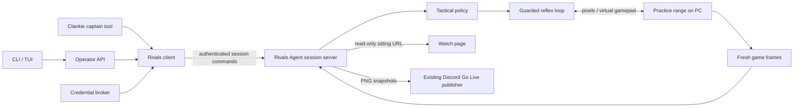

# ADR 0175: Rivals Agent is a gameplay skill

Status: accepted (James, 2026-09-20).

## Decision

Clankie uses Rivals Agent for both Spider-Man tactics and controller execution.
Clankie owns the sitting's purpose, conversation, and what he remembers. The
Rivals process owns perception, tactical decisions, and the fast guarded pad loop.
The Pokémon body seam remains specific to Pokémon.

## Contract

`POST /v1/rivals` and the captain's `rivals` tool share one validated command
schema. Commands are `status`, `start`, `objective`, `observe`, `share`, and
`stop`. CLI and TUI use the same operator API. The service resolves the
`rivals-agent` bearer from its broker and reads `gameplay.rivalsUrl` live.
Redirects are refused; response bodies are bounded.

The server runs in the PC's interactive desktop session. It opens capture and
the pad only when a sitting starts. A start has an idempotency key; subsequent
commands name the observed session ID, so a delayed stop cannot kill a new
sitting. Starts return `starting`; only a guarded loop tick establishes
`running`. Each sitting is bounded to 1–1800 seconds (default 300), and stop
requests return `stopping` until the loop releases its pad. The existing
practice-range guards remain authoritative. This API does not navigate menus,
queue matches, or expose raw inputs or a shell.

Objectives have `mode` and a prose `note`. `autonomous` uses the scripted tactical
policy, `combat` practices ordinary engagement while preserving its retreat
guard, and `disengage` asks the controller to withdraw. Notes are retained context;
`noteApplied: false` states that the current scripted policy does not interpret
them. This is not a claim that a learned policy is installed.

The observer publishes only frames whose range HUD is confirmed. Missing or
older-than-one-second frames refuse. PNG encoding happens on the reader thread,
outside the control loop. A read-only watch capability names one sitting and
expires when it stops; it cannot call control endpoints. Go Live consumes that
same frame source through the existing PNG publisher. A publish request is
`requested`, not `live`; the existing Vox media receipt proves delivery. There
is no game-audio feed in this integration.

## Alternatives and limits

Generalizing the GBA action schema would mix battle menus and real-time tactics
in one contract. A separate small client preserves both domains. Routing each
stick input through Clankie's model would put network/model latency in the reflex
loop; high-level objectives avoid that.

The bridge's `--dry` mode runs recorded pixels through real perception, policy,
and controller with a fake pad. It reports `execution: replay`; it verifies the
integration, not closed-loop gameplay skill. Live PC and Discord delivery need
their own evidence. Only one operator may own the PC desktop at a time, including
other Rivals development scripts. See [setup](../rivals.md) and
[VUH-1316](https://linear.app/vuhlp/issue/VUH-1316).
