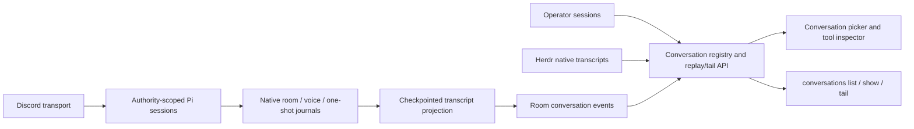

# ADR 0176: Every room is an inspectable conversation

Status: accepted

## Context

Discord research produces the same kinds of messages and tools as operator
work. A heard/said lane tail cannot explain that work, and requiring an
operator or agent to hunt down Pi files makes ordinary inspection needlessly
hard. The conversation contract already provides discovery, replay, live tails,
redacted tool details, and a visual renderer.

## Decision

External Discord text and voice captain rooms have an explicit `room` scope
with a lane and target. Their stable conversation id groups the native sessions
for that room, including actor-granted one-shots. The sessions retain their
independent model contexts and tool authority. Inspection does not grant send,
reset, fork, or autonomous execution authority over an external room.

The native Pi journal remains authoritative, as native harness journals do for
Herdr seats. Its messages and tools are projected into the existing conversation
event log with per-source entry checkpoints. Startup discovers journals modified
within the 30-day retention window; live Pi events advance their projections and
wake ordinary conversation tails. A source entry identifies the native file.
Images are not copied into the event log; tool details retain the existing
redaction and size bounds. Voice history is captain handoffs, not ambient speech.
Turn events describe captain execution, not confirmed delivery by Discord.

The TUI picker lists every conversation scope. Room views show read-only status
and expandable context/tool entries. `clankie conversations list`, `show`, and
`tail` provide the same authenticated contract to agents, with explicit paging.

## Trade-offs

Extending `/trace` alone would keep two inspection contracts and omit tool
history from the normal conversation UI. Moving all Pi sessions into the
operator runner would conflate transport permissions and execution lifetime.
The existing transcript projection provides one inspection contract while
preserving both boundaries. It stores a bounded readable projection beside the
native source, and discovery uses the existing conversation retention window.
