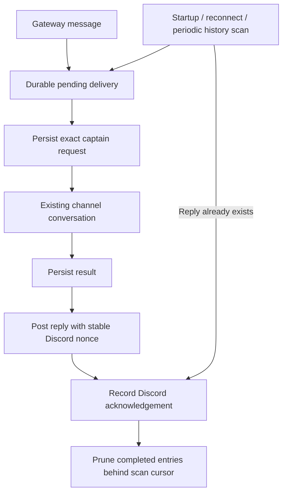

# ADR 0177: Discord delivery survives a bridge restart

## Decision

The official bot keeps a mode-0600 SQLite delivery journal beside its receipt
log (`discord-text-inbox.sqlite`). Discord remains the source of channel
history. The journal holds message ids, scan cursors, and the exact accepted
captain request/result until delivery is acknowledged. Completed entries are retained for seven days
before pruning behind the scan cursor. It is not a second
conversation or a new agent.

On startup, reconnect, and once a minute, the bridge scans admitted guild text
channels, active threads, and previously known DM channels after their saved
cursors. Mentions, configured names, and replies to the bot enter the journal;
ordinary offline chatter does not. An interrupted accepted turn remains
pending even when its trigger was an implicit conversational follow-up.
Current ingress and presence authority still gate every recovered delivery.
Messages arriving live retain the existing attention and reply policy.

The first installation scans the preceding 24 hours and imports unfinished
accepted deliveries from the existing receipts within that window. Recorded
replies and deliberate silence are acknowledged; historical
failures are reconsidered only when the history scan finds a directed message.
Subsequent downtime uses persistent cursors rather than a time cutoff.
Legacy absorbed receipts without an owning-delivery link are reconsidered
independently, rather than treated as proof that a reply reached Discord.

A retry reuses the exact accepted request, so a surviving captain can return
or join its existing delivery-id result. A result already saved in the journal
never runs the model again. A failed model result is retryable in both ingress
and the service. A deliberate silent result is completion, not failure.

The journal saves the outgoing reply before sending it. Discord history
reconciles that exact content when its acknowledgement was lost; a progress
update or tool-status card referencing the same question cannot acknowledge
the final answer. A stable
nonce also deduplicates immediate retry races using Discord's
[Create Message nonce contract](https://docs.discord.com/developers/resources/message#create-message).
The nonce window is only a few minutes; history reconciliation provides the
longer-lived check.

## Trade-offs

An in-memory queue or graceful shutdown alone cannot recover a killed process
or messages sent while offline. Replaying all server chatter creates unwanted
replies. The durable journal plus directed history scan covers those failures
without changing the captain's conversation model or creating an inbox UI.

This is at-least-once execution, not exactly-once tool execution: if both the
bridge and captain die before a result is saved, retrying may repeat work.
An absorbed message names its owning reply delivery. It stays pending until
that combined answer is acknowledged. If the combined answer was never saved
before a restart, the absorbed message is reconsidered as an independent turn
with a stable recovery id; a new answer to the first message cannot silently
acknowledge a question that was folded into the lost run.

Known DM channels and active threads are recoverable; the bot cannot discover
an unknown DM through guild history, and an undiscovered archived thread is
outside the active-thread scan. The lab user-session transport retains its
existing behavior.
