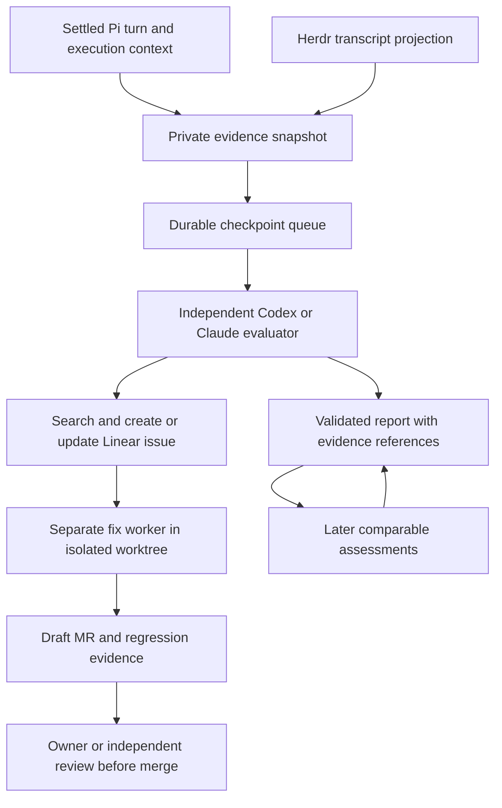

# ADR 0178: The evaluator has its own seat

Status: accepted (James, 2026-09-22). Tracked by [VUH-1350](https://linear.app/vuhlp/issue/VUH-1350).
Extends [ADR 0132](0132-a-goal-keeps-a-decision-journal.md).

## Context

James wants continuous independent assessment of Clankie's results, efficiency,
tools and harness, with useful findings becoming Linear issues and draft MRs.
The existing turn metrics and goal journals provide evidence, but Clankie's own
completion claim is not an independent assessment. A permanently prompting
reviewer would spend tokens waiting and could recursively review its own work.

## Decision

The service owns durable evidence and a serialized evaluation queue. Codex or
Claude Code runs in a service-created Herdr pane with fresh context for each
assessment. Enable, disable, status, open and retry are one operator API contract
projected through the CLI and TUI. The evaluator defaults off; Linear following
is independent and is never changed by evaluator controls.

Evidence is collected at settled Pi turns and native agent replies. Captures
coalesce by active goal identity, or by conversation when no goal identifies the
task. One quiet minute releases a checkpoint; a continuously growing queue item
releases after fifteen minutes. A checkpoint is not a task-completion claim:
the evaluator determines whether the result is ongoing, not a task, or unknown.
Native projections retain their session and entry identities and report unknown
usage/tool inventory. Pi capture retains the request, tool inventory, prompt hash,
skill catalog, goal decisions and settled metrics. Transcript tails explicitly
declare their 512 KiB bound; they are evidence excerpts, not complete archives.

An assessment is complete only when its agent settles and a schema-valid report
names that evaluation. The service persists dispatch before prompting and does
not automatically retry ambiguous failures. A restart inspects the same pane and
report. Failed assignments remain inspectable and require explicit retry. An
assessment exceeding thirty minutes is interrupted. Disabling stops capture and
new dispatch, while an already dispatched assessment finishes and is collected.

The evaluator may file substantiated findings and coordinate one separate fix
worker per assignment. These are agent instructions, not a sandbox or a new
workflow engine. The worker leaves a draft MR for review; no evaluator command
merges or deploys. Reports distinguish observed, issue created, MR open, applied
and validated, with evidence required for judgments. Prior findings accompany
subsequent assignments for deduplication and follow-up. Raw evidence stays local;
external issues receive redacted excerpts.

Service-created evaluator panes and observed descendants retain exclusion
provenance across restarts and parent exits. They remain visible in Herdr, but
their transcripts do not schedule evaluations. A changed binding or replaced
pane is surfaced rather than commandeering another agent.

## Alternatives

- A continuously thinking agent: unnecessary token cost and context growth.
  Host polling is cheap; the model only receives assignments.
- Clankie grades himself: useful reflection but weak independent evidence.
- A new observability or agent execution platform: existing durable records,
  Herdr lifecycle and harness-native tools cover the initial loop.
- Automatic retries after uncertain dispatch: could duplicate tickets or workers.
  Explicit retry follows inspection instead.

## Limits

The queue uses an atomic JSON state file, following the autonomy store pattern;
completed records and evidence require operator retention management as usage
grows. There is no single numeric quality score. Tool discovery, issue creation,
worker execution and later validation remain evidence-backed agent work; missing
credentials or insufficient traces are reported as limitations. The service
enforces one evaluator at a time, while worker limits and review-before-merge are
instructions to those agents. Gameplay outside captain turns uses its own play
journals and is not a separate automatic trigger here.
