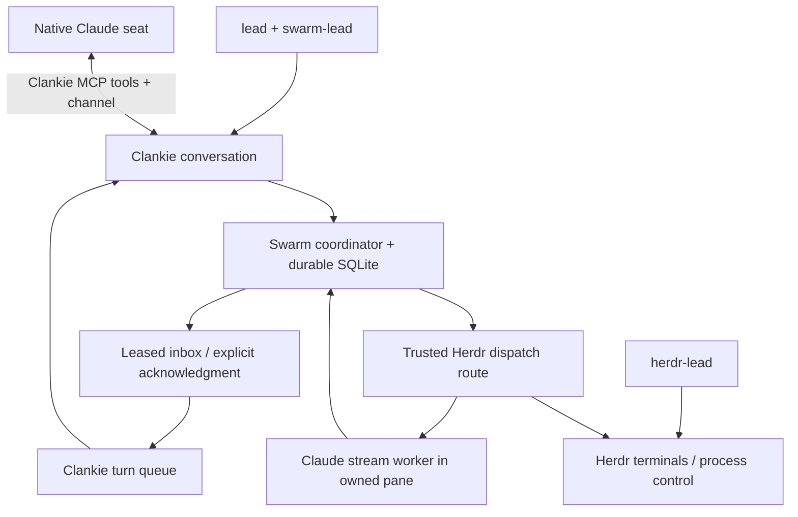

# 0180. Swarm owns cross-session coordination

Status: accepted. Extended by [ADR 0181](0181-clankie-is-independent-of-his-connections.md)
for independent runtimes, portals and optional trackers.

Clankie needs durable peer messages and task ownership across independent coding
hosts. Terminal input and pane status describe a running process but cannot
establish processing acknowledgment, task ownership or a restart-safe handoff.

Swarm MCP v2 is the coordination owner. Clankie embeds it as a pinned package;
its implementation stays in the swarm-mcp repository. The Pi operator runtime
mounts the nine tools per conversation and delivers leased envelopes through the
existing internal turn queue. Stable conversation identities survive a service
restart; each incarnation receives a new fenced session. The native Claude seat
uses the selected conversation's tools (global by default) through Clankie's MCP server and
receives envelopes through the plugin channel. Worker spawning uses a trusted
Herdr route whose token is persisted before creating a pane. Uncertain provisioning
retains its task and capacity; it never authorizes a second launch. Herdr's native
`layout.apply` replaces only the newly created tab with a direct argv process,
so interactive shell startup cannot consume the worker command. This existing
runtime API avoids a Herdr fork or shell-input readiness heuristics. The worker
publishes its actual pane ID in a private startup receipt; binding also requires
its authenticated runtime observation. A lost response is reconciled against
that receipt instead of replaying the launch.

`lead` holds shared leadership judgment; `swarm-lead` and `herdr-lead` select the
coordination workflow. Every worker uses the `swarm-mcp` protocol skill. Herdr
continues to own terminals, inspection and process control. Its leadership workflow
is an explicit fallback for unenrolled fleets, never a second delivery path for an
uncertain Swarm assignment. Native subagents remain appropriate for bounded work
inside one host. A configured work tracker holds the durable human-facing
deliverable record; it is independent of the coordination transport.

One private coordinator state directory is selected per canonical repository
under `$CLANKIE_STATE/swarm`. Worktrees share their repository's scope and each
conversation retains its own actor. The configured profile is `clankie`. The
initial built-in route provisions Claude workers in the requester's worktree,
with a capacity of four. Other hosts can participate through their supported
Swarm integrations; host availability and delivery support remain explicit.
The service and owned stream workers wake from durable inbox events without a
model polling loop. A channel-enabled native seat receives the global conversation's
wakes; plugin-dir seats have tools but no channel delivery.

The owner outlives the service connection. A service restart reconnects and fences
its prior sessions, preserving worker work. Cooperative cancellation waits for the
worker's fenced terminal outcome; closing a pane does not prove all descendants
stopped. Tool availability remains limited to operator conversations and the
authenticated native operator seat; this adds no authority to social Discord lanes.

The repository pins packed dependencies because the public npm package is the
legacy release. `vendor/README.md` records source provenance and regeneration;
release packaging includes the dependency graph and bundled skills. The skill
source remains in the skills repository, and checkout links resolve through the
installed package. No live global MCP configuration is rewritten.
