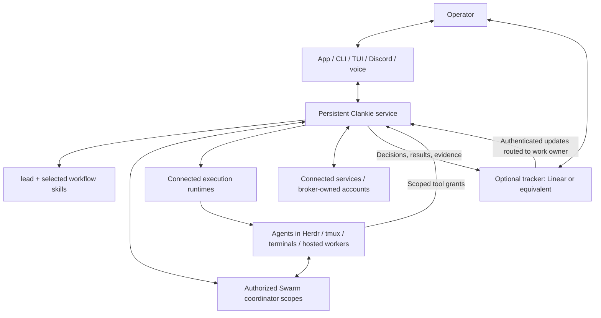

# 0181. Clankie is independent of his connections

Status: accepted (2026-09-23). Extends [ADR 0180](0180-swarm-is-the-coordination-layer.md).
The connection contract replaces ambient runtime selection as the architectural
default in [ADR 0170](0170-a-session-that-stops-is-unbound.md) and scopes
[ADR 0184](0184-clankie-leads-more-than-one-fleet.md) to Herdr connections.
Acceptance ratifies the design; current support and remaining acceptance live in
the [Swarm host README](../../packages/swarm/README.md#connection-contract-status).

## Context and decision

An operator can talk to Clankie in Discord, inspect work in Linear, and run workers
in independently created terminals. Making a Herdr session Clankie's identity
ties those choices together unnecessarily. Clankie is an always-on agent service;
his identity, memory, conversations and authorized ongoing work belong to that
service. The app, CLI/TUI, Discord, voice and native seats are portals to it.
Closing a portal does not end the work it owns.

The following roles compose independently:

| Role                  | Responsibility                                                                              |
| --------------------- | ------------------------------------------------------------------------------------------- |
| Clankie               | Understand intent, retain context, lead authorized work, review and deliver                 |
| Portals               | Converse, inspect and control under the caller's grants                                     |
| `lead`                | Shared leadership judgment; `swarm-lead` and `herdr-lead` supply concrete workflows         |
| Swarm MCP             | Preferred cross-session assignments, peer messages, ownership and handoffs                  |
| Execution runtimes    | Terminals and process lifecycle through available CLI/MCP capabilities; Herdr is one option |
| Optional work tracker | Durable outcomes, priorities, acceptance, dependencies, decisions and evidence              |



This is the accepted composition, not a claim that every depicted adapter ships.
Skills use existing tools; a new runtime does not require a universal adapter
framework or a speculative skill before someone needs its workflow.

## Connections and ownership

Runtime connections and Swarm connections have separate explicit identities and
scopes. One Clankie can use multiple authorized connections. The app, CLI and TUI
expose configured connections, their active state, participating sessions/agents
and unavailable capabilities. Opening a TUI or running `clankie restart` from a
different directory or terminal does not select a different fleet.

Swarm remains the preferred communication path even when Herdr runs every worker.
Agents started by the user can participate without Clankie creating them. They
need a reachable shared coordinator and authorized compatible scope; merely
installing the same MCP does not federate coordinators. Communication access does
not imply process control. Several ordinary terminal windows are usable when
their agents enroll or an explicit supported control route reaches them; arbitrary
windows do not become controllable by discovery alone. Uncertain dispatch keeps
one intent and one reconciliation path, never a duplicate terminal assignment.
Execution is optional: disabled or unavailable Herdr does not stop the service or
Swarm communication. Losing a selected runtime does not create a replacement
fleet. Connection health is separate from captain liveness.

## Work trackers and operator identity

Linear is an optional durable work surface. Several Swarm execution tasks may
serve one issue; the tracker receives meaningful decisions, blockers, results and
proof rather than every message. Work has one owning lead/conversation. An issue
reply routes to that owner, who responds on the issue and dispatches any resulting
authorized work through Swarm. A webhook delivery does not create another leader
or grant authority. Provider-authenticated actor IDs, configured operator grants
and the existing work scope determine what the event author can request.

The supported operator pattern is Discord for conversation, Linear for work and
review, Swarm for peer communication, and Herdr or another runtime for execution.
It permits an operator to work entirely in Discord and Linear. Equally, app-only
operation needs no external tracker or Discord account. With a tracker connected,
the app exposes the same work and its links rather than a competing authoritative
copy.

Agents publish tracker work through a configured automation account distinct from
the human operator's account. Workers retain individual Swarm identities and
record provenance despite sharing the outward tracker identity. Account selection
is owner configuration, never a hardcoded product email or display-name check;
existing shared credentials do not imply migration. Verified identity matters
before treating a comment as human direction or publishing under the bot account.

Webhook ingestion verifies the provider, deduplicates delivery IDs and correlates
specific outbound writes to their echoes. Ignoring every automation-account event,
or every update to a recently written issue, can discard another worker's result
or a human reply. Retry-safe processing preserves those distinct events and
resumes the existing work owner across service restarts.

The current ingress uses [durable returned-revision receipts](0168-linear-awareness-is-opt-in.md)
for conservative echo correlation and worker provenance. Signed events commit
once to the durable inbox, retain their selected issue owner and resume pending
followed wakes after restart. Explicit organization/issue bindings route new
activity to existing service conversations. Live provider account migration and
end-to-end Discord/Linear operation still require verification.

## Shared connected accounts

The operator connects supported services once in Clankie. Authorized workers call
through his MCP host under individual, revocable grants bound to the connection,
verified account, allowed operations, work scope and delegating authority. Swarm
supplies worker identity and coordination; enrollment alone grants no account
access. Provider credentials and refresh stay in Clankie's broker. Runtime
placement does not select the account, and missing or revoked access never falls
back to the human's credentials. Grants are enforced on every call and do not
broaden after restart. Linear is the first integration; the same contract applies
to subsequent supported connectors. Implementation boundaries and acceptance live
in the [shared-account plan](../../packages/swarm/README.md#shared-connected-accounts-slices-35).

The broker serializes Linear token refresh with credential replacement and
disconnect across processes. An existing-entry update transaction holds the same
lock as set/delete, rechecks the current entry and commits the refreshed token
before releasing it. Disconnect waits for an admitted refresh, then removes its
result. This uses the existing lockfile dependency and credential formats rather
than adding a separate revision store or a new secret database. The cost is
serializing unrelated writes during the bounded refresh; per-provider locks are
an option if contention warrants them. An in-process promise cache alone cannot
protect against CLI/service races. The MCP host separately invalidates transports
when configuration or credentials change and checks the selected credential on
each HTTP request. Worker grant enforcement remains a separate requirement.

The first worker boundary reuses the existing 15-minute capability-token issuer
and stores immutable grant records with durable revocation in service state.
This keeps secrets in the broker and permits restart without broadening grants.
An operator-authenticated endpoint issues each grant; the worker endpoint exposes
only selected provider tools. Sessions bind to a grant, and every request/call
checks revocation, expiry and account binding. Exact configured argument values
restrict tools whose semantics permit that boundary; a work ID alone is provenance.
Linear API keys and MCP OAuth support verified user/workspace identity. This
avoids sharing the operator lane bearer or treating enrollment as tool authority.
The [worker contract](../worker-access.md) records the current API/CLI and limits.

Swarm-bound grants additionally retain the scope, creator conversation, enrolled
worker, task attempt and fence. The service resolves and rechecks them through
that conversation's authenticated coordinator connection instead of trusting
worker-supplied ownership. Work completion, cancellation, lease loss or a new
attempt ends access. Tracker work IDs remain separate from execution task IDs;
one tracker issue can own several independently fenced assignments.

Renewable access is an explicit issuance option requiring a Swarm binding.
Renewal rechecks the live assignment and account, signs another bounded token
for the same immutable authority and keeps the original grant ID. It never
creates a descendant grant that could escape revocation. The issuance record
stays immutable, so renewal cannot race a file update and restore revoked access.
Only token timestamps change; lifetime and all restrictions remain fixed. MCP
handlers authorize each HTTP request's token instead of retaining the initial
session token. The worker bridge persists renewal in its private file; expired
tokens require reissue rather than becoming long-lived refresh credentials.

Enrolled workers retrieve already-issued grants through authenticated delivery.
Only the non-secret grant ID travels through coordination messages. The service
selects the coordinator from its stored binding, verifies the supplied Swarm
session there and checks actor, scope, assignment and account before returning
a worker token. This avoids credential-bearing messages and arbitrary worker-
supplied coordinator destinations. A fresh authenticated session can retrieve a
renewable grant after its previous token expires; an expired token alone cannot.
Delivery does not mint new authority or bypass the original revocation record.

Enrolled worker MCP sessions authenticate against a selected, already-connected
Swarm scope. They start with no tools and expose the union of that actor's valid
explicit grants, checking task/account authority again on every call. Grant
issuance and revocation send standard MCP tool-list notifications. This lets a
worker start before the leader knows its assigned actor, without issuing broad
bootstrap access or restarting the harness when access arrives. The built-in
Herdr route composes the bridge into trusted launch configuration; Swarm itself
stays independent of Clankie. Single-grant bearer delivery remains available.

The native Claude seat uses its selected service conversation actor (global by
default) via
Clankie's operator MCP bank. A separate native enrollment would split task creator
identity from the conversation that verifies grants. Sharing the existing tools
preserves one task owner across Pi and Claude; the existing channel delivers its
leased envelopes. Launch-directory context cannot select a different coordinator.
`clankie seat --conversation ID` selects an existing global/workspace conversation,
resolves its service-owned cwd, and retains the binding on resume. Prompt assembly
loads the same workspace agent instructions as Pi. MCP sessions pin the
conversation; channel outboxes and replies remain per conversation. A bridge
without a loaded channel does not consume its events. Launched Claude seats
project settled transcripts through an authenticated native hook, independently
of Herdr or channels; [ADR 0152](0152-a-harness-takes-the-operator-seat.md) defines
the binding and replay contract. Named external connections select an existing
coordinator explicitly, with a dedicated enrolled actor pinned to the owning
conversation. The same nine tools take a connection name; omission selects the
embedded coordinator. A connection ID cannot redirect outstanding work to another
endpoint, actor, scope or conversation. The broker stores capabilities; persisted
bindings and grants retain connection identity. This reuses authenticated IPC and
operator-managed SSH forwarding instead of adding a second coordination protocol.
The coordinator's existing dispatch configuration accepts multiple Herdr routes;
there is no second scheduler in Clankie. Route IDs share the existing namespace
with native and enrolled-peer routes. Provisioning receipts pin their runtime
paths and socket, so recovery cannot interpret a pane ID in another session.
Retargeting requires a new route ID; the original configuration remains available
for outstanding intents. Receipts without verified runtime identity require
explicit reconciliation. The owner reloads dispatch configuration on each request,
while refusing changes to its database or launcher identity. Disabling a route
revokes provisioning/recovery authority and leaves existing workers alive.

Clankie's `runtime` API/CLI/TUI stores named endpoints independently of his default
fleet. `swarm_assign runtime` selects execution and `connection` selects the
coordinator. The host synchronizes owned route files before connect/disconnect
succeeds, and before routed assignments. A bootstrap feature check prevents an
older owner from falsely accepting live configuration changes. Read-only combined
inventory is available through `connections`. Companion-app Settings uses a bounded
metadata projection over the existing operator relay with the `steer` device grant.
It manages named connections without receiving provider credentials or private
runtime paths.

Terminal catalogs include all enabled runtime connections, with runtime identity
separate from each Herdr session's workspace/tab IDs. Named terminal addresses
bind the connection, pinned endpoint and native terminal ID. One observer/control
store per runtime preserves existing leases and streams without cross-session
collisions. Every request rechecks current connection admission; observation and
control also recheck after an asynchronous attach. Disconnect or endpoint change
closes affected observers/controllers and refuses the old address. No request
falls back to another runtime. Default-fleet seat links retain their native IDs.

The app groups workspaces by runtime and local ID and passes terminal addresses
unchanged through the native renderer and relay.
[Swarm contacts](0182-swarm-peers-are-messageable-personas.md) use persona DMs
independently of terminals. Commons placement and shared channel rounds use
execution seats.

```mermaid
sequenceDiagram
  participant O as Operator portal
  participant C as Clankie
  participant S as Swarm owner
  participant H as Selected runtime
  O->>C: Connect named runtime
  C->>C: Probe and pin socket identity
  C->>S: Publish route configuration
  O->>C: Assign work with runtime ID
  C->>S: Dispatch with runtime capability
  S->>S: Reload configuration; retain intent route
  S->>H: Launch once under pinned receipt
  O->>C: Disconnect runtime
  C->>S: Disable route; preserve work and receipt
  Note over S,H: Existing workers stay alive
```

## Owner and project working preferences

Clankie carries the owner's working style across his own seats and the swarms he
leads. Owner-authored defaults and the selected project's instructions/skills
compose with the shared `lead` guidance. The project is explicit work context,
not whichever terminal launches a portal. Both newly spawned and enrolled workers
receive the applicable context while keeping their own worker identities.
Prompts and skills describe how to work; they do not grant connected-account or
machine authority. Private context stays within its authorized project/work scope.

Existing persona, prompt assembly and workspace resource loading are the starting
points. Project-specific procedures remain project-owned; memory records
experiences rather than silently changing standing instructions. Assignments pin
owner/project instructions as immutable Swarm artifacts; retries keep that
snapshot, including explicitly selected installed skills and their supporting
files. Skill snapshots transfer no credentials and do not execute scripts. The
implementation boundaries and remaining work are tracked in the
[working-preferences plan](../../packages/swarm/README.md#working-preferences-and-portable-skills-slices-36).

## Local and hosted packaging

The same boundaries apply to a local install and a fully hosted Clankie. Bundling
Herdr is useful for a ready-to-use execution environment: process supervision,
visible terminals and supported workers, especially on managed hosts. The bundle
is a deployment choice; it does not make Herdr a core identity or communication
requirement. External runtimes and trackers remain connectable choices.

The public gateway is remote access to a configured host. Hosting the gateway does
not host Clankie's captain or workers. A fully hosted offering includes an actual
service and execution environment, with tenant-scoped credentials, state and
runtime connections; it preserves the same operator and tool authority boundaries.
The [single-owner Linux bundle](../../infra/hosted/README.md) reuses the release
bundler and credential broker, with Compose owning captain/relay lifecycle and
per-owner volumes. This provides an independently runnable coding environment
without building a second process supervisor or a multi-tenant control plane.
Containers within that owner's environment are trusted; mutually untrusted owners
need a stronger host boundary. Managed provisioning remains separate work.

## Alternatives and consequences

Making Clankie a Herdr-session captain simplifies a bundled experience but prevents
independent runtime selection. Making Linear mandatory excludes app-only use and
confuses durable work with live execution. Making Swarm manage every process
duplicates runtime responsibilities. The chosen composition preserves a convenient
default bundle while letting existing CLI, MCP and skill capabilities do their
own jobs. Implementations must expose their actual capabilities and limitations;
an accepted connection contract does not establish an unimplemented integration.
