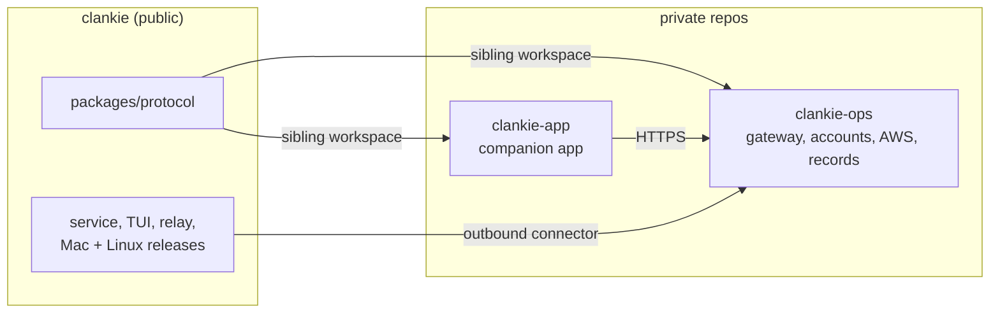

# ADR 0183: The harness is public, the hosted service is private

Status: accepted (James, 2026-09-24). Moves the source and deployment of the
public doorway from [ADR 0151](0151-the-public-doorway-routes-home.md), account
enrollment from [ADR 0153](0153-an-account-signs-the-mac-in.md), and push
delivery from [ADR 0159](0159-the-device-authorizes-push-delivery.md) out of this
repository. The decisions themselves stand.

## Context

Clankie is free to self-host, the companion app is free, and managed hosting is
the paid product. The companion app (`clankie-app`) and production values
(`clankie-ops`) were already private. This public repository still held the
server behind `api.clankie.bot`, its Cognito and Lightsail templates, the
workflow that deployed it on every release tag, and App Store and launch
records. Those run only on Clankie's servers or describe the business around
them; publishing them gives an owner nothing to run.

## Decision

One question places a file: does it run on an owner's machine, or does an owner
need it to run one?

- **Public (`clankie`)**: the service, TUI, relay, bodies, plugins, shipped
  skills, `packages/protocol`, the Mac release and single-owner Linux image,
  ADRs, and the public docs site with its deployment.
- **Private (`clankie-ops`)**: the gateway source, Cognito accounts, gateway
  and account AWS templates and deploy workflow, production configuration, App
  Store and launch records, and any future managed-hosting control plane
  (billing, tenant provisioning, lifecycle, quotas).
- **Private (`clankie-app`)**: the iPhone, iPad and macOS companion app.

The protocol is the contract and stays public, because the public Mac connector
speaks it. Private repos consume it in place from a sibling checkout; changes
flow from here outward, never back.

## Alternatives considered

- **Keep the hosted service public.** Rejected: it publishes operational and
  commercial records, and ties public release tags to production deploys.
- **Make the single-owner Linux image private.** Rejected: it packages an
  Apache-2.0 harness anyone can containerize. The paid layer is multi-tenant
  operation, which starts private.
- **A separate private repo for gateway code.** Rejected: the templates and
  production values were split only because the templates were public.
- **Rewrite public history.** Rejected: already-published code keeps its
  license, pull-request refs keep old commits reachable, and every active
  worktree would need resetting.

## Consequences

- Public releases no longer deploy the gateway. It deploys from `clankie-ops`
  against a chosen public ref, so a Mac release that needs new gateway behavior
  ships after that deploy.
- Self-hosters get no gateway implementation. The Mac connector, protocol, and
  device-to-Mac encryption ([ADR 0173](0173-the-gateway-cannot-read-device-traffic.md))
  remain public, so what the doorway can read is still inspectable from the Mac.
- Earlier public commits still contain the moved files.
