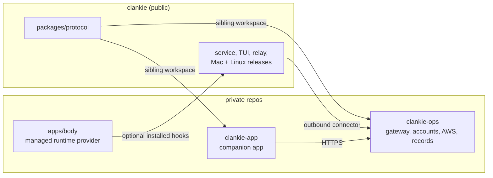

# ADR 0183: The harness is public, the hosted service is private

Status: accepted (James, 2026-09-24). Moves the source and deployment of the
public doorway from [ADR 0151](0151-the-public-doorway-routes-home.md), account
enrollment from [ADR 0153](0153-an-account-signs-the-mac-in.md), and push
delivery from [ADR 0159](0159-the-device-authorizes-push-delivery.md) out of this
repository. The decisions themselves stand.

## Context

Clankie is free to self-host, the companion app is free, and managed hosting is
the paid product. The companion app (`clankie-app`) and production values
(`clankie-ops`) were already private. This public repository still held the
server behind `api.clankie.bot`, its Cognito and Lightsail templates, the
workflow that deployed it on every release tag, and App Store and launch
records. Those run only on Clankie's servers or describe the business around
them; publishing them gives an owner nothing to run.

## Decision

One question places a file: does it run on an owner's machine, or does an owner
need it to run one?

- **Public (`clankie`)**: the service, TUI, relay, bodies, plugins, shipped
  skills, `packages/protocol`, the Mac release and single-owner Linux image,
  ADRs, and the public docs site with its deployment.
- **Private (`clankie-ops`)**: the gateway source, Cognito accounts, gateway
  and account AWS templates and deploy workflow, production configuration, App
  Store and launch records, and any future managed-hosting control plane
  (billing, tenant provisioning, lifecycle, quotas). Managed-body composition
  and its credit, heartbeat-accounting and model-plan policy live here too.
- **Private (`clankie-app`)**: the companion app: iPhone, iPad, Android and
  macOS today, plus the web app and the Windows/Linux desktop app planned by
  app ADR 0066.

```mermaid
flowchart LR
  subgraph Public["clankie (public)"]
    Protocol["packages/protocol"]
    Mac["service, TUI, relay,<br/>Mac + Linux releases"]
  end
  subgraph Private["private repos"]
    Gateway["clankie-ops<br/>gateway, accounts, AWS, records"]
    Managed["apps/body<br/>managed runtime provider"]
    App["clankie-app<br/>companion app"]
  end
  Protocol -->|sibling workspace| Gateway
  Protocol -->|sibling workspace| App
  Mac -->|outbound connector| Gateway
  Managed -->|optional installed hooks| Mac
  App -->|HTTPS| Gateway
```

The protocol is the contract and stays public, because the public Mac connector
speaks it. Private repos consume it in place from a sibling checkout; changes
flow from here outward, never back.

## Amendment: optional managed runtime composition (2026-10-05, VUH-1664)

The public service defines an optional
[`RuntimeProvider`](../../apps/clankie/src/runtime-provider.ts). With no
`CLANKIE_RUNTIME_PROVIDER_MODULE`, it loads an empty provider: no managed quota
routes, credit accounting, plan model routing or hire limits. A host can select
an installed module by its absolute path. The service loads its
`createRuntimeProvider` factory on every index restart; a configured provider
must initialize before Clankie starts. A managed bootstrap requires that module
and complete quota, hire-capacity, heartbeat and worker-model hooks; a misbuilt
managed image fails startup. Bootstrap validation remains strict, explicitly
allowlisting the existing private routing and hire-limit fields before projecting
generic identity. This is deployment configuration, never a tool argument or
model-selected module.

The hooks are generic: optional routes receive the existing owner/device
authorizer and declare exact gateway routes; heartbeat hooks observe raw turn
origins, a boolean authenticated-work signal and service lifetime. The public
encrypted gateway classifies successful device work before emitting that
boolean; decrypted request paths and bodies do not enter the provider. Model
hooks supply worker models and react to model changes. None grants a new device,
tool, account or machine authority. The ordinary public service, transport and
lifecycle remain the implementation used by both deployments.

Private `clankie-ops/apps/body` supplies credit routes, quotas, control-plane
heartbeat accounting, the included-usage forwarder and customer-model policy.
Its image extends a selected public Linux image and keeps the provider module
path in image configuration, so launcher restarts retain the composition.
The credits schema and route declarations moved from `@clankie/protocol` into
the private `@clankie/hosted-protocol` package. The companion app keeps the wire
decoder it consumes locally in its private repo, so its CI does not require
access to the operations checkout.

Composer dictation keeps its device API, paired-device authority checks,
bounded ephemeral audio and request receipts public. Its optional cloud port
accepts the existing device principal and returns a receipt or a validated
admission refusal; it carries no fleet endpoint or managed billing rule. The
private provider supplies the signed composer adapter, adds the body installation
identity and owns fleet admission, allowance reservations and metering. The
public body's one-shot signed JSON primitive supplies transport without upload
retries. An uncertain answer can be reconciled through a receipt read; it never
authorizes another audio upload.

Signed body requests, credential renewal, pairing and
[`hosted-device-security`](../../apps/clankie/src/hosted-device-security.ts)
remain public remote-access client code. The generic body module is an explicit
external entry for dependency analysis because the private provider imports its
bootstrap schema and transport; those contracts remain checked by the composed
runtime integration. They keep keys on the host, bind
requests and replies to the correct identity, prevent pairing replay, and
recover device revocations safely after a disk restore. Owners need these
boundaries to inspect or run remote access; their presence does not select a
managed plan or enable business policy. Managed infrastructure and the server
half of those contracts remain private.

## Alternatives considered

- **Keep the hosted service public.** Rejected: it publishes operational and
  commercial records, and ties public release tags to production deploys.
- **Make the single-owner Linux image private.** Rejected: it packages an
  Apache-2.0 harness anyone can containerize. The paid layer is multi-tenant
  operation, which starts private.
- **A separate private repo for gateway code.** Rejected: the templates and
  production values were split only because the templates were public.
- **Rewrite public history.** Rejected: already-published code keeps its
  license, pull-request refs keep old commits reachable, and every active
  worktree would need resetting.

## Consequences

- Public releases no longer deploy the gateway. It deploys from `clankie-ops`
  against a chosen public ref, so a Mac release that needs new gateway behavior
  ships after that deploy.
- Self-hosters get no gateway implementation. The Mac connector, protocol, and
  device-to-Mac encryption ([ADR 0173](0173-the-gateway-cannot-read-device-traffic.md))
  remain public, so what the doorway can read is still inspectable from the Mac.
- Earlier public commits still contain the moved files.
