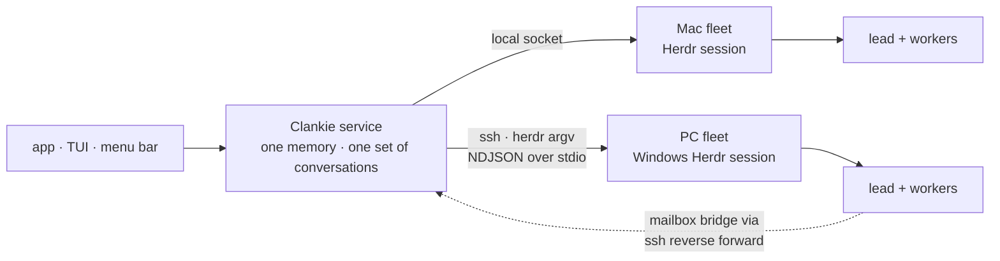

# ADR 0184: Clankie leads more than one fleet

Status: proposed (2026-09-23). [ADR 0181](0181-clankie-is-independent-of-his-connections.md)
scopes this proposal to Herdr runtime connections; a Swarm scope is independently
selected and Clankie is not defined by a Herdr fleet. Amends
[ADR 0149](0149-his-herdr-session-is-chosen-not-inherited.md) and
[ADR 0164](0164-the-fleet-is-its-own-session.md): the binding names a list of
fleets instead of one session. The seat contract of
[ADR 0135](0135-a-herdr-seat-is-a-conversation.md), the mailbox of
[ADR 0161](0161-a-fleet-seat-reads-its-mail-instead-of-its-keyboard.md), and
the socket rule of [ADR 0157](0157-herdr-is-an-owned-runtime.md) are unchanged.

## Context

The owner runs Herdr on more than one machine — the Mac and a Windows PC — and
already drives both from one terminal tab over ssh. Clankie sees one: the
service resolves a single session to a single socket at startup, and every
Herdr child it spawns (census, hire, send, `terminal session observe`,
`terminal session control`) inherits that socket. Agents on the PC, including
the lead the owner runs there, are invisible to Clankie and to the app.

Herdr is a CLI over a local socket, and every operation Clankie uses is either
one request/response or one NDJSON stream on stdio. Both survive an ssh hop
unchanged; the `windows-pc` skill already drives the PC's Herdr that way.

Running a second Clankie on each machine was the alternative: the gateway
already derives one host id per installation (ADR 0153), so the app could list
and switch hosts. That produces several Clankies with separate memories and
conversations rather than one Clankie who knows about all the work, and it
needs the service to run on Windows. It stays open for owners who genuinely
want separate Clankies; it is not how one Clankie reaches another machine.

## Decision

**A fleet is a named Herdr session plus the transport that reaches it.**
`herdr.fleets` in settings lists them; the first is the default for hires that
name no fleet.

- **Transports.** `local` (a socket on this machine, today's only shape) and
  `ssh` (a host alias from the owner's ssh config plus the remote session
  name). An ssh fleet runs `herdr` on the remote host with an argv, never a
  shell string, so PowerShell quoting never enters it. One persistent ssh
  control connection per fleet carries every call. The Herdr socket is still
  never exposed through the gateway or relay; ssh uses the owner's own keys.
- **Seat identity carries the fleet.** A seat id is `<fleet>/<terminal id>`;
  the census, the terminal catalog, and the fleet snapshot carry a `fleet`
  coordinate above workspace, tab, and pane. The local default fleet keeps
  bare ids, so existing conversations keep their seats.
- **An unreachable fleet is a state, not a failure.** The census reports it
  `unreachable` with the last-seen time and every other fleet answers normally.
- **Every lead is a contact.** A pane on any fleet is a seat, so the lead
  running on the PC is a conversation like any local agent: the app, the TUI,
  and Clankie himself can message it, watch its terminal, and take control.
  - _Send._ Delivery runs through the fleet's transport. The pty lane
    (`pane send-text`) and the Codex lane (`codex queue`, run on the remote)
    work on any fleet from day one.
  - _Replies._ Transcript harvest reads the harness's session file through the
    transport, on the machine where the harness runs, and falls back to
    `herdr agent read` when the file cannot be found.
  - _Mailbox._ A remote Claude Code seat reaches the service through a reverse
    port forward on the fleet's ssh connection, and its bridge names its fleet
    alongside `HERDR_PANE_ID`. Until that lands, remote seats take the pty
    lane, exactly as an unbridged local seat does.
- **He chooses where work goes.** His census lists every fleet with its
  machine; hiring on the PC is a `fleet` argument on the same hire, not a rule.
- **Writers.** `clankie herdr add NAME --ssh HOST --session SESSION`,
  `clankie herdr remove NAME`, and the `/herdr` TUI menu. As with every
  binding, changes take effect on `clankie restart captain`.
- **Onboarding.** A device joins Clankie by scanning the existing `/pair` QR
  code. A machine the Mac can already reach over ssh needs no step of its own:
  the service asks each host in the owner's ssh config for `herdr session
list`, and the app's fleet dropdown offers those sessions with an add action
  that uses the same writer. A machine with no ssh route is out of scope here;
  the intended follow-up is a `clankie join` on that machine that prints a QR
  code and dials out through the gateway the way the Mac does, becoming a
  third transport beside `local` and `ssh`.



```text
┌──────────────────────────┐
│ Clankie · Mac        ▾   │  ← tap the menu header
├──────────────────────────┤
│ ● Mac      12 agents  ✓  │
│ ● PC        4 agents     │
│ ○ Laptop   unreachable   │
└──────────────────────────┘
```

## Consequences

- The app switches fleets from the expanded menu's header, which today shows a
  fixed "Clankie": it names the current fleet, and tapping it drops down every
  fleet with its reachable state. The choice is the device's own view state,
  not a host setting. It scopes the agent sections of Messages and the
  terminal list to that fleet, and a hire from the app lands there by default.
  Clankie and channels stay in every fleet's view, because they belong to no
  machine. Each fleet's lead and workers keep the workspace and tab grouping
  they have today.
- Terminal observe and control over ssh add the link's latency to each frame
  and keystroke; the bounded frames and gap resets of ADR 0138 already cover
  a slow or dropped link.
- Hiring on a remote fleet needs the harness installed there; a missing
  harness is the same typed hire failure as locally.
- Clankie's own bash stays local. Arbitrary shell on the PC remains the
  owner's `windows-pc` skill, not a fleet power.
- A remote seat without its mailbox is exposed to the draft-mixing race of
  ADR 0161 until the reverse-forward bridge ships.
