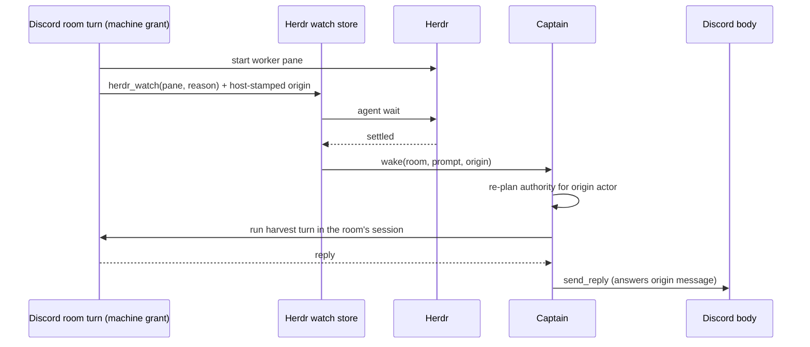

# ADR 0186: A Discord room harvests its own workers

Status: accepted (James, 2026-09-24). Extends
[ADR 0131](0131-herdr-completion-watches-wake-the-operator-thread.md) from the
operator thread to Discord text rooms whose turn holds machine access.

## Context

A Discord text turn with a machine grant can start a Herdr worker, but only
the operator lane had `herdr_watch`. To keep harvest ownership, the room handed
the worker to the operator conversation. The operator harvested it and closed
its pane. Then it tried to report back with `clankie send` to the room
conversation. Room conversations are read-only transcripts, so the send failed
(then as an unexplained HTTP 500). The person in Discord was told
"Claude's up in `w2H:pQ`" and found no pane. The room's next turns did not know
the pane had closed, because the result lived only in the operator thread.

The operator lane has no Discord delivery to answer, and giving it a general
post-to-any-room tool would let a console turn speak in rooms it was never
asked in. The room that was asked already owns the conversation and the
message to answer.

## Decision

A `discord_presence` turn whose authority plan grants shell tools gets
`herdr_watch`. The host stamps the watch with the Discord origin: base session
key, room target, actor, guild, channel, the message the turn is answering, and
transport kind. The origin persists with the watch record, so it survives a
service restart.

When the pane settles, the watch wakes that room instead of an operator thread:

- Authority is planned again for the stored actor against current settings.
  If the actor has lost machine access, the wake runs nothing.
- The turn runs in the same session a message from that actor would get: the
  durable authority lane where one exists, otherwise a one-shot recorded under
  the room's `turns/` directory.
- If the room is mid-turn, the notification steers into that turn and rides
  its reply.
- Otherwise no body holds a delivery, so the finished reply posts through the
  captain's Discord action port as `send_reply`, answering the origin message
  and bounded like any room reply. `[[stay-silent]]` posts nothing.

A send to a room conversation is refused with a 409 and its message, not a 500.

## Consequences

- One conversation owns a Discord-started worker from dispatch to report, and
  the room remembers it in the same way it remembers its other turns.
- `send_reply` is a new Discord action. Both bodies map it through the shared
  action control, onto the existing `send_message` presence write.
- The wake is accepted once started. A failed room turn is logged, not retried,
  because a retry would harvest the same pane twice.
- A room with no machine grant still cannot watch or start workers.
