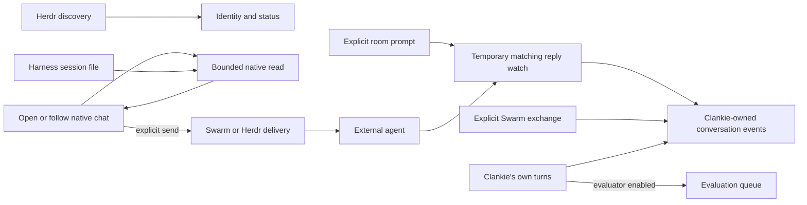

# ADR 0188: Native agent chats read their own history

Status: accepted (James, 2026-09-25). Amends [ADR 0135](0135-a-herdr-seat-is-a-conversation.md)
and [ADR 0174](0174-finished-files-belong-to-conversations.md).

## Context

An agent visible in Herdr is not necessarily working for Clankie. Discovering
James's Codex pane must not import his private conversation into Clankie's
conversation store or schedule an evaluation. The app still needs native chat:
history, tools, images, typing state, direct sends, and reconnectable tails.

## Decision

Discovery maintains identities, routing and status. It does not create a chat
thread or read an external agent's transcript. Opening an agent chat creates its
address; replay and tail read the harness's existing session through the native
transcript adapter. No background transcript subscription is attached to a
contact merely because it appears in the roster.

The existing authenticated conversation API returns the native view. Cursors
identify a session and its entry prefix; a different session, branch rewrite or
retained-window shift asks the client to reload. Long polls read only for the
bounded lifetime of that request. Message and tool normalization, redaction and
bounds stay in the existing adapter. Native entries are not appended to
`events.jsonl`. The host remembers the session locator and working directory,
so a closed pane's history remains readable while that native session file exists.
A harness without a transcript adapter supplies a bounded terminal answer on demand.

The host keeps communications it actually owns: Clankie's Pi and native-head
conversations, Swarm messages, explicit app sends, room exchanges, reactions and
delivered files. Native chat images are delivered only when their page is read,
through the existing workspace containment and authenticated download boundary.
Clankie's evaluator captures only his own turns while enabled.

A room turn temporarily observes the exact prompt it sends and reads the settled
answer following it. It does not harvest a previous answer, an unrelated prompt,
or a replacement native session. Transcriptless harnesses use a changed-answer
fallback. A completion watch explicitly armed by Clankie remains a separate wake
mechanism; merely reading a chat does not call his model.

Existing imported logs remain on disk; this change does not erase historical
records. A live native chat reads its source rather than extending those copies.
When no source can be resolved, the host's retained conversation remains the
fallback. Source locators are private metadata, not part of the client protocol.

## Alternatives

- Import every discovered session: duplicates private history and confuses
  visibility with ownership.
- Turn off external-agent chat: loses the app experience James wants.
- Import only after opening a chat: still creates a second transcript store
  without making the native source more authoritative or available.

Read-through keeps the native chat experience with one source of history.
