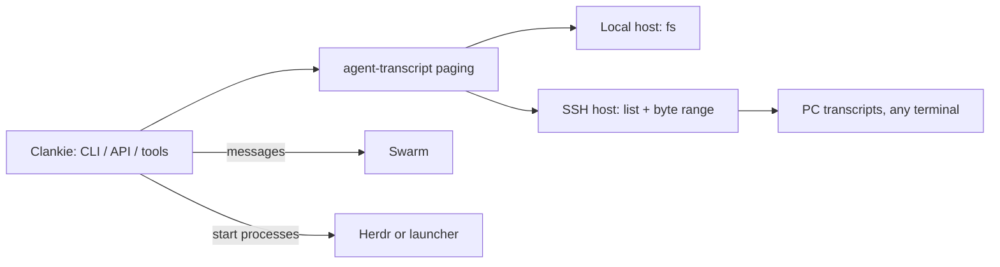

# ADR 0189: Agent sessions read from their transcripts, on any host

Status: proposed (Claude and Codex, 2026-09-25). Extends
[ADR 0188](0188-native-agent-chats-read-their-own-history.md) and applies
[ADR 0181](0181-clankie-is-independent-of-his-connections.md).

## Context

Clankie could only read an agent he found through Herdr or tmux. Two agents in
plain PowerShell tabs on James's PC were invisible to him, though both agents
write complete transcripts to disk and the PC already accepts SSH from this Mac.
Reading their terminals by screenshot would be slow and lossy.

## Decision

A session is read from its harness transcript, independent of any terminal host.
Reading, messaging and execution are separate connections: transcripts for
reading, Swarm for messages, and Herdr or another launcher only for starting
processes.

A host exposes two primitives: list its Claude, Codex, Grok and Pi transcript files and return
a byte range of one. The local host uses the filesystem; an SSH host runs one
POSIX or PowerShell command per call over the owner's SSH configuration, with
nothing installed remotely. Reads are confined to the harnesses' transcript roots
and capped at 4 MiB. All parsing, redaction and paging stay on Clankie's side in
`@clankie/agent-transcript`, the same adapter ADR 0188 uses.

Pages are bounded: a tail widens up to the read cap, and a cursor binds the
session, offset and a hash of preceding bytes so a replaced file restarts cleanly
instead of paging from a stale offset. Nothing is imported into Clankie's
conversation store, and reading never wakes his model. The captain tools ride
machine authority, like the shell.

## Alternatives

- Screenshots or UI Automation of terminal windows: lossy and slow; kept only as
  a fallback for programs that write no transcript.
- A helper installed on each host: more capable, but another deployment to keep
  current; two shell commands suffice.
- Copying transcripts to the Mac: duplicates private history (ADR 0188).

## Resumed turns (step 2)

Clankie can also continue a Claude, Codex, Grok or Pi session by running that
harness headless, resumed onto the saved history, over the same host connection.
This is a new process, not delivery into an open tab, so it can fork a session a
tab still holds. A one-minute quiet window and one turn per session reduce that
risk without removing it. A run whose connection was lost is `unknown`, and keeps
the session locked until an operator releases it. The turn gets the harness's
default permissions; granting more is a later owner setting.

This needs no Swarm enrollment and no install, so it reaches agents that were
never set up for Clankie. Agents enrolled in Swarm are still messaged through
Swarm.

## Not yet decided

Binding a read session to its Swarm identity, and waking an idle enrolled Claude
or Codex process with a Swarm message, need per-harness verification.
