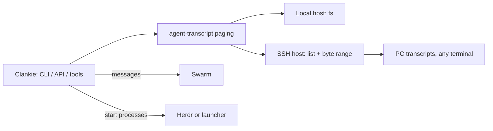

# ADR 0189: Agent sessions read from their transcripts, on any host

Status: proposed (Claude and Codex, 2026-09-25). Step 2 (resumed turns) retired
2026-09-30 under [ADR 0203](0203-clankie-keeps-what-better-models-cannot-absorb.md):
it was never used, and a headless process replacing a worker is what ADR 0203
rules out; reading stays. Extends
[ADR 0188](0188-native-agent-chats-read-their-own-history.md) and applies
[ADR 0181](0181-clankie-is-independent-of-his-connections.md). [ADR 0212](0212-machines-and-devices.md)
(proposed) folds its separate SSH host list into one record per machine.

## Context

Clankie could only read an agent he found through Herdr or tmux. Two agents in
plain PowerShell tabs on James's PC were invisible to him, though both agents
write complete transcripts to disk and the PC already accepts SSH from this Mac.
Reading their terminals by screenshot would be slow and lossy.

## Decision

A session is read from its harness transcript, independent of any terminal host.
Reading, messaging and execution are separate connections: transcripts for
reading, Swarm for messages, and Herdr or another launcher only for starting
processes.

A host exposes two primitives: list its Claude, Codex, Grok and Pi transcript files and return
a byte range of one. The local host uses the filesystem; an SSH host runs one
POSIX or PowerShell command per call over the owner's SSH configuration, with
nothing installed remotely. Reads are confined to the harnesses' transcript roots
and capped at 4 MiB. All parsing, redaction and paging stay on Clankie's side in
`@clankie/agent-transcript`, the same adapter ADR 0188 uses.

Pages are bounded: a tail widens up to the read cap, and a cursor binds the
session, offset and a hash of preceding bytes so a replaced file restarts cleanly
instead of paging from a stale offset. Nothing is imported into Clankie's
conversation store, and reading never wakes his model. The captain tools ride
machine authority, like the shell.

```mermaid
flowchart LR
  Clankie[Clankie: CLI / API / tools] --> Read[agent-transcript paging]
  Read --> Local[Local host: fs]
  Read --> SSH[SSH host: list + byte range]
  SSH --> PC[PC transcripts, any terminal]
  Clankie -->|messages| Swarm[Swarm]
  Clankie -->|start processes| Launcher[Herdr or launcher]
```

## Alternatives

- Screenshots or UI Automation of terminal windows: lossy and slow; kept only as
  a fallback for programs that write no transcript.
- A helper installed on each host: more capable, but another deployment to keep
  current; two shell commands suffice.
- Copying transcripts to the Mac: duplicates private history (ADR 0188).

## Resumed turns (step 2)

Retired 2026-09-30: the separate headless runner and its durable runs/quiet-window
heuristic are removed. A file's modification time cannot establish exclusive
ownership of a session.

## Native continuation

Saved-session continuation is an option on `hire_agent`, not another runner.
Fresh confined transcript metadata provides the exact UUID, harness and original
working directory. A complete inventory of the configured Herdr servers on that
host identifies an existing native seat; reuse precedes capacity checks. Otherwise
the normal hire path starts `claude --resume`, `codex resume`, `grok --resume`,
or `pi --session` interactively and confirms the same UUID before sending work.
Claude and Codex use the existing adapters; other or remote hires keep the normal
native terminal lane. Completion remains the existing seat watch/harness event.

Remote transcript and runtime labels need not agree. Their exact SSH target and
shell must agree, and the runtime must grant the original workspace. Codex keeps
the registered account that owns the transcript, including canonical path checks.
Concurrent starts serialize within the hire path, without a parallel run store.
Incomplete inventory or ambiguous live identity refuses a start. Uncertain native
delivery is typed and never retried through another lane; an uncertain start
retains its labeled pane for inspection, including after service recreation.
Unregistered terminals are outside this inventory, so their owners must close
them before resuming that history. Quiet history is not proof they are closed.

CLI, API and TUI project the same hire path (`agents resume`,
`POST /v1/agent-sessions/resume`, and the saved-session action). Enrolled Swarm
workers keep Swarm fencing; resumption never creates a replacement actor or claim.

## Not yet decided

Binding a read session to its Swarm identity, and waking an idle enrolled Claude
or Codex process with a Swarm message, need per-harness verification.
