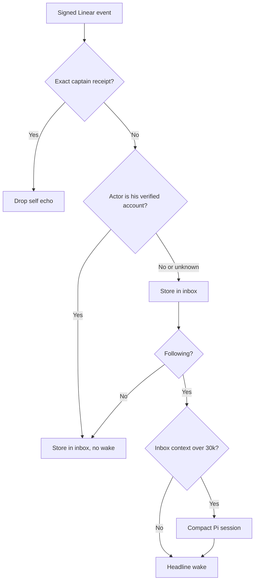

# ADR 0189: His own Linear activity does not wake him

Status: accepted (James, 2026-09-25, VUH-1362). Amends [ADR 0168](0168-linear-awareness-is-opt-in.md).
Amended by [ADR 0191](0191-a-reply-to-his-post-goes-to-whoever-owns-the-work.md).

## Context

Following Linear, the inbox woke about once per worker progress comment. Workers
post through Clankie's own Linear account (`clankie`), often from their own
Linear connection rather than his MCP host, so no write receipt marks them.
Of 15 authored wakes in one session, 14 were that account and every one passed
silently. Each wake also resent the inbox's whole Pi history: the session had
run since 2026-09-08 and carried about 112k tokens, sent uncached whenever
wakes were spaced beyond the provider cache.

## Decision

A signed event whose actor is Clankie's verified Linear account, in that
account's workspace, is stored in the inbox with following off. It is read
like any other event but never schedules a model turn. This covers his own
writes and every worker writing through his account, receipt or not. Receipt
matching (ADR 0168) still drops exact captain echoes and attaches worker
provenance. An unverified or disconnected account means authorship is unknown,
and the event wakes him as before.

This assumes Clankie has his own Linear identity. If his Linear connection is
the operator's account, the operator's own comments stop waking him too; give
him a separate account before following Linear.

Before a hook wake in the `linear-inbox` conversation, a Pi context above 30k
tokens is compacted. The summary carries what he is tracking; cursors and read
state already live in conversation metadata. A failed compaction wakes him with
the full context. Issue-bound project conversations are not compacted this way.

## Alternatives

Rotating to a fresh session costs nothing but forgets what he was watching.
Debouncing bursts per issue would merge a comment and its follow-up update,
but once his own account is quiet, those bursts no longer wake him.
