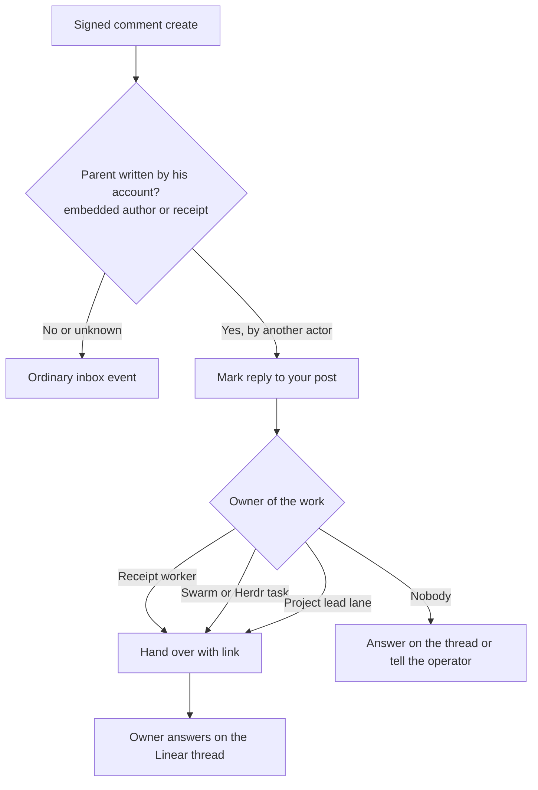

# ADR 0191: A reply to his post goes to whoever owns the work

Status: proposed (VUH-1365; the intent is James's, stated on the issue).
Amends [ADR 0167](0167-a-linear-comment-is-answered-on-the-ticket.md),
[ADR 0168](0168-linear-awareness-is-opt-in.md) and
[ADR 0189](0189-his-own-linear-activity-does-not-wake-him.md).

## Context

On 2026-09-26 James asked two questions in a comment on a Rivals Agent project
update the `clankie` account had posted. The webhook stored it (inbox event
`000000002807`), but the wake headline read only `Linear Comment create · James
Volpe`: headlines named an issue's identifier and title, and a comment on a
project update has no issue. The inbox lane, briefed that routine updates can
pass silently, passed without reading it. No write receipt existed for the
update, and issue bindings cover issues only, so nothing named the owner either.

## Decision

A headline names what the event is about. A comment names its parent: the
issue identifier and title, the project and short update ID
(`Rivals Agent update 5087a961`), or the document title. Other events name
themselves as before.

A new comment is a reply to his post when its actor is not the post's author
and the post was written by his account. Only signed IDs decide it: the
embedded author ID (a project update's `userId`) equals his verified Linear
account in that workspace, or a retained write receipt (ADR 0168) covers the
parent comment, project update, document or issue. The receipt's worker
provenance travels with the event as `replyTo.worker`. Unknown authorship is
not a reply; the event stays ordinary inbox context.

A reply keeps its normal delivery: it wakes under Follow Linear like any other
activity from another actor, and his own account's activity still never wakes
him (ADR 0189). Its headline carries `reply to your post`, and a wake that
lists one says so in one line. The quoted event tells him to get the comment,
with its link, to whoever owns the work: the receipt's worker, the live Swarm
or Herdr task owner, or the project's lead lane, so the owner answers on the
Linear thread (ADR 0167). When nobody owns it he answers on the thread himself
or tells the operator. A reply is never passed over silently. He still chooses
the words and the route; routine activity and his own echoes stay silent.

## Alternatives

Binding owners for project updates and documents, like issue bindings, would
route without a model turn, but workers often post from their own Linear
connection, so no binding would exist for the post James asked about. Live
Swarm ownership is already the source of truth for who holds the work.

Waking on a reply even with Follow Linear off would make replies louder than
the owner's opt-in. It is left to the switch.
