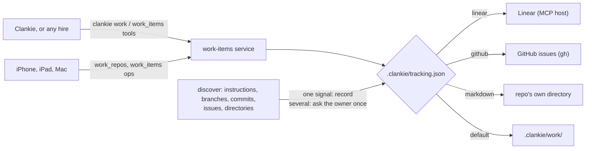

# ADR 0191: Work is tracked where the repo tracks it

Status: accepted (James, 2026-09-26). Tracks [VUH-1374](https://linear.app/vuhlp/issue/VUH-1374).

## Context

Clankie and the agents he hires track work today in whatever shape the moment
suggests: an owner's Linear project, GitHub issues, or ad-hoc Markdown notes in
the repo. Each hire reinvents the shape, results arrive without the evidence
behind them, and the app has nothing consistent to show. Owners already have
conventions, and a product that forces its own tracker on a repo that has one
is worse than no tracker at all.

## Decision

One work-item contract, several backends, and the repo decides which.

1. **Discover first.** Before creating anything, Clankie reads what the repo
   already does: a Linear project or `TEAM-123` identifiers named in its agent
   instructions, branches or commits; GitHub issues in use; a one-file-per-item
   Markdown directory such as `docs/tasks`; decision records in `docs/adr`; a
   single `TODO.md`. `clankie work discover` reports every signal and a
   suggestion.
2. **Ask once when ambiguous.** Two competing trackers, or a convention that
   cannot hold items (a single `TODO.md`), is a question for the owner, not a
   guess. The answer is written to `.clankie/tracking.json` in the repo, with who
   decided and when, so every later agent follows it without asking again. A
   single unambiguous signal is recorded the same way, marked as discovered.
3. **One tool contract.** `list`, `show`, `create`, `update` (status, owner,
   criteria), and `attach` (evidence) behave the same whichever backend is
   recorded:
   - `linear`: the connected Linear account, through the service's MCP host.
   - `github`: the repo's GitHub issues, through the owner's `gh` login.
   - `markdown`: the repo's own one-file-per-item directory.
   - `default`: `.clankie/work/`, only when nothing else exists.

   Criteria are a Markdown checklist under `## Acceptance Criteria` and
   evidence a captioned link list under `## Evidence` in every backend, so an
   item reads the same in an issue body as in a file.

4. **Every agent gets it.** The contract is the `clankie work` CLI (JSON in and
   out), the captain's `work_items` tools, and the `work-items` product skill,
   which is attached to every hire. A Codex, Claude or pi worker therefore
   tracks work the same way Clankie does, in the owner's convention.
5. **The app can read through the same layer, as an experiment.** The
   operator dispatch contract gains read-only `work_repos` and `work_items` ops
   (chat grant). The app's view of them (a board by status, each item's
   criteria and evidence) is an experimental feature that is off until the
   owner turns it on in Settings. Work tracking is an agent-facing foundation;
   a full tracker inside the app is not the product.

**Default format.** One file per item, `.clankie/work/<id>-<slug>.md`, with a
small front matter (`id`, `title`, `status`, `owner`, `depends_on`, `created`,
`updated`), then a summary, `## Acceptance Criteria` and `## Evidence`. One
file per item keeps parallel agents from conflicting, and history lives in git
and pull requests. IDs are random (`W-` plus six characters), so two agents
creating items at once cannot collide.

**Evidence stays out of git.** An evidence entry is a link with a kind
(`image`, `video`, `log`, `link`) and a caption saying what it proves. Large
media belongs in an artifact store (delivered files, a Linear upload, a
GitHub attachment); the item carries the link.

**Repos the app may read are registered, not arbitrary.** A repo becomes
readable over the device contract only when it is the captain's working
directory or was registered by `clankie work init` on this machine. A paired
device cannot name an arbitrary filesystem path.

## Negative space

- Not a project-management tool: status, criteria, ownership and evidence only.
  No sprints, estimates, priorities or custom workflows.
- Not a user-facing tracker by default. The app view stays behind an
  experimental Settings switch; the owner's own tracker remains where people
  plan and read work.
- No automatic sync between backends. An owner who wants the default format
  mirrored elsewhere records that backend instead.
- No writes from paired devices. The app reads; agents and the owner write
  through the CLI and tools, where the repo's own git history applies.
- No new Linear or GitHub credentials. Linear rides the account already
  connected to Clankie; GitHub rides the owner's `gh` login.

## Consequences

- Clankie never creates `.clankie/work/` in a repo that already tracks work.
  The only file he adds there is `.clankie/tracking.json`, the recorded answer.
- Status names map onto each backend's own states (Linear state types, GitHub
  open or closed with a reason and a `status:` label for in-progress and
  in-review), so the unified status is a projection, not a second state.
- A backend that is unavailable (Linear disconnected, `gh` signed out) fails
  loudly with the recorded convention named, rather than silently falling back
  to files that would fork the record.
