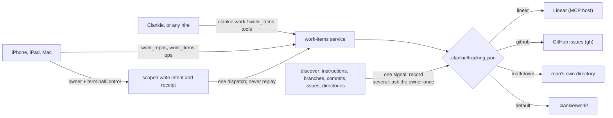

# ADR 0191: Work is tracked where the repo tracks it

Status: accepted (James, 2026-09-26). Tracks [VUH-1374](https://linear.app/vuhlp/issue/VUH-1374).
Amended for parent metadata ([VUH-1593](https://linear.app/vuhlp/issue/VUH-1593))
and owner-authorized receipt-backed writes ([VUH-1595](https://linear.app/vuhlp/issue/VUH-1595); journal direction approved 2026-10-04).
The tool vocabulary, priority and disconnected behavior are amended by
[ADR 0226](0226-one-tracker-tool-surface.md); the original design below is historical
where it differs from that decision.

## Context

Clankie and the agents he hires track work today in whatever shape the moment
suggests: an owner's Linear project, GitHub issues, or ad-hoc Markdown notes in
the repo. Each hire reinvents the shape, results arrive without the evidence
behind them, and the app has nothing consistent to show. Owners already have
conventions, and a product that forces its own tracker on a repo that has one
is worse than no tracker at all.

## Decision

One work-item contract, several backends, and the repo decides which.

1. **Discover first.** Before creating anything, Clankie reads what the repo
   already does: a Linear project or `TEAM-123` identifiers named in its agent
   instructions, branches or commits; GitHub issues in use; a one-file-per-item
   Markdown directory such as `docs/tasks`; decision records in `docs/adr`; a
   single `TODO.md`. `clankie work discover` reports every signal and a
   suggestion.
2. **Ask once when ambiguous.** Two competing trackers, or a convention that
   cannot hold items (a single `TODO.md`), is a question for the owner, not a
   guess. The answer is written to `.clankie/tracking.json` in the repo, with who
   decided and when, so every later agent follows it without asking again. A
   single unambiguous signal is recorded the same way, marked as discovered.
3. **One tool contract.** `list`, `show`, `create`, `update` (status, owner,
   criteria), and `attach` (evidence) behave the same whichever backend is
   recorded:
   - `linear`: the connected Linear account, through the service's MCP host.
   - `github`: the repo's GitHub issues, through the owner's `gh` login.
   - `markdown`: the repo's own one-file-per-item directory.
   - `default`: `.clankie/work/`, only when nothing else exists.

   Criteria are a Markdown checklist under `## Acceptance Criteria` and
   evidence a captioned link list under `## Evidence` in every backend, so an
   item reads the same in an issue body as in a file.

   A Linear convention may save an existing `linear.label` to distinguish a
   repo's board within a shared team/project. `clankie work init --linear-label
LABEL` and the init request's `linearLabel` record it. Omitting it preserves
   the team/project-wide board. Each provider page receives the saved label;
   ad-hoc role, status and owner filters intersect it. New issues carry the
   saved label; edits and evidence attachments preserve all existing labels and
   uploaded media. Unknown labels fail rather than being created. Direct
   known-item reads remain unchanged: this is board selection, not authority.

4. **Every agent gets it.** The contract is the `clankie work` CLI (JSON in and
   out), the captain's `work_items` tools, and the `work-items` product skill,
   which is attached to every hire. A Codex, Claude or pi worker therefore
   tracks work the same way Clankie does, in the owner's convention.
5. **The app can read through the same layer, as an experiment.** The
   operator dispatch contract gains read-only `work_repos` and `work_items` ops
   (chat grant). The app's view of them (a board by status, each item's
   criteria and evidence) is an experimental feature that is off until the
   owner turns it on in Settings. Work tracking is an agent-facing foundation;
   a full tracker inside the app is not the product.
6. **Owner-authorized gestures can update an existing item.** Paired devices
   with `terminalControl` can assign its work-metadata owner, add or remove a
   role label, or append a prerequisite through `work_item_write`
   ([VUH-1595](https://linear.app/vuhlp/issue/VUH-1595)). Each request carries a
   caller-created UUID. `work_item_write_receipt` reads that original receipt.
   The CLI exposes the same narrow write and receipt operations. Generic
   creation, status, criteria, evidence and parent edits remain agent/CLI work.

```mermaid
flowchart LR
  Agent["Clankie, or any hire"] -->|clankie work / work_items tools| Service["work-items service"]
  App["iPhone, iPad, Mac"] -->|work_repos, work_items ops| Service
  App -->|owner + terminalControl| Intent["scoped write intent and receipt"]
  Intent -->|one dispatch; never replay| Service
  Service --> Convention{".clankie/tracking.json"}
  Convention -->|linear| Linear["Linear (MCP host)"]
  Convention -->|github| GitHub["GitHub issues (gh)"]
  Convention -->|markdown| Dir["repo's own directory"]
  Convention -->|default| Default[".clankie/work/"]
  Discover["discover: instructions, branches, commits,<br/>issues, directories"] -->|one signal: record<br/>several: ask the owner once| Convention
```

**Default format.** One file per item, `.clankie/work/<id>-<slug>.md`, with a
small front matter (`id`, `title`, `status`, `owner`, `depends_on`, `created`,
`updated`), then a summary, `## Acceptance Criteria` and `## Evidence`. One
file per item keeps parallel agents from conflicting, and history lives in git
and pull requests. IDs are random (`W-` plus six characters), so two agents
creating items at once cannot collide.

**Parent metadata.** An item may state its backend-native `parent` ID
([VUH-1593](https://linear.app/vuhlp/issue/VUH-1593)): Linear's parent issue,
GitHub's sub-issue parent, or scalar `parent:` front matter in Markdown.
Same-repo GitHub parents use `#42`; a parent in another repo uses
`owner/repo#42`, so an unrelated local issue cannot become its parent.
Hierarchy is separate from `dependsOn`. Items without a recorded parent still
validate. This is read metadata; the unified write contract does not mutate
parent relationships. An older client's response reader can omit the additive
field while keeping its known fields strict.

**Owner write authority and receipts.** The service authorizes the original
owner identity and rechecks expiry, revocation, abort, saved repository or
project binding, workspace identity and tracker convention immediately before
publication. A device names an opaque registered or project repository ID,
never a path. Project writes require the local enrolled tracker workspace.
Linear additionally proves the source issue belongs to the configured canonical
team and project. GitHub owner writes use the connected account, rather than
an ambient `gh` login. Connected-provider dispatch retains its account and
configuration fences. Dependencies remain prerequisite metadata; adding one
never writes the referenced item.

The narrow work-write journal shares the flat, atomic, private receipt store
used by native seat calls. It uses the delivery fingerprint and unresolved
claim fence; it does not extend the native seat tool enum. Intent is recorded
before any effect. Every outcome carries the original request ID: `applied`,
`refused` before dispatch, or `uncertain` after possible dispatch. A repeated ID
can only return its existing receipt, after checking its exact owner, source
item, tracker/account binding and command fingerprint. Restart, reconciliation
and receipt expiry never execute a write. All uncertain records and admission
tombstones remain; only the oldest settled result bodies beyond 1,000 are
removed. Audit events record owner, source, request ID, action and outcome,
without copying message contents or credentials.

Updates read fresh tracker state before merging. Linear label writes preserve
its entire raw label set because the provider replaces it; response display
limits never become a write limit. GitHub role edits preserve reserved status
labels. The backend accepts the write before a follow-up item read, so a lost
read cannot turn a confirmed effect into a retry suggestion.

**Evidence stays out of git.** An evidence entry is a link with a kind
(`image`, `video`, `log`, `link`) and a caption saying what it proves. Large
media belongs in an artifact store (delivered files, a Linear upload, a
GitHub attachment); the item carries the link.

**Repos the app may read are registered, not arbitrary.** A repo becomes
readable over the device contract only when it is the captain's working
directory or was registered by `clankie work init` on this machine. A paired
device cannot name an arbitrary filesystem path.

Each listed repo also says its `root`, the directory it was registered at
([VUH-1401](https://linear.app/vuhlp/issue/VUH-1401)). The app's commons keys
districts by the directory a seat works in, and the root lets it hang a repo's
work in the right district without guessing from the name. Showing the path
changes nothing above: a device still names a repo only by its `id`.

## World reads amendment (VUH-1712, VUH-1713, VUH-1714)

Accepted assignment direction, 2026-10-05: the release source defaults to **both**,
with an owner setting for `tags`, `milestones`, or `both`. Planned milestones and
published version tags are separate facts. Completing work or a milestone does
not imply shipment. This records the implementation direction James gave Ivy;
the app's design and release presentation remain separate work.

- Work status adds `backlog`: Linear backlog and triage state types, GitHub's
  explicit `status: backlog` label, and Markdown `status: backlog` front matter.
  Open GitHub issues without a status label and Markdown without a status stay
  `todo`. Setting backlog writes the provider's backlog state or that explicit
  label/front matter. `priority` remains the shared optional Linear 0–4 scale;
  GitHub reads priority labels and Markdown reads scalar front matter.
- `milestone` states a native id and name: Linear project milestone, GitHub
  milestone number/title, or Markdown `milestone_id` and `milestone_name`.
  It adds no milestone-assignment write API.
- A device requests `work_items` with `statusVersion: 2` to receive backlog and
  milestones. Requests omitting this opt-in receive backlog as `todo` and omit
  milestone, so pre-amendment status enums continue to parse. This compatibility
  projection is on the host, not a guessed app state.
- `work_project` (device) and `clankie work project` / `/work project` (operator)
  return planned milestone names/dates/item ids, shipped versions, and goals.
  The saved `releases.source` and `releases.lane` are shared host settings;
  `work init --release-source both --release-lane macos` updates them without
  changing an existing tracker. The default lane `repository` states that no
  platform-specific lane was recorded. Bind separate mobile and macOS repos
  with their own explicit lanes; the core never guesses a platform from a tag.
- Linear plans use project milestones; GitHub plans use open milestones.
  Membership comes from the complete provider issue collection, intersected
  with a saved Linear board label. Markdown has no native milestone collection
  or target dates, so it reports planned releases unavailable even when items
  carry authored milestone names.
- Shipped versions are the host's existing `v*` git tags and, for GitHub trackers,
  published GitHub releases with `v*` tags. GitHub publication wins when both
  name the same tag. `dateKind` distinguishes publication, annotated-tag and
  lightweight-tag commit dates. No remote fetch occurs on a device read. Item
  ids remain empty where no explicit release association exists. Store builds,
  release-item membership and platform dates are not inferred.
- Goals are Linear initiatives and their native project progress fractions
  ([Linear schema](https://github.com/linear/linear/blob/master/packages/sdk/src/schema.graphql)).
  Progress retains Linear's estimate weighting. Trackers without initiatives
  return an empty goals list. Unsupported or failed facts carry `unavailable`
  entries, and omitted target dates/progress never become fabricated values.
- Metadata lists reuse the connected host's coalesced snapshot reader, account
  and configuration binding, failure cooldown, per-waiter authority checks,
  and write/webhook invalidation from VUH-1697. Goal member pagination runs once
  inside that shared read. Planned membership uses the work poller's identical
  issue fields and filters, so it reuses that scan. Device renders do not create
  provider scans. GitHub account collection pages also coalesce for 60 seconds,
  with a 30-second failure cooldown and mutation invalidation.

## Negative space

- The app projects tracker facts; it does not invent a second planning store.
  No automatic sync, inferred shipment, or custom workflow is added here.
- Not a user-facing tracker by default. The app view stays behind an
  experimental Settings switch; the owner's own tracker remains where people
  plan and read work.
- No automatic sync between backends. An owner who wants the default format
  mirrored elsewhere records that backend instead.
- Paired-device writes cover only owner, role labels and prerequisite metadata.
  Broader tracker edits remain with agents and the owner’s CLI tools.
- No new Linear or GitHub credentials. Linear rides the account already
  connected to Clankie; GitHub rides the owner's `gh` login. A body without a
  `gh` login uses its GitHub account connection instead
  ([ADR 0196](0196-account-connections-keep-tokens-on-the-body.md)).

## Consequences

- Clankie never creates `.clankie/work/` in a repo that already tracks work.
  The only file he adds there is `.clankie/tracking.json`, the recorded answer.
- Status names map onto each backend's own states (Linear state types, GitHub
  open or closed with a reason and a `status:` label for in-progress and
  in-review), so the unified status is a projection, not a second state.
- A backend that is unavailable (Linear disconnected, `gh` signed out) fails
  loudly with the recorded convention named, rather than silently falling back
  to files that would fork the record.
