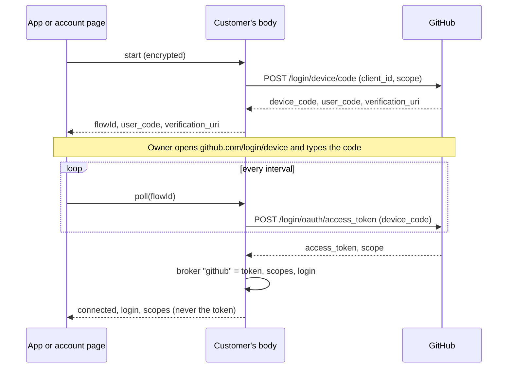
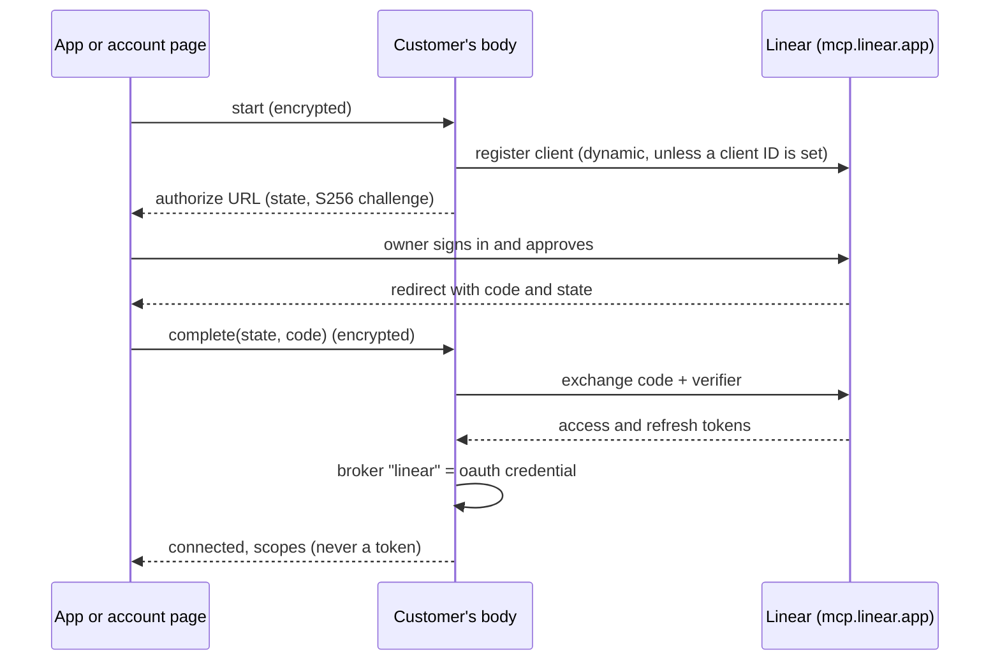

# ADR 0196: Account connections keep tokens on the body

Status: superseded for Hosted Connections by
[ADR 0232](0232-hosted-connections-use-the-body-broker.md) (2026-10-05).
The initial API scaffolding remains; the MCP OAuth proposal below is historical.
Provider app registrations remain James's. Tracks
[VUH-1383](https://linear.app/vuhlp/issue/VUH-1383). Amends ADR 0191's
"no new GitHub credentials" for bodies without a `gh` login.

## Context

A hosted customer has no console, no `gh` login and no browser on the body, so
the ADR 0191 work tracker's GitHub and Linear backends report "unavailable"
there. On a Mac, GitHub rides the owner's `gh` login and Linear the MCP OAuth
that `/connect linear` runs through a localhost callback. ADR 0181 already
treats accounts as connections, independent of Clankie's identity. The same
rule as the VUH-1369 model keys applies to anything that can act as the
customer: the secret lives in the body's credential broker and nowhere else,
not the fleet store, not the gateway, not a log.

## Decision

The body runs every flow and keeps every secret. The app and the account page
only show a code or open a URL, and hand back what the provider gave them
through the encrypted device path (ADR 0173's envelope). One API serves the
app, the account page and `clankie accounts`:

| Method | Path                           | Does                                             |
| ------ | ------------------------------ | ------------------------------------------------ |
| GET    | `/v1/accounts`                 | Each provider's status, account, scopes, since   |
| POST   | `/v1/accounts/github/start`    | Start a device flow; return user code and URL    |
| POST   | `/v1/accounts/github/poll`     | Poll it; on success the token goes to the broker |
| POST   | `/v1/accounts/linear/start`    | Start OAuth with PKCE; return the authorize URL  |
| POST   | `/v1/accounts/linear/complete` | Hand back `state` and `code`; the body exchanges |
| POST   | `/v1/accounts/disconnect`      | Revoke at the provider, then delete locally      |

Access is the model-keys rule: the owner operator bearer, or a paired device
with Take Control. Remote calls only arrive inside the encrypted envelope.

### GitHub: device flow

- **Token location:** broker entry `github`, an `api` credential whose metadata
  holds the scopes, login, client ID and connection time. The device code stays
  on the body too; the app only gets the user code.
- **Scopes:** `repo`. Issues on private repos need it; GitHub has no narrower
  OAuth scope for issues. A GitHub App with fine-grained Issues permission is
  the better long-term shape and uses the same device flow.
- **Polling:** the body answers polls that arrive faster than GitHub's interval
  itself and honors `slow_down`, so a chatty client cannot get the app
  rate-limited.
- **Revocation:** `DELETE /applications/{client_id}/grant` needs the OAuth
  app's client secret. When the body holds it (broker entry `github-oauth-app`)
  disconnect revokes the grant; without it the body still deletes the token
  and returns the GitHub page where the owner revokes it. Whether hosted bodies
  carry that secret is open (see below).

### Linear: OAuth with PKCE and a sealed hand-off

- **Sealed hand-off:** the PKCE verifier never leaves the body, so the code the
  app carries is useless to anyone who sees it, and the app sends it only in
  the encrypted envelope. `state` names the flow and is single use.
- **Token location:** broker entry `linear`, the same entry `/connect linear`
  writes on a Mac. The service's Linear MCP host already reads it, so the
  ADR 0191 Linear backend works on a hosted body as soon as it exists.
- **Scopes:** `read write`, the MCP server's scopes, audience-restricted to
  `https://mcp.linear.app/mcp`.
- **Client:** dynamic registration at Linear's MCP server by default, or an
  owner-set client ID. The redirect URI is owner-set configuration; the app
  must catch it (a universal link or custom scheme) and pass it through.
- **Revocation:** RFC 7009 at the `revocation_endpoint` the authorization
  server advertises; the refresh token ends the grant. When none is advertised,
  or for a personal API key, the body deletes the token and returns Linear's
  security settings page.

### Configuration

Client IDs are public, so they are owner-set settings (`oauthApps` in
`settings.json`, `clankie accounts apps set`) with an environment override
(`CLANKIE_GITHUB_OAUTH_CLIENT_ID`, `CLANKIE_LINEAR_OAUTH_CLIENT_ID`,
`CLANKIE_LINEAR_OAUTH_REDIRECT_URI`) that a hosted body's provisioner sets.
They are read per request. Without one a provider reports `unconfigured`.

### What the fleet may see

Nothing about a connection: not the token, not the account, not the scopes, not
whether one exists. The routes emit no telemetry and log nothing; every result
is a closed code, because provider error text can echo what it was sent. The
gateway sees only ciphertext.

### The work tracker

The GitHub backend gains a REST path (`githubRestApi`) beside `gh`. A body with
a GitHub connection uses its token; a hosted body never falls back to `gh` and,
without a connection, says "connect GitHub to Clankie". The REST client only
follows pagination links on the API origin, so the token cannot be sent
elsewhere.

## Negative space

- No token ever crosses the device path, in either direction.
- No provider flows run in the app, the account page or the gateway.
- No broker entries for other providers. Google, Slack and Notion come later and
  follow the same shape.
- Discord keeps its own flow (VUH-1372).

## Open for James

- Register the GitHub OAuth app (device flow enabled) or a GitHub App, and
  decide whether hosted bodies get its client secret so disconnect can revoke.
- Decide the Linear redirect URI the app catches, and whether to register a
  Linear OAuth app or keep dynamic registration.

## Consequences

- A hosted customer connects GitHub and Linear from any paired device with Take
  Control, and the work tracker's backends work on their body.
- A Mac owner can use the same flows; a GitHub connection takes precedence over
  their `gh` login for the work tracker.
- Pending flows live in memory: a body restart mid-flow means starting again.
